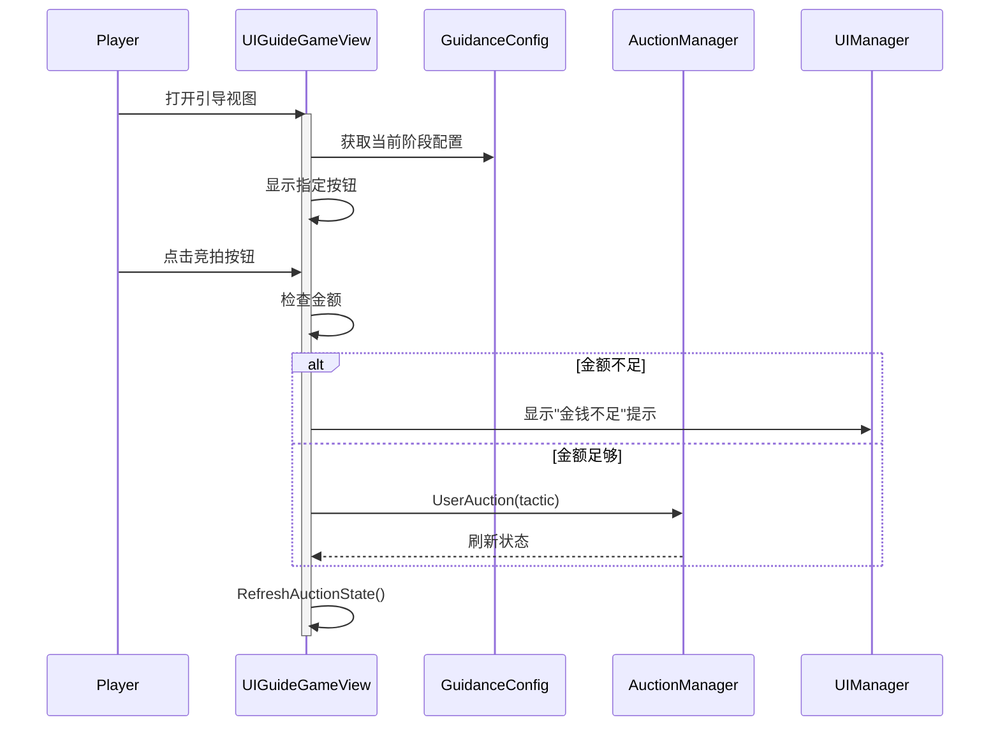

# UIGuideGameView.cs - 引导游戏视图

## 📄 文件信息

| 属性 | 值 |
|------|------|
| 文件路径 | `Assets/Scripts/Code/Game/UIGame/UIAuction/UIGuideGameView.cs` |
| 命名空间 | `TaoTie` |
| 基类 | `UIBaseView` |
| 实现接口 | `IOnCreate`, `IOnEnable`, `IOnDisable`, `IOnWidthPaddingChange` |

---

## 🎯 类说明

`UIGuideGameView` 是引导关卡的游戏视图，用于新手引导阶段展示简化的竞拍界面，根据引导配置动态显示指定的竞拍按钮和提示。

### 核心职责

- **引导展示**: 根据引导配置显示指定的竞拍按钮
- **状态同步**: 同步拍卖状态并刷新 UI 显示
- **价格范围**: 显示系统估价范围提示
- **动画控制**: 控制按钮的显示/隐藏动画
- **跳过功能**: 支持开发者跳过引导（仅编辑器）

---

## 📋 字段说明

### UI 组件字段

| 字段名 | 类型 | 说明 |
|--------|------|------|
| `BidButtons` | `UIButton[]` | 三个竞拍按钮数组 |
| `ButtonText` | `UITextmesh[]` | 按钮金额文本数组 |
| `TextRangePrice` | `UITextmesh` | 价格范围文本 |
| `SkipBtn` | `UIButton` | 跳过按钮（仅编辑器） |
| `Animator` | `UIAnimator` | 主动画控制器 |
| `Button` | `UIAnimator` | 按钮区域动画 |
| `TextRange` | `UIImage` | 价格范围背景 |
| `ButtonBg` | `UIImage` | 按钮背景图片 |
| `CashGroup` | `UICashGroup` | 顶部金币显示组件 |

### 状态字段

| 字段名 | 类型 | 说明 |
|--------|------|------|
| `cancel` | `ETCancellationToken` | 动画取消令牌 |
| `cancelAnim` | `ETCancellationToken` | 按钮动画取消令牌 |
| `auctionMoney` | `BigNumber[]` | 三个竞拍金额缓存 |
| `actionLineVolume` | `ActionLineVolume` | 场景体积光效果引用 |

---

## 🔧 方法说明

### 生命周期方法

#### `OnCreate()`
视图创建时初始化所有 UI 组件。

**主要功能:**
1. 初始化所有 UI 组件引用
2. 获取场景中的体积光效果引用
3. 初始化按钮数组

#### `OnEnable()`
视图启用时绑定事件并刷新状态。

**主要功能:**
1. 设置跳过按钮（仅编辑器）
2. 播放打开动画
3. 绑定按钮点击事件
4. 注册消息监听（拍卖状态刷新、价格范围显示）
5. 刷新初始状态

#### `OnDisable()`
视图禁用时移除消息监听。

#### `CloseSelf()`
关闭窗口时播放关闭动画。

---

### 业务方法

#### `RefreshAuctionState(AuctionState auctionState)`
根据拍卖状态刷新界面显示。

**状态处理:**
- **WaitUser（等待用户）**:
  - 显示三个竞拍金额
  - 显示价格范围
  - 根据引导配置显示指定按钮
- **Ready（准备阶段）**:
  - 显示"-"占位符
  - 隐藏价格范围
  - 根据引导配置切换背景

**引导限制:**
- 根据 `GuidanceStageConfig` 配置显示指定按钮
- 检查玩家竞拍次数限制
- 检查是否达到引导阶段目标

#### `RefreshRangePrice()`
刷新价格范围显示。

**计算逻辑:**
```csharp
min = AllPrice * SysJudgePriceMin
max = AllPrice * SysJudgePriceMax
```

**背景颜色:**
- 上次竞拍价 < min：绿色背景（偏低）
- 上次竞拍价 >= max：红色背景（偏高）
- 其他：黄色背景（合理）

#### `HideButtons(ETCancellationToken cancellationToken)`
隐藏竞拍按钮（用于引导动画）。

#### `ShowButtons()`
显示竞拍按钮并重置文本。

#### `ReEnter(ETCancellationToken cancellationToken)`
重新进入时设置取消令牌。

---

### 事件处理方法

#### `ShowTextRange()`
显示价格范围提示。

#### `OnAuction(int index)`
处理竞拍按钮点击。

**流程:**
1. 检查金钱是否足够
2. 关闭任务详情窗口（如果打开）
3. 如果正在抬价：触发相机震动和震动反馈
4. 调用拍卖管理器执行竞拍

#### `OnClickSkip()`
跳过引导（仅编辑器）。

**功能:**
- 如果有动画正在进行：取消动画
- 否则：切换跳过标记

---

## 🔄 流程图



---

## 💡 使用示例

### 打开引导游戏视图

```csharp
// 从引导场景打开
UIManager.Instance.OpenWindow<UIGuideGameView>(UIGuideGameView.PrefabPath);

// 视图会自动：
// 1. 获取当前引导阶段配置
// 2. 显示指定的竞拍按钮
// 3. 同步拍卖状态
```

### 引导配置示例

```csharp
// GuidanceStageConfig 配置结构
{
    Stage: 1,
    Button: new int[] { 0 },           // 只显示第一个按钮
    PlayerMaxRaiseCount: 1,            // 玩家最多抬价 1 次
    BeforePlayerAuction: 2,            // 玩家竞拍前 AI 竞拍 2 次
    // ... 其他引导配置
}
```

---

## 🔗 相关文档

- [UIGameView.cs.md](./UIGameView.cs.md) - 正式游戏视图
- [UIAssistantView.cs.md](./UIAssistantView.cs.md) - 助手对话视图
- [GuidanceStageConfig.cs.md](../../../../Module/Generate/Config/GuidanceStageConfig.cs.md) - 引导阶段配置

---

*最后更新：2026-03-02*
