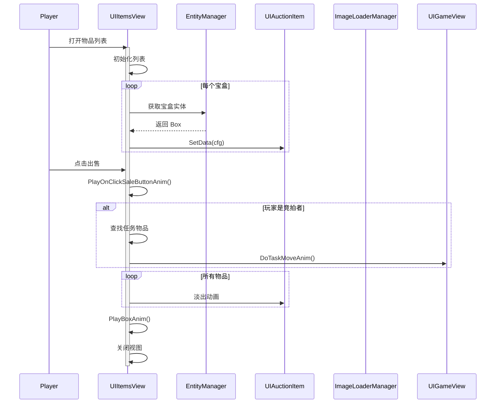

# UIItemsView.cs - 物品列表视图

## 📄 文件信息

| 属性 | 值 |
|------|------|
| 文件路径 | `Assets/Scripts/Code/Game/UIGame/UIAuction/UIItemsView.cs` |
| 命名空间 | `TaoTie` |
| 基类 | `UIBaseView` |
| 实现接口 | `IOnCreate`, `IOnEnable<List<long>>`, `IOnDisable` |

---

## 🎯 类说明

`UIItemsView` 是物品列表视图，用于在拍卖阶段展示当前所有宝盒中的物品，支持物品鉴定动画、价格变化响应、以及出售时的特效动画。

### 核心职责

- **物品展示**: 以列表形式展示所有宝盒中的物品
- **鉴定动画**: 播放宝盒开启动画（3D 物体飞入 UI）
- **价格响应**: 监听并响应物品鉴定和价格变化事件
- **出售动画**: 播放出售时的物品飞入动画和特效
- **状态管理**: 管理物品的动画完成状态

---

## 📋 字段说明

### UI 组件字段

| 字段名 | 类型 | 说明 |
|--------|------|------|
| `Space` | `UICopyGameObject` | 物品列表容器（复制游戏对象） |

### 数据字段

| 字段名 | 类型 | 说明 |
|--------|------|------|
| `boxes` | `List<long>` | 宝盒 ID 列表 |
| `items` | `UIAuctionItem[]` | 物品项组件数组（最大数量） |
| `overAnim` | `List<long>` | 已完成动画的宝盒 ID 列表 |
| `MoneyPos` | `Vector3[]` | 金钱动画起始位置数组 |
| `Money` | `BigNumber[]` | 每个物品的最终价格数组 |

---

## 🔧 方法说明

### 生命周期方法

#### `OnCreate()`
视图创建时初始化物品列表容器。

**主要功能:**
1. 初始化 `UICopyGameObject` 组件
2. 设置列表项工厂方法

#### `OnEnable(List<long> data)`
视图启用时设置宝盒数据并注册消息监听。

**参数说明:**
- `data`: 宝盒 ID 列表

**主要功能:**
1. 保存宝盒 ID 列表
2. 清空动画完成列表
3. 设置列表项数量
4. 注册价格变化和鉴定结果消息监听

#### `OnDisable()`
视图禁用时移除消息监听。

---

### 业务方法

#### `GetItemsItemByIndex(int index, GameObject obj)`
列表项工厂方法，创建或复用物品项组件。

**主要功能:**
1. 获取或创建 `UIAuctionItem` 组件
2. 如果索引超出范围：隐藏物品项
3. 否则：
   - 获取宝盒实体
   - 获取物品配置（鉴定前/后）
   - 设置物品数据
   - 计算最终价格

#### `SetChangeItemResult(int old, int result, bool isAI)`
响应物品鉴定结果，更新对应物品显示。

**参数说明:**
- `old`: 原物品 ID
- `result`: 新物品 ID
- `isAI`: 是否是 AI 操作

#### `SetChangePriceResult(int itemId, BigNumber result, bool isAI)`
响应价格变化事件，更新对应物品价格。

**参数说明:**
- `itemId`: 物品 ID
- `result`: 新价格
- `isAI`: 是否是 AI 操作

#### `GetAnimParam(out Vector3[] pos, out BigNumber[] money)`
获取金钱动画参数。

**输出:**
- `pos`: 物品图标位置数组
- `money`: 物品价格数组

#### `PlayAnim(long id, ETCancellationToken cancel)`
播放单个宝盒的开启动画。

**流程:**
1. 调用内部动画方法
2. 动画完成后刷新结算按钮视图

#### `PlayWithoutAnim()`
不播放动画直接显示所有物品。

**使用场景:** 跳过动画或快速展示

#### `PlayOnClickSaleButtonAnim(bool isMe)`
播放出售按钮点击后的动画。

**参数说明:**
- `isMe`: 当前竞拍者是否是玩家

**流程:**
1. 如果是玩家：
   - 查找任务物品
   - 播放任务物品飞入动画
2. 为所有物品播放淡出动画
3. 播放宝盒爆炸特效
4. 等待所有动画完成
5. 关闭视图并重置透明度

#### `PlayAnimInner(long id, ETCancellationToken cancel)`
内部动画方法，播放单个宝盒开启动画。

**动画流程:**
1. 获取宝盒实体和持有组件
2. 获取 3D 世界坐标起始位置
3. 加载物品图标
4. 创建临时图片对象
5. 从 3D 位置飞入 UI 位置（500ms）
6. 旋转动画（360 度）
7. 清理临时对象
8. 显示物品并高亮

#### `SingleItemItem(UIAuctionItem auctionItem, float animTime)`
播放单个物品的淡出动画。

#### `PlayBoxAnim()`
播放宝盒爆炸特效。

**场景支持:**
- `MapScene`: 正式地图场景
- `GuideScene`: 引导场景

#### `ResetCanvasGroup()`
重置所有物品项的透明度为 1。

---

## 🔄 流程图



---

## 💡 使用示例

### 打开物品列表视图

```csharp
// 获取宝盒 ID 列表
List<long> boxIds = IAuctionManager.Instance.GetUserBoxIds();

// 打开物品列表
UIManager.Instance.OpenWindow<UIItemsView, List<long>>(
    UIItemsView.PrefabPath,
    boxIds
);
```

### 播放单个宝盒开启动画

```csharp
// 播放指定宝盒的开启动画
await itemsView.PlayAnim(boxId, cancellationToken);

// 动画完成后会自动刷新结算按钮
```

### 跳过动画直接显示

```csharp
// 不播放动画直接显示所有物品
itemsView.PlayWithoutAnim();

// 适用于：
// 1. 玩家选择跳过动画
// 2. 重连后快速恢复状态
```

---

## 🔗 相关文档

- [UIAuctionItem.cs.md](./UIAuctionItem.cs.md) - 物品项组件
- [UIButtonView.cs.md](./UIButtonView.cs.md) - 结算按钮视图
- [UIGameView.cs.md](./UIGameView.cs.md) - 游戏主界面
- [Box.cs.md](../../../Entity/Box.cs.md) - 宝盒实体

---

*最后更新：2026-03-02*
