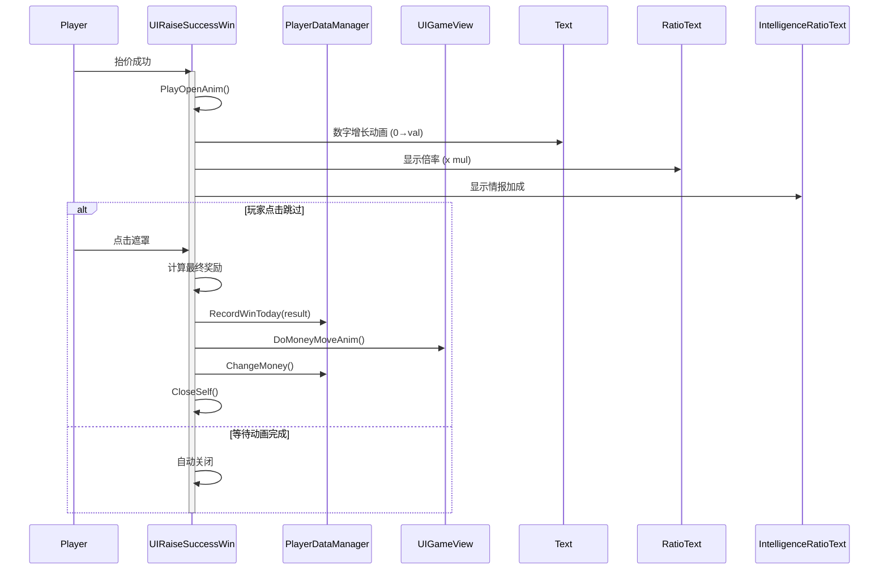

# UIRaiseSuccessWin.cs - 抬价成功窗口

## 📄 文件信息

| 属性 | 值 |
|------|------|
| 文件路径 | `Assets/Scripts/Code/Game/UIGame/UIAuction/UIRaiseSuccessWin.cs` |
| 命名空间 | `TaoTie` |
| 基类 | `UIBaseView` |
| 实现接口 | `IOnCreate`, `IOnEnable<BigNumber,float,float,bool>`, `IOnEnable<BigNumber,float>`, `IOnDisable`, `IOnDestroy` |

---

## 🎯 类说明

`UIRaiseSuccessWin` 是抬价成功窗口，当玩家成功抬价时显示，展示抬价金额、倍率奖励和情报加成效果，并播放数字增长动画。

### 核心职责

- **奖励展示**: 显示抬价基础金额和倍率
- **动画播放**: 播放数字增长和倍率显示动画
- **情报加成**: 支持显示情报带来的额外加成
- **即时完成**: 支持点击跳过动画直接领取奖励
- **金钱飞入**: 奖励领取后播放金钱飞入动画

---

## 📋 字段说明

### UI 组件字段

| 字段名 | 类型 | 说明 |
|--------|------|------|
| `Mask` | `UIPointerClick` | 遮罩层（点击关闭/跳过） |
| `Text` | `UITextmesh` | 奖励金额显示文本 |
| `RatioText` | `UITextmesh` | 倍率文本（如"x1.5"） |
| `IntelligenceRatioText` | `UITextmesh` | 情报加成文本 |
| `Win` | `UIAnimator` | 窗口动画控制器 |

### 数据字段

| 字段名 | 类型 | 说明 |
|--------|------|------|
| `val` | `BigNumber` | 基础金额 |
| `mul` | `float` | 抬价倍率 |
| `IntelligenceMul` | `float` | 情报加成倍率/数值 |
| `isMul` | `bool` | 情报加成类型（true=乘法，false=加法） |
| `cancel` | `ETCancellationToken` | 动画取消令牌 |

### 位置缓存

| 字段名 | 类型 | 说明 |
|--------|------|------|
| `RatioTextPos` | `Vector3` | 倍率文本原始位置 |
| `IntelligenceTextPos` | `Vector2` | 情报加成文本原始位置 |

### 常量

| 常量名 | 类型 | 值 | 说明 |
|--------|------|-----|------|
| `PrefabPath` | `string` | `"UIGame/UIAuction/Prefabs/UIRaiseSuccessWin.prefab"` | 预制体路径 |

---

## 🔧 方法说明

### 生命周期方法

#### `OnCreate()`
窗口创建时初始化所有 UI 组件。

#### `OnEnable(BigNumber val, float mul)`
启用窗口并显示抬价奖励（无情报加成）。

**参数说明:**
- `val`: 基础金额
- `mul`: 抬价倍率

#### `OnEnable(BigNumber val, float mul, float IntelligenceMul, bool isMul)`
启用窗口并显示抬价奖励（含情报加成）。

**参数说明:**
- `val`: 基础金额
- `mul`: 抬价倍率
- `IntelligenceMul`: 情报加成数值
- `isMul`: 情报加成类型（true=乘法，false=加法）

#### `OnDisable()` / `OnDestroy()`
窗口禁用/销毁时清理取消令牌。

#### `CloseSelf()`
关闭窗口时播放关闭动画。

---

### 业务方法

#### `PlayOpenAnim(...)`
播放打开动画。

**动画流程:**
1. 播放窗口打开动画
2. 数字从 0 增长到基础金额（400ms）
3. 显示倍率文本（缩放动画）
4. 显示情报加成文本（如果有）
5. 倍率文本飞入动画
6. 最终金额计算动画（6 次渐变，每次 50ms）
7. 最终放大效果（200ms）

#### `OnClickMaskAsync()`
处理遮罩点击（跳过动画）。

**流程:**
1. 如果动画已完成：计算最终奖励，播放金钱飞入动画，关闭窗口
2. 如果动画未完成：取消动画，立即显示最终金额

#### `CompleteImmediately()`
立即完成动画，显示最终结果。

---

## 🔄 流程图



---

## 💡 使用示例

### 显示抬价成功窗口（无情报）

```csharp
// 基础金额 1000，倍率 1.5
UIManager.Instance.OpenWindow<UIRaiseSuccessWin, BigNumber, float>(
    UIRaiseSuccessWin.PrefabPath,
    new BigNumber(1000),
    1.5f
);
```

### 显示抬价成功窗口（含情报加成）

```csharp
// 基础金额 1000，倍率 1.5，情报加成 x2（乘法）
UIManager.Instance.OpenWindow<UIRaiseSuccessWin, BigNumber, float, float, bool>(
    UIRaiseSuccessWin.PrefabPath,
    new BigNumber(1000),
    1.5f,
    2.0f,   // 情报倍率
    true    // 乘法
);

// 基础金额 1000，倍率 1.5，情报加成 +500（加法）
UIManager.Instance.OpenWindow<UIRaiseSuccessWin, BigNumber, float, float, bool>(
    UIRaiseSuccessWin.PrefabPath,
    new BigNumber(1000),
    1.5f,
    500,    // 情报加成
    false   // 加法
);
```

---

## 🔗 相关文档

- [UIGameView.cs.md](./UIGameView.cs.md) - 游戏主界面
- [PlayerDataManager.cs.md](../../../Data/PlayerDataManager.cs.md) - 玩家数据管理

---

*最后更新：2026-03-02*
