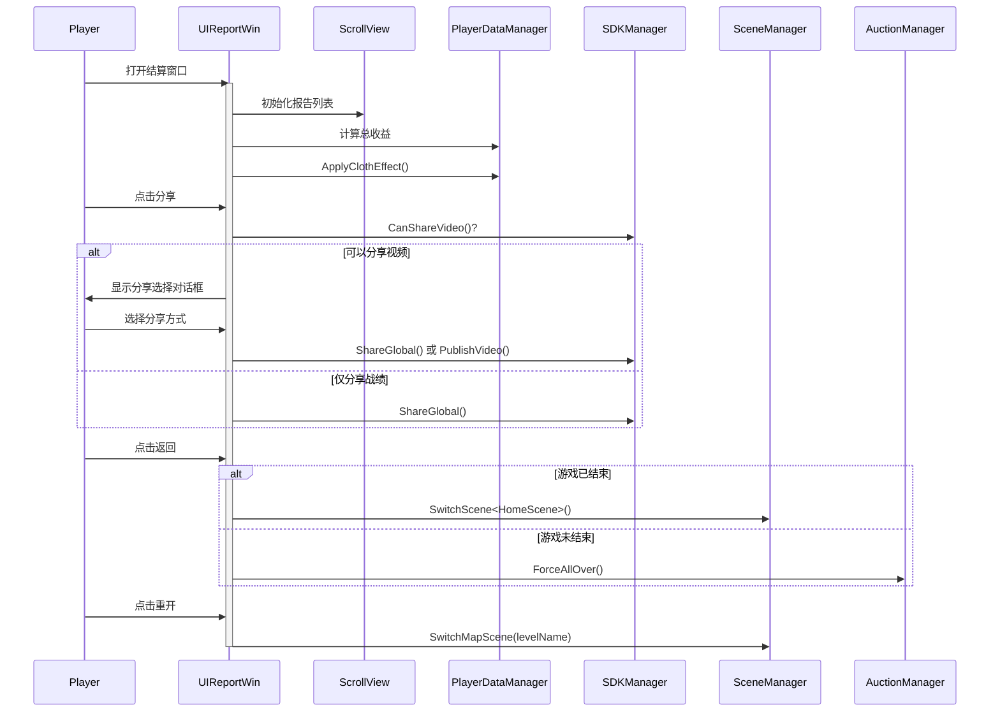

# UIReportWin.cs - 对局结算报告窗口

## 📄 文件信息

| 属性 | 值 |
|------|------|
| 文件路径 | `Assets/Scripts/Code/Game/UIGame/UIAuction/UIReportWin.cs` |
| 命名空间 | `TaoTie` |
| 基类 | `UIBaseView` |
| 实现接口 | `IOnCreate`, `IOnEnable<AuctionReport[],int>`, `IOnEnable<AuctionReport[],int,bool>`, `IOnDisable` |

---

## 🎯 类说明

`UIReportWin` 是对局结算报告窗口，在游戏结束时展示本局所有玩家的收益情况、胜负统计，并提供分享、重开等功能。

### 核心职责

- **报告展示**: 以列表形式展示所有玩家的竞拍报告
- **胜负统计**: 计算并显示玩家本局总收益
- **服装效果**: 应用服装套装的终局收益加成
- **分享功能**: 支持分享战绩或录制视频
- **场景切换**: 提供返回家园或重开游戏的选项

---

## 📋 字段说明

### UI 组件字段

| 字段名 | 类型 | 说明 |
|--------|------|------|
| `ScrollView` | `UILoopListView2` | 滚动列表视图 |
| `Task` | `UIButton` | 任务按钮 |
| `Share` | `UIButton` | 分享按钮 |
| `TextResult` | `UITextmesh` | 总收益结果文本 |
| `Back` | `UIButton` | 返回按钮 |
| `ReGame` | `UIButton` | 重开游戏按钮 |
| `ReGameText` | `UITextmesh` | 重开按钮文本 |
| `Title` | `UITextmesh` | 关卡标题 |
| `Bottom` | `UIImage` | 底部背景（颜色表示胜负） |
| `Icon` | `UIImage` | 关卡图标 |

### 状态字段

| 字段名 | 类型 | 说明 |
|--------|------|------|
| `list` | `AuctionReport[]` | 竞拍报告数组 |
| `isGameOver` | `bool` | 游戏是否结束标记 |

---

## 🔧 方法说明

### 生命周期方法

#### `OnCreate()`
窗口创建时初始化所有 UI 组件。

**主要功能:**
1. 初始化滚动列表视图
2. 绑定所有按钮点击事件
3. 添加红点等子组件

#### `OnEnable(AuctionReport[] reports, int level)`
启用窗口并显示报告（默认游戏结束状态）。

**参数说明:**
- `reports`: 竞拍报告数组
- `level`: 关卡等级

#### `OnEnable(AuctionReport[] reports, int level, bool isGameOver)`
启用窗口并设置游戏状态。

**参数说明:**
- `reports`: 竞拍报告数组
- `level`: 关卡等级
- `isGameOver`: 是否游戏结束

**主要功能:**
1. 设置游戏结束标记
2. 初始化滚动列表数据
3. 绑定所有按钮事件
4. 设置分享按钮可见性（根据 SDK 能力）
5. 计算总收益并显示
6. 根据胜负设置颜色（绿=赢，红=输）
7. 应用服装效果加成
8. 设置相机遮罩层（仅显示 UI 层）

#### `OnDisable()`
窗口禁用时恢复相机遮罩层并停止录制。

#### `GetScrollViewItemByIndex(...)`
滚动列表项工厂方法，创建或复用报告项。

---

### 业务方法

#### `ApplyClothEffect()`
应用服装套装的终局收益加成效果。

**计算逻辑:**
1. 获取 `FinalMoneyAddon` 效果百分比
2. 遍历所有报告，计算加成金额
3. 加成条件：
   - 自己的报告且终局收益 > 0
   - 或其他玩家的报告且竞拍成功次数 > 0
4. 记录收益并增加玩家金钱
5. 显示Toast 提示

#### `OnClickShareAsync()`
异步处理分享功能。

**流程:**
1. 停止游戏录制
2. 检查是否可以分享视频
3. 如果可以：显示分享选择对话框
   - 分享视频
   - 分享邀请
4. 如果不可以：直接分享全局战绩

---

### 事件处理方法

#### `OnClickTask()`
打开任务详情窗口。

#### `OnClickShare()`
触发分享功能。

#### `OnClickBack()`
处理返回按钮点击。

**逻辑:**
- 如果游戏结束：返回家园场景
- 如果游戏未结束：关闭窗口并强制结束拍卖

#### `OnClickReGame()`
处理重开游戏按钮点击。

**逻辑:**
- 如果游戏结束：重新进入地图场景
- 如果游戏未结束：恢复时间流速并关闭窗口

---

## 🔄 流程图



---

## 💡 使用示例

### 打开结算窗口（游戏结束）

```csharp
// 准备报告数据
AuctionReport[] reports = new AuctionReport[]
{
    new AuctionReport { Type = ReportType.Self, FinalUserWin = 1000 },
    new AuctionReport { Type = ReportType.Others, RaiseSuccessCount = 2 }
};

// 打开窗口
UIManager.Instance.OpenWindow<UIReportWin, AuctionReport[], int>(
    UIReportWin.PrefabPath,
    reports,
    levelId  // 关卡 ID
);
```

### 打开结算窗口（阶段结算）

```csharp
// 阶段结算（非游戏结束）
UIManager.Instance.OpenWindow<UIReportWin, AuctionReport[], int, bool>(
    UIReportWin.PrefabPath,
    reports,
    levelId,
    false  // isGameOver = false
);
```

---

## 🔗 相关文档

- [UIReportItem.cs.md](./UIReportItem.cs.md) - 报告列表项
- [AuctionReport.cs.md](../../../Data/AuctionReport.cs.md) - 竞拍报告数据结构
- [PlayerDataManager.cs.md](../../../Data/PlayerDataManager.cs.md) - 玩家数据管理
- [SDKManager.cs.md](../../../Manager/SDKManager.cs.md) - SDK 管理器

---

*最后更新：2026-03-02*
