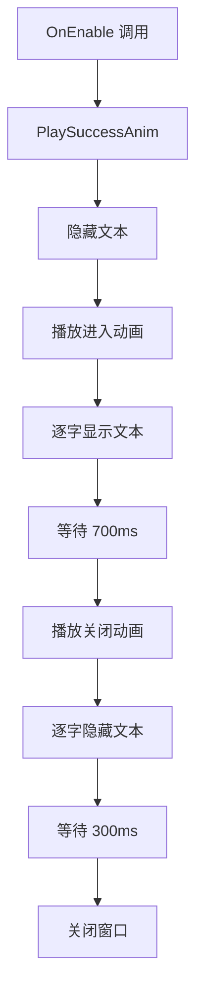

# UISuccessAuction.cs - 竞拍成功动画

## 📄 文件信息

| 属性 | 值 |
|------|------|
| 文件路径 | `Assets/Scripts/Code/Game/UIGame/UIAuction/UISuccessAuction.cs` |
| 命名空间 | `TaoTie` |
| 基类 | `UIBaseView` |
| 实现接口 | `IOnCreate`, `IOnEnable`, `IOnDisable`, `IOnWidthPaddingChange` |

---

## 🎯 类说明

`UISuccessAuction` 是竞拍成功动画组件，当玩家竞拍成功时播放"竞拍成功"文字的逐字显示和消失动画。

### 核心职责

- **文字动画**: 逐字显示"竞拍成功"文本
- **自动关闭**: 动画播放完成后自动关闭窗口
- **简洁提示**: 提供简洁的竞拍成功反馈

---

## 📋 字段说明

### UI 组件字段

| 字段名 | 类型 | 说明 |
|--------|------|------|
| `_animator` | `UIAnimator` | 窗口动画控制器 |
| `_textmesh` | `UITextmesh` | "竞拍成功"文本 |

### 常量

| 常量名 | 类型 | 值 | 说明 |
|--------|------|-----|------|
| `PrefabPath` | `string` | `"UIGame/UIAuction/Prefabs/UISuccessAuction.prefab"` | 预制体路径 |

---

## 🔧 方法说明

### 生命周期方法

#### `OnCreate()`
组件创建时初始化动画和文本组件。

#### `OnEnable()`
组件启用时播放成功动画。

#### `OnDisable()`
组件禁用时的清理（当前为空实现）。

---

### 业务方法

#### `PlaySuccessAnim()`
播放竞拍成功动画。

**动画流程:**
1. 隐藏文本
2. 播放窗口进入动画（"SuccessAuction"）
3. 逐字显示文本（每字 20ms）
4. 等待 700ms（阅读时间）
5. 播放窗口关闭动画（"CloseAuction"）
6. 逐字隐藏文本（每字 50ms）
7. 等待 300ms
8. 关闭窗口

---

## 🔄 流程图



---

## 💡 使用示例

### 播放竞拍成功动画

```csharp
// 当玩家竞拍成功时
if (IAuctionManager.Instance.LastAuctionPlayerId == PlayerDataManager.Instance.PlayerId)
{
    UIManager.Instance.OpenWindow<UISuccessAuction>(UISuccessAuction.PrefabPath);
}

// 窗口会自动：
// 1. 播放进入动画
// 2. 逐字显示"竞拍成功"
// 3. 等待阅读时间
// 4. 播放关闭动画
// 5. 自动关闭
```

---

## 🔗 相关文档

- [UIGameView.cs.md](./UIGameView.cs.md) - 游戏主界面
- [AuctionManager.cs.md](../../../System/Auction/AuctionManager.cs.md) - 拍卖管理器

---

*最后更新：2026-03-02*
