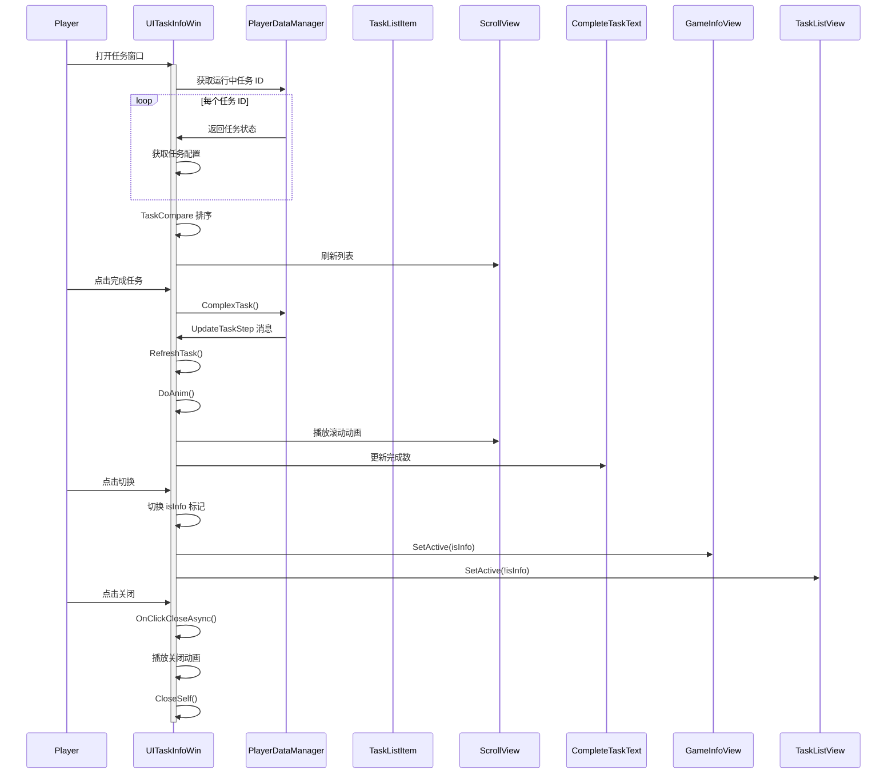

# UITaskInfoWin.cs - 任务详情窗口

## 📄 文件信息

| 属性 | 值 |
|------|------|
| 文件路径 | `Assets/Scripts/Code/Game/UIGame/UIAuction/UITaskInfoWin.cs` |
| 命名空间 | `TaoTie` |
| 基类 | `UIBaseView` |
| 实现接口 | `IOnCreate`, `IOnEnable<bool,BigNumber>`, `IOnWidthPaddingChange`, `IOnDisable` |

---

## 🎯 类说明

`UITaskInfoWin` 是任务详情窗口，展示玩家当前的每日任务列表、完成进度、今日已完成数量，并支持切换显示当前情报信息。

### 核心职责

- **任务列表**: 以滚动列表形式展示所有进行中的任务
- **任务排序**: 按完成状态、解锁状态、进度等智能排序
- **情报切换**: 支持在任务列表和情报信息之间切换
- **进度刷新**: 实时监听任务进度变化并刷新列表
- **完成动画**: 任务完成时播放列表滚动动画

---

## 📋 字段说明

### UI 组件字段

| 字段名 | 类型 | 说明 |
|--------|------|------|
| `GameInfoView` | `UIGameInfoView` | 情报信息视图 |
| `TaskListView` | `UIEmptyView` | 任务列表容器 |
| `Close` | `UIPointerClick` | 关闭按钮 |
| `ScrollView` | `UILoopListView2` | 任务滚动列表 |
| `Top` | `UICashGroup` | 顶部金币显示 |
| `Animator` | `UIAnimator` | 窗口动画控制器 |
| `ChangeBtn` | `UIButton` | 切换按钮（任务/情报） |
| `Title1/Title2` | `UIEmptyView` | 标题容器 |
| `CompleteTaskText` | `UITextmesh` | 今日完成任务数文本 |

### 数据字段

| 字段名 | 类型 | 说明 |
|--------|------|------|
| `tasks` | `List<TaskConfig>` | 任务配置列表 |
| `isInfo` | `bool` | 是否显示情报模式 |
| `completeTask` | `int` | 已完成任务数量 |
| `positionList` | `List<TaskData>` | 任务位置缓存（用于动画） |
| `isClose` | `bool` | 关闭标记（防止重复点击） |

### 常量

| 常量名 | 类型 | 值 | 说明 |
|--------|------|-----|------|
| `PrefabPath` | `string` | `"UIGame/UIAuction/Prefabs/UITaskInfoWin.prefab"` | 预制体路径 |

---

## 🔧 方法说明

### 生命周期方法

#### `OnCreate()`
窗口创建时初始化所有 UI 组件。

**主要功能:**
1. 初始化所有 UI 组件引用
2. 初始化滚动列表
3. 设置国际化文本
4. 绑定关闭按钮事件

#### `OnEnable(bool isInfo, BigNumber num)`
窗口启用时设置数据并刷新显示。

**参数说明:**
- `isInfo`: 是否显示情报模式
- `num`: 玩家当前金钱

**主要功能:**
1. 播放打开音效
2. 设置顶部金币显示
3. 获取所有进行中的任务
4. 统计已完成任务数量
5. 任务排序
6. 刷新滚动列表
7. 显示情报信息（如果有）
8. 设置切换按钮状态
9. 注册任务更新消息监听

#### `OnDisable()`
窗口禁用时清理资源。

**主要功能:**
1. 移除消息监听
2. 恢复游戏时间流速
3. 通知 UIGameView 窗口已关闭

---

### 业务方法

#### `TaskCompare(TaskConfig task1, TaskConfig task2)`
任务排序比较函数。

**排序优先级:**
1. 完成状态（未完成优先）
2. 解锁状态（已解锁优先）
3. 进度状态（已达上限优先）
4. 是否有进度（有进度优先）
5. 剩余数量（剩余少优先）
6. 总数量（数量多优先）
7. 稀有度（稀有度高优先）

#### `UpdateTaskStep()`
响应任务进度更新消息，刷新列表。

#### `RefreshTask()`
重新获取并排序任务列表。

#### `UpdateTaskList()`
更新任务列表并保持滚动位置。

#### `DoAnim(TaskListItem overItem, int overTaskCount)`
播放任务完成后的列表滚动动画。

**流程:**
1. 缓存相关任务项的当前位置
2. 播放 200ms 位置过渡动画
3. 更新任务列表
4. 更新完成任务数显示

---

### 事件处理方法

#### `OnClickClose()`
处理关闭按钮点击。

#### `OnClickCloseAsync()`
异步关闭窗口。

**流程:**
1. 播放关闭音效
2. 播放关闭动画
3. 关闭窗口

#### `OnChange()`
切换任务/情报显示模式。

#### `GetScrollViewItemByIndex(...)`
滚动列表项工厂方法。

---

## 🔄 流程图



---

## 💡 使用示例

### 打开任务详情窗口

```csharp
// 打开任务列表模式
UIManager.Instance.OpenWindow<UITaskInfoWin, bool, BigNumber>(
    UITaskInfoWin.PrefabPath,
    false,  // isInfo = false，显示任务列表
    PlayerDataManager.Instance.TotalMoney
);

// 打开情报模式
UIManager.Instance.OpenWindow<UITaskInfoWin, bool, BigNumber>(
    UITaskInfoWin.PrefabPath,
    true,   // isInfo = true，显示情报信息
    PlayerDataManager.Instance.TotalMoney
);
```

### 任务排序示例

```csharp
// 排序逻辑（优先级从高到低）：
// 1. 未完成的任务 > 已完成的任务
// 2. 已解锁的建筑 > 未解锁的建筑
// 3. 已达领取条件的任务 > 未达到的任务
// 4. 有进度的任务 > 无进度的任务
// 5. 剩余数量少的 > 剩余数量多的
// 6. 总数量多的 > 总数量少的
// 7. 稀有度高的 > 稀有度低的
```

---

## 🔗 相关文档

- [TaskListItem.cs.md](./TaskListItem.cs.md) - 任务列表项
- [UIGameInfoView.cs.md](./UIGameInfoView.cs.md) - 情报信息视图
- [TaskConfig.cs.md](../../../../Module/Generate/Config/TaskConfig.cs.md) - 任务配置表
- [PlayerDataManager.cs.md](../../../Data/PlayerDataManager.cs.md) - 玩家数据管理

---

*最后更新：2026-03-02*
