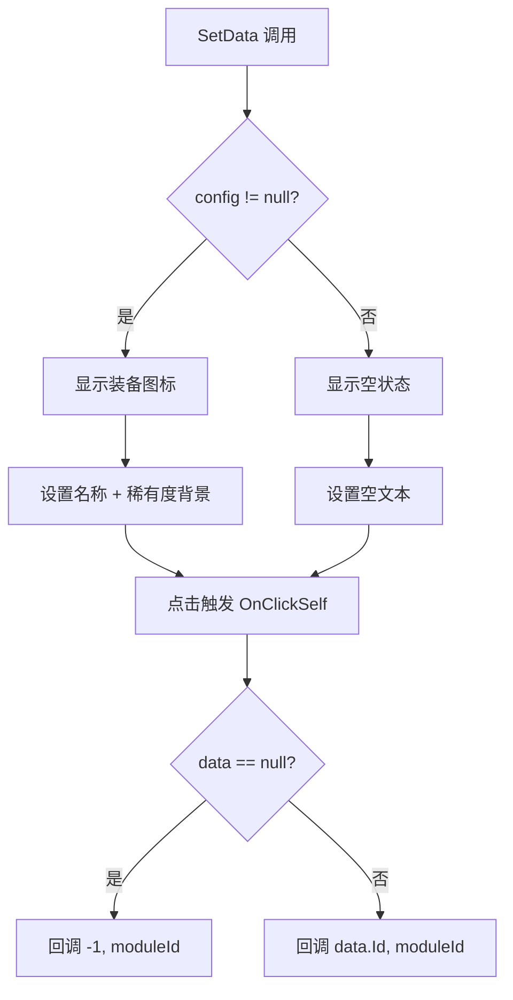

# ClothItem.cs 注解文档

## 文件基本信息

| 属性 | 值 |
|------|-----|
| **文件名** | ClothItem.cs |
| **路径** | Assets/Scripts/Code/Game/UIGame/UICreate/ClothItem.cs |
| **所属模块** | 游戏层 → Code/Game/UIGame/UICreate |
| **文件职责** | 装备物品显示项，展示单个装备的图标、名称、稀有度，用于背包和商店列表 |

---

## 类/结构体说明

### ClothItem

| 属性 | 说明 |
|------|------|
| **职责** | 显示单个装备的视觉信息，包括图标、名称、稀有度背景，支持空状态显示 |
| **泛型参数** | 无 |
| **继承关系** | `UIBaseContainer` |
| **实现的接口** | `IOnCreate` |

**设计模式**: 组件化

```csharp
// 在 TableItem 中初始化
Cloths = new ClothItem[4];
for (int i = 0; i < Cloths.Length; i++)
{
    Cloths[i] = AddComponent<ClothItem>("ClothItem"+i);
}
```

---

## 字段与属性（按重要程度排序）

| 名称 | 类型 | 访问级别 | 说明 |
|------|------|----------|------|
| `button` | `UIButton` | `public` | 点击按钮 |
| `Icon` | `UIImage` | `public` | 装备图标 |
| `Name` | `UITextmesh` | `public` | 装备名称 |
| `Rare` | `UIImage` | `public` | 稀有度背景 |
| `onClickItem` | `Action<int,int>` | `private` | 点击回调 |
| `moduleId` | `int` | `private` | 模块 ID |
| `data` | `ClothConfig` | `private` | 装备配置数据 |

---

## 方法说明（按重要程度排序）

### OnCreate()

**签名**:
```csharp
public void OnCreate()
```

**职责**: 初始化组件

**核心逻辑**:
```
1. 添加 Rare 稀有度背景
2. 添加 Name 名称文本
3. 添加 button 按钮
4. 添加 Icon 图标
5. 绑定按钮点击事件 OnClickSelf
```

**调用者**: 父视图通过 AddComponent 调用

---

### SetData(ClothConfig config, Action<int,int> onClickItem, int moduleId)

**签名**:
```csharp
public void SetData(ClothConfig config, Action<int,int> onClickItem, int moduleId)
```

**职责**: 设置装备数据

**核心逻辑**:
```
1. 保存 data、moduleId、onClickItem
2. 根据 data 是否为 null 设置 Icon 和 Rare 的显示状态
3. 如果 data != null:
   - 设置 Icon 为装备图标
   - 设置 Name 为装备名称 (国际化)
   - 获取稀有度图标
   - 设置 Rare 背景为稀有度背景
4. 如果 data == null:
   - 设置 Name 为空文本 (I18NKey.Text_Empty)
```

**调用者**: TableItem.SetData, ShopItem.SetData

**被调用者**: `I18NManager.Instance.I18NGetText()`, `RareConfigCategory.Instance.GetRare()`

---

### OnClickSelf()

**签名**:
```csharp
public void OnClickSelf()
```

**职责**: 处理点击事件

**核心逻辑**:
```
1. 如果 data == null → 调用 onClickItem(-1, moduleId) (卸下/空位)
2. 否则 → 调用 onClickItem(data.Id, moduleId) (装备该物品)
```

**调用者**: button 点击事件

---

## 显示状态



---

## 使用示例

### 在 TableItem 中使用

```csharp
public class TableItem : UIBaseContainer, IOnCreate
{
    public ClothItem[] Cloths;
    
    public void OnCreate()
    {
        Cloths = new ClothItem[4];
        for (int i = 0; i < Cloths.Length; i++)
        {
            Cloths[i] = AddComponent<ClothItem>("ClothItem"+i);
        }
    }

    public void SetData(int moduleId, List<ClothConfig> data, int tab = 0, 
                        Action<int,int> onClickItem = null)
    {
        for (int i = 0; i < 4; i++)
        {
            var index = tab * 4 + i - 1;
            Cloths[i].SetActive(index < data.Count);
            if (index < data.Count)
            {
                Cloths[i].SetData(
                    index >= 0 ? data[index] : null, 
                    index >= data.Count ? null : onClickItem,
                    moduleId);
            }
        }
    }
}
```

### 在 ShopItem 中使用

```csharp
public class ShopItem : UIBaseContainer, IOnCreate
{
    public ClothItem ClothItem;
    
    public void SetData(int id, Action<int, int> onClickItem)
    {
        var config = ClothConfigCategory.Instance.Get(id);
        ClothItem.SetData(config, onClickItem, config.Module);
    }
}
```

---

## 相关文档

- [TableItem.cs.md](./TableItem.cs.md) - 父容器 (背包列表项)
- [ShopItem.cs.md](./ShopItem.cs.md) - 父容器 (商店商品项)
- [ClothConfig.cs.md](../../../Config/ClothConfig.cs.md) - 装备配置
- [RareConfig.cs.md](../../../Config/RareConfig.cs.md) - 稀有度配置

---

*文档生成时间：2026-03-02 | OpenClaw AI 助手*
