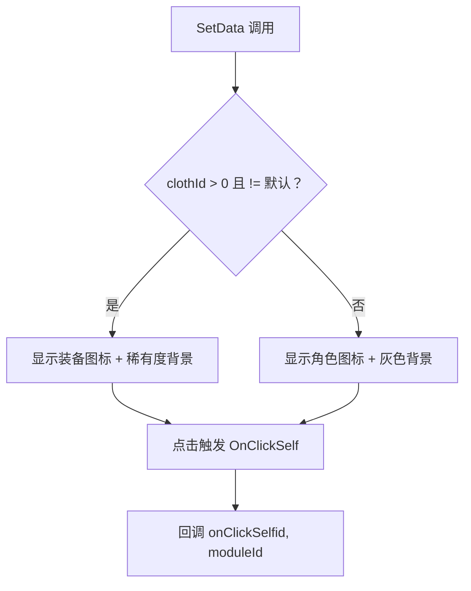

# CreateItem.cs 注解文档

## 文件基本信息

| 属性 | 值 |
|------|-----|
| **文件名** | CreateItem.cs |
| **路径** | Assets/Scripts/Code/Game/UIGame/UICreate/CreateItem.cs |
| **所属模块** | 游戏层 → Code/Game/UIGame/UICreate |
| **文件职责** | 角色创建界面的装备槽位显示项，展示当前装备的图标和稀有度 |

---

## 类/结构体说明

### CreateItem

| 属性 | 说明 |
|------|------|
| **职责** | 显示角色某个模块的当前装备状态，支持点击切换装备 |
| **泛型参数** | 无 |
| **继承关系** | `UIBaseContainer` |
| **实现的接口** | `IOnCreate` |

**设计模式**: 组件化

```csharp
// 在 UICreateView 中初始化
Item = new CreateItem[8];
for (int i = 0; i < Item.Length; i++)
{
    Item[i] = AddComponent<CreateItem>("UICommonView/Bg/Content/Items/Item"+i);
}
```

---

## 字段与属性（按重要程度排序）

| 名称 | 类型 | 访问级别 | 说明 |
|------|------|----------|------|
| `Button` | `UIButton` | `public` | 点击按钮 (包含稀有度背景) |
| `Type` | `UIImage` | `public` | 装备类型图标 |
| `onClickSelf` | `Action<int, int>` | `private` | 点击回调 |
| `id` | `int` | `private` | 当前装备 ID |
| `moduleId` | `int` | `private` | 模块 ID |

---

## 方法说明（按重要程度排序）

### OnCreate()

**签名**:
```csharp
public void OnCreate()
```

**职责**: 初始化组件

**核心逻辑**:
```
1. 添加 Button 按钮组件
2. 添加 Type 类型图标
3. 绑定按钮点击事件 OnClickSelf
```

**调用者**: 父视图通过 AddComponent 调用

---

### SetData(int moduleId, Action<int, int> onClick, int clothId)

**签名**:
```csharp
public void SetData(int moduleId, Action<int, int> onClick, int clothId)
```

**职责**: 设置装备槽位数据

**核心逻辑**:
```
1. 保存点击回调、moduleId、clothId
2. 获取角色配置 CharacterConfigCategory.Instance.Get(moduleId)
3. 如果 clothId != 默认装备 且 clothId > 0:
   - 获取装备配置 ClothConfigCategory.Instance.Get(clothId)
   - 设置 Type 图标为装备图标
   - 获取稀有度图标
   - 设置 Button 背景为稀有度背景
4. 否则 (默认装备或未装备):
   - 设置 Type 图标为角色类型图标
   - 设置 Button 背景为灰色 (未装备状态)
```

**调用者**: UICreateView.OnEnable, OnEquipItem

**被调用者**: `CharacterConfigCategory.Instance.Get()`, `ClothConfigCategory.Instance.Get()`, `RareConfigCategory.Instance.GetRare()`

---

### OnClickSelf()

**签名**:
```csharp
private void OnClickSelf()
```

**职责**: 处理点击事件

**核心逻辑**:
```
1. 调用 onClickSelf?.Invoke(id, moduleId)
```

**调用者**: Button 点击事件

---

## 显示状态



---

## 使用示例

### 在 UICreateView 中初始化

```csharp
public class UICreateView : UIBaseView, IOnCreate, IOnEnable<Player>
{
    public CreateItem[] Item;
    
    public void OnCreate()
    {
        Item = new CreateItem[8];
        for (int i = 0; i < Item.Length; i++)
        {
            Item[i] = AddComponent<CreateItem>("UICommonView/Bg/Content/Items/Item"+i);
        }
    }
    
    public void OnEnable(Player player)
    {
        for (int i = 0; i < Item.Length; i++)
        {
            // 模块 ID 从 2 开始 (0-1 保留)
            Item[i].SetData(i + 2, OnClickEquipItem, PlayerDataManager.Instance.Show[i + 1]);
        }
    }
    
    private void OnClickEquipItem(int id, int moduleId)
    {
        ShowList(moduleId);
        if (id > 0)
        {
            OnClickItem(id, moduleId);
        }
    }
}
```

---

## 相关文档

- [UICreateView.cs.md](./UICreateView.cs.md) - 父视图
- [ClothConfig.cs.md](../../../Config/ClothConfig.cs.md) - 装备配置
- [CharacterConfig.cs.md](../../../Config/CharacterConfig.cs.md) - 角色配置
- [RareConfig.cs.md](../../../Config/RareConfig.cs.md) - 稀有度配置

---

*文档生成时间：2026-03-02 | OpenClaw AI 助手*
