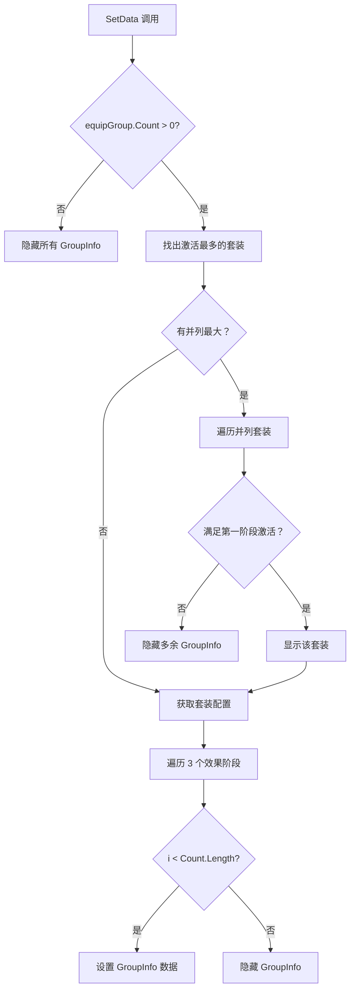

# GroupInfoTable.cs 注解文档

## 文件基本信息

| 属性 | 值 |
|------|-----|
| **文件名** | GroupInfoTable.cs |
| **路径** | Assets/Scripts/Code/Game/UIGame/UICreate/GroupInfoTable.cs |
| **所属模块** | 游戏层 → Code/Game/UIGame/UICreate |
| **文件职责** | 套装激活信息显示表，展示当前装备的套装激活进度和效果 |

---

## 类/结构体说明

### GroupInfoTable

| 属性 | 说明 |
|------|------|
| **职责** | 显示套装激活信息，找出激活数量最多的套装并展示其效果进度 |
| **泛型参数** | 无 |
| **继承关系** | `UIBaseContainer` |
| **实现的接口** | `IOnCreate` |

**设计模式**: 组件化

```csharp
// 在 UIBagWin 或 UIShopWin 中
GroupInfoTable = AddComponent<GroupInfoTable>("Top/Tip");
```

---

## 字段与属性（按重要程度排序）

| 名称 | 类型 | 访问级别 | 说明 |
|------|------|----------|------|
| `GroupInfos` | `GroupInfo[]` | `public` | 3 个套装效果显示项 |

---

## 方法说明（按重要程度排序）

### OnCreate()

**签名**:
```csharp
public void OnCreate()
```

**职责**: 初始化组件

**核心逻辑**:
```
1. 初始化 3 个 GroupInfo 数组
2. 为每个 GroupInfo 添加组件 ("GroupInfo0" - "GroupInfo2")
```

**调用者**: 父视图通过 AddComponent 调用

---

### SetData(Dictionary<int, int> equipGroup)

**签名**:
```csharp
public void SetData(Dictionary<int, int> equipGroup)
```

**职责**: 设置套装数据

**核心逻辑**:
```
1. 根据 equipGroup.Count 设置 GroupInfos 显示状态
2. 如果 equipGroup 为空 → 隐藏所有 GroupInfo 并返回
3. 遍历字典找出激活数量最多的套装:
   - 记录最大数量 max 和对应套装 ID top
   - 统计并列最大值数量 sameMax
4. 如果有多个套装并列最大:
   - 遍历所有并列套装
   - 获取套装配置，检查是否满足第一阶段激活条件
   - 如果满足 → 显示该套装的第一阶段效果
   - 如果找不到满足条件的套装 → 隐藏多余的 GroupInfo 并返回
5. 获取套装配置 EquipGroupConfig
6. 遍历 3 个 GroupInfo:
   - 如果 i < groupConfig.Count.Length → 设置数据
   - 否则 → 隐藏
```

**参数说明**:
- `equipGroup`: 字典，key=套装 ID，value=激活数量

**调用者**: UICreateView.RefreshGroupInfo

**被调用者**: `EquipGroupConfigCategory.Instance.TryGet()`, `GroupInfo.SetData()`

---

## 套装激活逻辑



---

## 使用示例

### 在 UIBagWin 中使用

```csharp
public class UIBagWin : UIBaseContainer, IOnCreate
{
    public GroupInfoTable GroupInfoTable;
    
    public void OnCreate()
    {
        GroupInfoTable = AddComponent<GroupInfoTable>("Top/Tip");
    }
    
    public void ShowList(int id)
    {
        // ... 刷新装备列表
        
        // 套装信息会在父视图 RefreshGroupInfo 中更新
    }
}
```

### 在 UICreateView 中更新

```csharp
public class UICreateView : UIBaseView
{
    private void RefreshGroupInfo()
    {
        using DictionaryComponent<int, int> temp = DictionaryComponent<int, int>.Create();
        
        // 统计各套装激活数量
        for (int i = 1; i < player.SubModule.Length; i++)
        {
            var module = CharacterConfigCategory.Instance.Get(i + 1);
            if (player.SubModule[i] != 0 && module.DefaultCloth != player.SubModule[i])
            {
                var cloth = ClothConfigCategory.Instance.Get(player.SubModule[i]);
                if (cloth.GroupId > 0)
                {
                    if (temp.ContainsKey(cloth.GroupId))
                    {
                        temp[cloth.GroupId]++;
                    }
                    else
                    {
                        temp[cloth.GroupId] = 1;
                    }
                }
            }
        }

        // 设置套装信息
        BagWin.GroupInfoTable.SetData(temp);
        ShopWin.GroupInfoTable.SetData(temp);
    }
}
```

---

## 数据结构示例

```csharp
// equipGroup 字典示例
Dictionary<int, int> equipGroup = new Dictionary<int, int>
{
    { 101, 2 },  // 套装 101 激活 2 件
    { 102, 3 },  // 套装 102 激活 3 件 (最多)
    { 103, 1 }   // 套装 103 激活 1 件
};

// GroupInfo 显示:
// GroupInfo0: 2/3 (已激活) - 第一阶段效果
// GroupInfo1: 3/5 (未激活) - 第二阶段效果
// GroupInfo2: 5/5 (未激活) - 第三阶段效果
```

---

## 相关文档

- [UICreateView.cs.md](./UICreateView.cs.md) - 调用方
- [UIBagWin.cs.md](./UIBagWin.cs.md) - 背包窗口
- [UIShopWin.cs.md](./UIShopWin.cs.md) - 商店窗口
- [GroupInfo.cs.md](./GroupInfo.cs.md) - 套装效果项
- [EquipGroupConfig.cs.md](../../../Config/EquipGroupConfig.cs.md) - 套装配置
- [ClothConfig.cs.md](../../../Config/ClothConfig.cs.md) - 装备配置

---

*文档生成时间：2026-03-02 | OpenClaw AI 助手*
