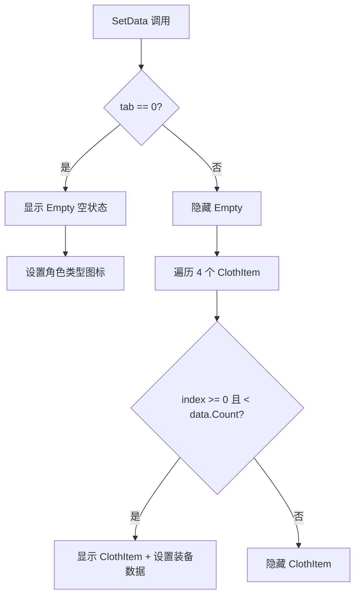

# TableItem.cs 注解文档

## 文件基本信息

| 属性 | 值 |
|------|-----|
| **文件名** | TableItem.cs |
| **路径** | Assets/Scripts/Code/Game/UIGame/UICreate/TableItem.cs |
| **所属模块** | 游戏层 → Code/Game/UIGame/UICreate |
| **文件职责** | 背包滚动列表项，每行显示 4 个装备物品，支持空状态显示 |

---

## 类/结构体说明

### TableItem

| 属性 | 说明 |
|------|------|
| **职责** | 作为 UILoopListView2 的列表项，每行显示 4 个装备物品，用于背包界面的虚拟列表 |
| **泛型参数** | 无 |
| **继承关系** | `UIBaseContainer` |
| **实现的接口** | `IOnCreate` |

**设计模式**: 组件化 + 虚拟列表项

```csharp
// 在 UIBagWin 的滚动列表中使用
var item = listView.NewListViewItem("TableItem", index);
TableItem tableItem = ScrollView.GetUIItemView<TableItem>(item);
tableItem.SetData(moduleId, clothConfigs, index, OnClickItem);
```

---

## 字段与属性（按重要程度排序）

| 名称 | 类型 | 访问级别 | 说明 |
|------|------|----------|------|
| `Cloths` | `ClothItem[]` | `public` | 4 个装备显示项数组 |
| `Empty` | `UIEmptyView` | `public` | 空状态视图 |
| `EmptyImage` | `UIImage` | `public` | 空状态图标 |

---

## 方法说明（按重要程度排序）

### OnCreate()

**签名**:
```csharp
public void OnCreate()
```

**职责**: 初始化组件

**核心逻辑**:
```
1. 初始化 4 个 ClothItem 数组
2. 为每个 ClothItem 添加组件 ("ClothItem0" - "ClothItem3")
3. 添加 Empty 空状态视图 (在 ClothItem0 下)
4. 添加 EmptyImage 空状态图标
```

**调用者**: UILoopListView2 创建列表项时

---

### SetData(int moduleId, List<ClothConfig> data, int tab, Action<int,int> onClickItem)

**签名**:
```csharp
public void SetData(int moduleId, List<ClothConfig> data, int tab = 0, 
                    Action<int,int> onClickItem = null)
```

**职责**: 设置列表项数据

**核心逻辑**:
```
1. 如果 tab == 0 → 显示 Empty 空状态，否则隐藏
2. 遍历 4 个 ClothItem:
   - 计算物品索引 index = tab * 4 + i - 1
   - 根据 index 是否在 data 范围内设置显示状态
   - 如果 index >= 0 且 < data.Count → 设置 ClothItem 数据
   - 如果 index < 0 (第一行第一个位置) → 传递 null (空位)
   - 如果 index >= data.Count → 传递 null (空位)
3. 如果 tab == 0:
   - 获取角色配置
   - 设置 EmptyImage 为角色类型图标
```

**参数说明**:
- `moduleId`: 模块 ID (装备类型)
- `data`: 装备配置列表
- `tab`: 表格索引 (0=空状态页，1+=数据页)
- `onClickItem`: 点击回调

**调用者**: UIBagWin.GetScrollViewItemByIndex

---

## 列表项结构

```
TableItem
├── ClothItem0
│   ├── Icon (UIImage)
│   ├── Name (UITextmesh)
│   ├── Rare (UIImage)
│   └── Empty (UIEmptyView) [仅 tab=0 时显示]
│       └── Icon (UIImage) [角色类型图标]
├── ClothItem1
├── ClothItem2
└── ClothItem3
```

---

## 使用示例

### 在 UIBagWin 中使用

```csharp
public class UIBagWin : UIBaseContainer, IOnCreate
{
    public UILoopListView2 ScrollView;
    
    public void OnCreate()
    {
        ScrollView = AddComponent<UILoopListView2>("ScrollView");
        ScrollView.InitListView(0, GetScrollViewItemByIndex);
    }
    
    public LoopListViewItem2 GetScrollViewItemByIndex(LoopListView2 listView, int index)
    {
        var table = (clothConfigs.Count + 4) / 4;
        if (index < 0 || index >= table) return null;
        
        var item = listView.NewListViewItem("TableItem", index);
        TableItem tableItem;
        
        if (!item.IsInitHandlerCalled)
        {
            item.IsInitHandlerCalled = true;
            tableItem = ScrollView.AddItemViewComponent<TableItem>(item);
        }
        else
        {
            tableItem = ScrollView.GetUIItemView<TableItem>(item);
        }
        
        // 设置列表项尺寸
        var y = tableItem.GetRectTransform().sizeDelta.y;
        var x = ScrollView.GetRectTransform().rect.width;
        tableItem.GetRectTransform().sizeDelta = new Vector2(x, y);
        
        // 设置数据 (tab = index + 1, 因为 0 是空状态页)
        tableItem.SetData(moduleId, clothConfigs, index + 1, OnClickItem);
        return item;
    }
}
```

---

## 渲染逻辑



---

## 相关文档

- [UIBagWin.cs.md](./UIBagWin.cs.md) - 父视图 (背包窗口)
- [UILoopListView2.cs.md](../../Module/UIComponent/UILoopListView2.cs.md) - 滚动列表
- [ClothItem.cs.md](./ClothItem.cs.md) - 装备显示项
- [UIEmptyView.cs.md](../../Module/UIComponent/UIEmptyView.cs.md) - 空视图

---

*文档生成时间：2026-03-02 | OpenClaw AI 助手*
