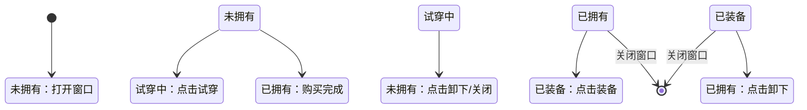

# UIEquipWin.cs 注解文档

## 文件基本信息

| 属性 | 值 |
|------|-----|
| **文件名** | UIEquipWin.cs |
| **路径** | Assets/Scripts/Code/Game/UIGame/UICreate/UIEquipWin.cs |
| **所属模块** | 游戏层 → Code/Game/UIGame/UICreate |
| **文件职责** | 装备详情窗口，显示装备信息、效果、套装加成，支持试穿和购买 |

---

## 类/结构体说明

### UIEquipWin

| 属性 | 说明 |
|------|------|
| **职责** | 展示单个装备的详细信息，包括稀有度、效果、套装激活状态，支持试穿/购买操作 |
| **泛型参数** | 无 |
| **继承关系** | `UIBaseView` |
| **实现的接口** | `IOnCreate`, `IOnEnable<int, Action<int,int>, Player>` |

**设计模式**: MVC 视图层

```csharp
// 通过 UIManager 打开
UIManager.Instance.OpenWindow<UIEquipWin, int, Action<int,int>, Player>(
    UIEquipWin.PrefabPath, id, OnEquipItem, player);
```

---

## 字段与属性（按重要程度排序）

| 名称 | 类型 | 访问级别 | 说明 |
|------|------|----------|------|
| `PrefabPath` | `string` | `public static` | 预制体路径 "UIGame/UICreate/Prefabs/UIEquipWin.prefab" |
| `Close` | `UIButton` | `public` | 关闭按钮 |
| `Rare` | `UIImage` | `public` | 稀有度背景图 |
| `Icon` | `UIImage` | `public` | 装备图标 |
| `Name` | `UITextmesh` | `public` | 装备名称 |
| `HeadTitle` | `UITextmesh` | `public` | 窗口标题 |
| `Title` | `UITextmesh` | `public` | 装备类型标题 |
| `Details` | `UITextmesh` | `public` | 效果详情文本 |
| `Try` | `UIButton` | `public` | 试穿按钮 |
| `TryText` | `UITextmesh` | `public` | 试穿按钮文本 |
| `Control` | `UIButton` | `public` | 控制按钮 (购买/装备/卸下) |
| `ControlText` | `UITextmesh` | `public` | 控制按钮文本 |
| `EffectGroup` | `UICopyGameObject` | `public` | 套装效果列表容器 |
| `UICommonWin` | `UIAnimator` | `public` | 窗口动画控制器 |
| `equipId` | `int` | `private` | 当前装备 ID |
| `Config` | `ClothConfig` | `public` | 当前装备配置 (计算属性) |
| `groupConfig` | `EquipGroupConfig` | `private` | 套装配置 |
| `onClickItem` | `Action<int,int>` | `private` | 装备回调 |
| `player` | `Player` | `private` | 玩家数据 |
| `groupCount` | `int` | `private` | 当前套装激活数量 |

---

## 方法说明（按重要程度排序）

### OnCreate()

**签名**:
```csharp
public void OnCreate()
```

**职责**: 初始化装备详情窗口组件

**核心逻辑**:
```
1. 添加 UICommonWin 动画组件
2. 添加 HeadTitle 标题文本
3. 添加 Close 关闭按钮
4. 添加 Rare 稀有度图片
5. 添加 Icon 装备图标
6. 添加 Name 名称文本
7. 添加 Title 类型标题
8. 添加 Details 效果详情
9. 添加 Try 试穿按钮
10. 添加 TryText 试穿文本
11. 添加 Control 控制按钮
12. 添加 ControlText 控制文本
13. 添加 EffectGroup 套装效果列表并初始化
```

**调用者**: UIManager 创建窗口时

---

### OnEnable(int id, Action<int,int> onClickItem, Player player)

**签名**:
```csharp
public void OnEnable(int id, Action<int,int> onClickItem, Player player)
```

**职责**: 启用窗口时设置装备数据

**核心逻辑**:
```
1. 播放窗口打开音效
2. 保存 player、onClickItem、equipId
3. 获取装备配置 Config
4. 设置图标、名称、稀有度背景
5. 设置装备类型标题
6. 设置效果详情文本 (根据 EffectType)
7. 绑定 Close 和 Try 按钮事件
8. 获取套装配置 (如果 GroupId>0)
9. 设置套装效果列表数量
10. 刷新状态 RefreshState()
```

**调用者**: UIManager 打开窗口时

**被调用者**: `ClothConfigCategory.Instance.Get()`, `RefreshState()`

---

### OnClickEquip()

**签名**:
```csharp
public void OnClickEquip()
```

**职责**: 处理试穿/装备按钮点击

**核心逻辑**:
```
1. 获取装备模块 ID
2. 检查是否已装备
3. 如果已装备 → 调用 onClickItem(-1, module) 卸下
4. 如果未装备 → 调用 onClickItem(equipId, module) 装备
5. 刷新状态
6. 关闭窗口
```

**调用者**: Try 按钮点击

**被调用者**: `onClickItem?.Invoke()`, `RefreshState()`, `CloseSelf()`

---

### OnClickBuy()

**签名**:
```csharp
public void OnClickBuy()
```

**职责**: 处理购买按钮点击

**核心逻辑**:
```
1. 检查是否已拥有
   - 是 → 显示已拥有提示
2. 根据获取方式处理:
   - GetWay=0(广告) → 调用 OnClickAdAsync()
   - GetWay=1(金币) → 检查金币是否足够
     - 足够 → 扣除金币，增加物品，关闭窗口
     - 不足 → 显示金币不足提示
```

**调用者**: Control 按钮点击 (当 ControlText 为"购买"时)

**被调用者**: `AdManager.PlayAd()`, `PlayerDataManager.ChangeMoney()`, `PlayerDataManager.ChangeItem()`

---

### OnClickAdAsync()

**签名**:
```csharp
private async ETTask OnClickAdAsync()
```

**职责**: 异步处理广告观看购买

**核心逻辑**:
```
1. 调用 AdManager.Instance.PlayAd()
2. 如果广告完成:
   - 调用 PlayerDataManager.ChangeItem() 增加物品
   - 关闭窗口
3. 异常处理: 记录错误日志
```

**调用者**: OnClickBuy

---

### RefreshState()

**签名**:
```csharp
private void RefreshState()
```

**职责**: 刷新按钮状态

**核心逻辑**:
```
1. 检查是否拥有该装备
2. 检查是否已装备
3. 根据状态设置按钮:
   - 未拥有:
     - Try 显示，Control 显示"购买"
     - TryText 显示"试穿"或"卸下"(如果已试穿)
   - 已拥有:
     - Try 隐藏
     - Control 显示"装备"或"卸下"
     - Control 绑定 OnClickEquip
4. 计算套装激活数量 GetGroupCount()
5. 刷新套装效果列表
```

**调用者**: OnEnable, OnClickEquip

**被调用者**: `GetGroupCount()`, `EffectGroup.RefreshAllShownItem()`

---

### GetGroupCount()

**签名**:
```csharp
private int GetGroupCount()
```

**职责**: 计算当前套装激活数量

**核心逻辑**:
```
1. 初始化 res = 0
2. 遍历玩家所有模块 (1-8)
3. 如果装备不是默认装备:
   - 获取装备配置
   - 如果 GroupId 匹配 → res++
4. 返回 res
```

**调用者**: RefreshState

---

### OnGetItemByIndex()

**签名**:
```csharp
private void OnGetItemByIndex(int index, GameObject obj)
```

**职责**: 套装效果列表项获取回调

**核心逻辑**:
```
1. 获取或创建 EffectItem 组件
2. 设置数据：效果类型、参数、需求数量、是否已激活
```

**调用者**: EffectGroup 滚动列表

---

### CloseSelf()

**签名**:
```csharp
public override async ETTask CloseSelf()
```

**职责**: 关闭窗口 (带动画)

**核心逻辑**:
```
1. 播放窗口关闭音效
2. 播放关闭动画 "UIWin_Close"
3. 调用基类 CloseSelf()
```

---

## 装备状态流转



---

## 使用示例

### 打开装备详情

```csharp
// 从背包或商店点击物品时
public void OnClickItem(int id, int moduleId)
{
    var module = CharacterConfigCategory.Instance.Get(moduleId);
    if (id <= 0 || id == module.DefaultCloth)
    {
        OnEquipItem(id, moduleId); // 直接装备
        return;
    }

    // 打开详情窗口
    UIManager.Instance
        .OpenWindow<UIEquipWin, int, Action<int,int>, Player>(
            UIEquipWin.PrefabPath, id, OnEquipItem, player)
        .Coroutine();
}

// 装备回调
public void OnEquipItem(int id, int moduleId)
{
    if (id <= 0)
    {
        var module = CharacterConfigCategory.Instance.Get(moduleId);
        if (module.DefaultCloth != 0)
        {
            id = module.DefaultCloth;
        }
    }
    player.SetModule(moduleId, id).Coroutine();
    RefreshGroupInfo();
}
```

---

## 相关文档

- [UICreateView.cs.md](./UICreateView.cs.md) - 调用方
- [ClothConfig.cs.md](../../../Config/ClothConfig.cs.md) - 装备配置
- [EquipGroupConfig.cs.md](../../../Config/EquipGroupConfig.cs.md) - 套装配置
- [Player.cs.md](../../Entity/Player.cs.md) - 玩家实体
- [EffectItem.cs.md](./EffectItem.cs.md) - 效果列表项

---

*文档生成时间：2026-03-02 | OpenClaw AI 助手*
