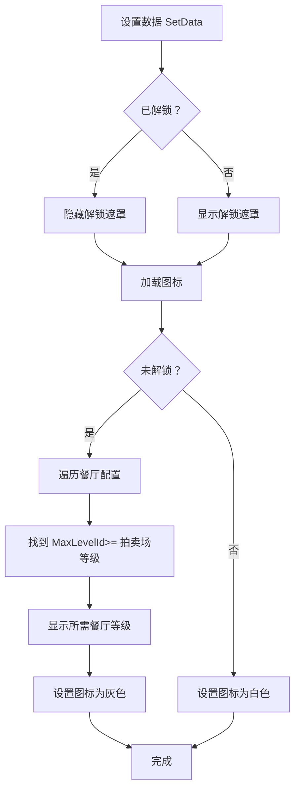

# AuctionSelectItem.cs - 拍卖场选择项组件

## 📄 文件信息

| 属性 | 值 |
|------|------|
| 文件路径 | `Assets/Scripts/Code/Game/UIGame/UILobby/AuctionSelectItem.cs` |
| 命名空间 | `TaoTie` |
| 基类 | `UIBaseContainer` |
| 实现接口 | `IOnCreate` |

---

## 🎯 类说明

`AuctionSelectItem` 是拍卖场选择界面的列表项组件，展示单个拍卖场的图标和解锁状态。未解锁的拍卖场会显示灰色遮罩和所需餐厅等级。

### 核心职责

- **拍卖场展示**: 显示拍卖场图标
- **解锁状态**: 显示拍卖场是否已解锁
- **等级提示**: 未解锁时显示所需餐厅等级

---

## 📋 字段说明

### UI 组件字段

| 字段名 | 类型 | 说明 |
|--------|------|------|
| `Text` | `UITextmesh` | 解锁等级提示文本 |
| `Icon` | `UIImage` | 拍卖场图标 |
| `Lock` | `UIImage` | 未解锁遮罩（灰色） |

---

## 🔧 方法说明

### 生命周期方法

#### `OnCreate()`
初始化组件 UI 组件和国际化文本。

```csharp
public void OnCreate()
{
    Text = AddComponent<UITextmesh>("Icon/Lock/Text");
    Icon = AddComponent<UIImage>("Icon");
    Lock = AddComponent<UIImage>("Icon/Lock");
    
    Text.SetI18NKey(I18NKey.Text_Auction_LvLock);
}
```

---

### 业务方法

#### `SetData(LevelConfig config)`
设置拍卖场数据。

**参数说明:**
- `config`: 等级配置（包含拍卖场信息）

**处理流程:**
1. 检查是否已解锁（玩家最高等级 >= 拍卖场等级）
2. 显示/隐藏解锁遮罩
3. 加载拍卖场图标
4. 未解锁时计算并显示所需餐厅等级
5. 设置图标颜色（未解锁时灰色）

**解锁等级计算:**
- 遍历所有餐厅配置
- 找到 `MaxLevelId >= 当前拍卖场等级` 的餐厅
- 取该餐厅的等级作为解锁要求

---

## 🔄 流程图



---

## 💡 使用示例

### 在拍卖选择列表中使用

```csharp
// UIAuctionSelectView.cs 中的列表初始化
public void OnCreate()
{
    ScrollView = AddComponent<UILoopListView2>("UICommonView/Bg/Content/ScrollView");
    ScrollView.InitListView(0, GetContentItemByIndex);
}

// 列表项创建回调
public LoopListViewItem2 GetContentItemByIndex(LoopListView2 listView2, int index)
{
    if (index < 0 || index >= levelConfigs.Count) return null;
    
    LoopListViewItem2 item = listView2.NewListViewItem("LevelItem", index);
    if (!item.IsInitHandlerCalled)
    {
        ScrollView.AddItemViewComponent<AuctionSelectItem>(item);
        item.IsInitHandlerCalled = true;
    }
    
    var taskGroup = ScrollView.GetUIItemView<AuctionSelectItem>(item);
    taskGroup.SetData(levelConfigs[index]);
    
    return item;
}
```

### 设置拍卖场数据

```csharp
public void SetData(LevelConfig config)
{
    // 检查是否已解锁
    bool islock = config.Id > 0 && PlayerDataManager.Instance.GetMaxLevel() < config.Id;
    Lock.SetActive(islock);
    
    // 加载图标
    Icon.SetSpritePath(config.Icon).Coroutine();
    
    if (islock)
    {
        // 计算所需餐厅等级
        var lvs = RestaurantConfigCategory.Instance.GetAllList();
        var max = 0;
        for (int i = 0; i < lvs.Count; i++)
        {
            if (lvs[i].MaxLevelId >= config.Id)
            {
                max = Mathf.Max(max, lvs[i].Level);
                break;
            }
        }
        Text.SetI18NText(max);
    }

    // 设置图标颜色
    Icon.SetColor(islock ? Color.gray : Color.white);
}
```

---

## 🔗 相关文档

- [UIAuctionSelectView.cs.md](./UIAuctionSelectView.cs.md) - 拍卖选择界面
- [LevelConfig.cs.md](../../../Config/LevelConfig.cs.md) - 等级配置
- [RestaurantConfig.cs.md](../../../Config/RestaurantConfig.cs.md) - 餐厅配置
- [UIBaseContainer.cs.md](../../../UI/UIBaseContainer.cs.md) - UI 容器基类

---

*最后更新：2026-03-02*
