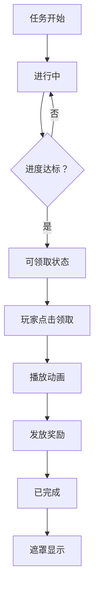

# DailyTaskItem.cs 注解文档

## 文件基本信息

| 属性 | 值 |
|------|-----|
| **文件名** | DailyTaskItem.cs |
| **路径** | Assets/Scripts/Code/Game/UIGame/UILobby/DailyTaskItem.cs |
| **所属模块** | 游戏层 → UIGame/UILobby |
| **文件职责** | 每日任务列表项，显示任务进度和奖励领取 |

---

## 类说明

### DailyTaskItem

| 属性 | 说明 |
|------|------|
| **职责** | 显示每日任务信息，包括进度、奖励、领取动画 |
| **继承关系** | 继承 `UIBaseContainer` |
| **实现的接口** | `IOnCreate` |

**使用场景**: 大厅界面的每日任务列表

---

## 结构体：TaskItemData

| 字段 | 类型 | 说明 |
|------|------|------|
| `currProgress` | `float` | 当前进度 |
| `showIndex` | `int` | 显示索引 |

---

## 字段与属性

| 名称 | 类型 | 访问级别 | 说明 |
|------|------|----------|------|
| `Title` | `UITextmesh` | `public` | 任务标题 |
| `Progress` | `UITextmesh` | `public` | 进度文本 |
| `Animator2` | `UIAnimator` | `public` | 点击动画 |
| `Icon` | `UIImage` | `public` | 任务图标 |
| `IconBg` | `UIImage` | `public` | 图标背景 |
| `Rewards` | `UITextmesh` | `public` | 奖励文本 |
| `ProgressMask` | `UIImage` | `public` | 进度条遮罩 |
| `PointerClick` | `UIPointerClick` | `public` | 点击事件 |
| `Over` | `UIEmptyView` | `public` | 完成标记 |
| `Mask` | `UIImage` | `public` | 遮罩 |
| `Light` | `UIImage` | `public` | 高亮光效 |
| `CanvasGroup` | `UIMonoBehaviour<CanvasGroup>` | `public` | 画布组 |
| `locks` | `HashSet<int>` | `private` | 锁定任务集合 |
| `configId` | `int` | `private` | 任务配置 ID |
| `Config` | `TaskConfig` | `public` | 任务配置对象 |

---

## 核心方法说明

### OnCreate()

**职责**: 创建时初始化 UI 组件

**核心逻辑**:
```
1. 获取所有 UI 组件引用
2. 添加 CanvasGroup 组件
3. 添加 UIAnimator 组件
```

---

### SetData()

**职责**: 设置任务数据

**参数**:
- `task`: 任务配置
- `locks`: 锁定任务集合

**核心逻辑**:
```
1. 重置状态
2. 根据 ItemType 加载图标:
   - 0 → ItemConfig (物品)
   - 1 → ContainerConfig (容器)
   - 其他 → 默认图标
3. 设置图标背景 (稀有度>3 用特殊背景)
4. 获取任务进度
5. 更新进度条和文本
6. 设置奖励文本
7. 根据任务状态设置 UI:
   - 已完成 → 遮罩，禁用点击
   - 可领取 → 显示完成标记，启用领取
   - 进行中 → 显示详情按钮
```

---

### OnClickComplex()

**职责**: 处理领取奖励

**核心逻辑**:
```
1. 检查是否可领取
2. 播放印章动画 PlayStampAnim()
3. 播放金币飞入动画 Top.DoMoneyMoveAnim()
4. 调用 PlayerDataManager.ComplexTask() 领取
5. 通知市场视图任务完成
```

---

### OnClickDetails()

**职责**: 打开任务详情

**核心逻辑**:
```
1. 播放点击动画
2. 打开 UITaskDetailsWin 窗口
```

---

### PlayStampAnim()

**职责**: 播放领取印章动画

**核心逻辑**:
```
1. 播放音效
2. 遮罩淡入 (100ms)
3. 印章图标缩放出现 (100ms)
4. 印章图标弹跳 (200ms)
```

---

## 任务状态流转



---

## UI 状态

| 状态 | Over | Mask | Animator | Light | 点击事件 |
|------|------|------|----------|-------|----------|
| 进行中 | false | false | 禁用 | false | 查看详情 |
| 可领取 | true | false | 启用 | true | 领取奖励 |
| 已完成 | false | true | 禁用 | false | 无 |

---

## 使用示例

### 示例 1: 设置任务数据

```csharp
// 获取任务项
var taskItem = uiView.GetContainer<DailyTaskItem>("Task1");

// 设置数据
TaskConfig config = TaskConfigCategory.Instance.Get(1001);
HashSet<int> locks = new HashSet<int>();
taskItem.SetData(config, locks);
```

### 示例 2: 监听任务完成

```csharp
// 注册事件
Messager.Instance.AddListener(0, MessageId.TaskComplete, OnTaskComplete);

void OnTaskComplete(int taskId)
{
    Log.Info($"任务 {taskId} 完成");
    // 刷新 UI
    RefreshTaskList();
}
```

---

## 设计说明

### 进度条实现

```csharp
// 使用 FillAmount 遮罩
float val = (float)step / config.ItemCount;
ProgressMask.SetFillAmount(val);

// 同时使用 Mask2 实现反向遮罩
rect.offsetMin = new Vector2(val * size.x, 0);
```

### 稀有度背景

```csharp
// 稀有度>3 使用特殊背景
IconBg.SetSpritePath(
    config.Rare > 3 
        ? "task_item_bg2.png"  // 高稀有度
        : "task_item_bg.png"   // 普通
);
```

### 动画防抖

```csharp
// 防止重复点击
if (isAnim) return;
isAnim = true;

// 动画完成
isAnim = false;
```

---

## 相关文档

- [UIBaseContainer.cs.md](../../../UI/UIBaseContainer.cs.md) - UI 容器基类
- [TaskConfig.cs.md](../../../Module/Config/TaskConfig.cs.md) - 任务配置
- [PlayerDataManager.cs.md](../../Data/PlayerDataManager.cs.md) - 玩家数据管理
- [UITaskDetailsWin.cs.md](./UITaskDetailsWin.cs.md) - 任务详情窗口

---

*文档生成时间：2026-03-02 | OpenClaw AI 助手*
