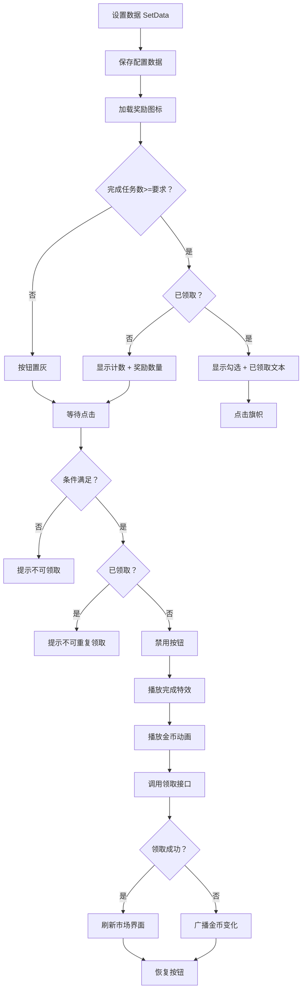

# DailyTaskRewards.cs - 每日任务阶段奖励组件

## 📄 文件信息

| 属性 | 值 |
|------|------|
| 文件路径 | `Assets/Scripts/Code/Game/UIGame/UILobby/DailyTaskRewards.cs` |
| 命名空间 | `TaoTie` |
| 基类 | `UIBaseContainer` |
| 实现接口 | `IOnCreate` |

---

## 🎯 类说明

`DailyTaskRewards` 是每日任务阶段奖励项组件，用于在市场界面中展示每个阶段的奖励。玩家完成指定数量的任务后，可以领取对应阶段的奖励。

### 核心职责

- **奖励展示**: 显示阶段奖励的图标和数量
- **进度状态**: 显示当前阶段要求的任务数量
- **领取状态**: 区分已领取/未领取状态
- **奖励领取**: 处理阶段奖励领取逻辑
- **领取动画**: 播放金币飞入动画和完成特效

---

## 📋 字段说明

### UI 组件字段

| 字段名 | 类型 | 说明 |
|--------|------|------|
| `Flag` | `UIButton` | 奖励旗帜按钮（整个奖励项） |
| `Icon` | `UIImage` | 奖励物品图标 |
| `Rewards` | `UITextmesh` | 奖励文本（数量或"已领取"） |
| `Count` | `UITextmesh` | 阶段要求任务数量 |
| `Check` | `UIImage` | 已领取勾选标记 |

### 数据字段

| 字段名 | 类型 | 说明 |
|--------|------|------|
| `Config` | `DailyTaskRewardsConfig` | 当前阶段奖励配置（只读属性） |
| `overTaskCount` | `int` | 当前已完成任务总数 |
| `curIndex` | `int` | 当前阶段索引 |

---

## 🔧 方法说明

### 生命周期方法

#### `OnCreate()`
初始化组件 UI 组件和事件绑定。

```csharp
public void OnCreate()
{
    Flag = AddComponent<UIButton>("Flag");
    Icon = AddComponent<UIImage>("Flag/Icon");
    Rewards = AddComponent<UITextmesh>("Flag/Text");
    Count = AddComponent<UITextmesh>("Flag/Count");
    Check = AddComponent<UIImage>("Flag/Check");
    
    Flag.SetOnClick(OnClickFlag);
}
```

---

### 业务方法

#### `SetData(int index, DailyTaskRewardsConfig config, int overTaskCount)`
设置阶段奖励数据。

**参数说明:**
- `index`: 阶段索引
- `config`: 阶段奖励配置
- `overTaskCount`: 当前已完成任务总数

**处理流程:**
1. 保存索引、配置和完成任务数
2. 设置要求任务数量文本
3. 加载奖励图标
4. 判断是否达到领取条件
5. 设置按钮灰色状态
6. 检查是否已领取
7. 根据状态显示计数或勾选标记
8. 设置奖励文本（数量或"已领取"）

#### `OnClickFlag()`
处理奖励旗帜点击事件。

**处理流程:**
1. 检查是否达到领取条件
2. 检查是否已领取过
3. 禁用按钮防止重复点击
4. 调用异步领取方法

#### `OnClickFlagAsync()`
异步处理奖励领取逻辑。

**返回:** `ETTask`

**处理流程:**
1. 显示勾选标记
2. 隐藏计数文本
3. 设置奖励文本为"已领取"
4. 播放任务完成特效
5. 播放金币飞入动画
6. 调用领取接口
7. 刷新市场界面或广播金币变化消息
8. 恢复按钮状态

#### `PlayTaskCompleteFX()`
播放任务完成特效。

**返回:** `ETTask`

**处理流程:**
1. 从对象池获取任务完成特效预制体
2. 设置特效位置到勾选标记处
3. 激活特效
4. 等待 500ms
5. 回收到对象池

---

## 🔄 流程图



---

## 💡 使用示例

### 在市场列表中创建奖励项

```csharp
// UIMarketView 中的奖励列表初始化
public void OnCreate()
{
    Rewards = AddComponent<UICopyGameObject>("UICommonView/Bg/Content/Bottom/Progress/Rewards");
    Rewards.InitListView(0, GetRewardsItemByIndex);
}

// 列表项创建回调
public void GetRewardsItemByIndex(int index, GameObject obj)
{
    var item = Rewards.GetUIItemView<DailyTaskRewards>(obj);
    if (item == null)
    {
        item = Rewards.AddItemViewComponent<DailyTaskRewards>(obj);
    }

    var config = DailyTaskRewardsConfigCategory.Instance.GetRewards(
        PlayerDataManager.Instance.RestaurantLv
    )[index];
    
    item.SetData(index, config, overTaskCount);
}
```

### 奖励配置数据结构

```csharp
// DailyTaskRewardsConfig 示例
public class DailyTaskRewardsConfig
{
    public int TaskCount;      // 要求的任务数量
    public int RewardCount;    // 奖励金币数量
    public string Icon;        // 奖励图标路径
}
```

### 领取奖励

```csharp
// 玩家点击奖励旗帜
public void OnClickFlag()
{
    if (overTaskCount < Config.TaskCount)
    {
        // 提示未达到领取条件
        UIManager.Instance.OpenBox<UIToast, I18NKey>(
            UIToast.PrefabPath, 
            I18NKey.Tips_Recieve_NotOpen
        ).Coroutine();
        return;
    }
    
    if (PlayerDataManager.Instance.IsGetDailyRewards(curIndex))
    {
        // 提示已领取
        UIManager.Instance.OpenBox<UIToast, I18NKey>(
            UIToast.PrefabPath, 
            I18NKey.Tips_Recieve_Twice
        ).Coroutine();
        return;
    }
    
    Flag.SetInteractable(false);
    OnClickFlagAsync().Coroutine();
}
```

---

## 🔗 相关文档

- [UIMarketView.cs.md](./UIMarketView.cs.md) - 市场界面
- [UITopView.cs.md](../UITT/UITopView.cs.md) - 顶部 UI 视图（金币动画）
- [DailyTaskRewardsConfig.cs.md](../../../Config/DailyTaskRewardsConfig.cs.md) - 每日任务奖励配置
- [PlayerDataManager.cs.md](../../Data/PlayerDataManager.cs.md) - 玩家数据管理器
- [UICopyGameObject.cs.md](../../../UIComponent/UICopyGameObject.cs.md) - 复制游戏对象组件

---

*最后更新：2026-03-02*
