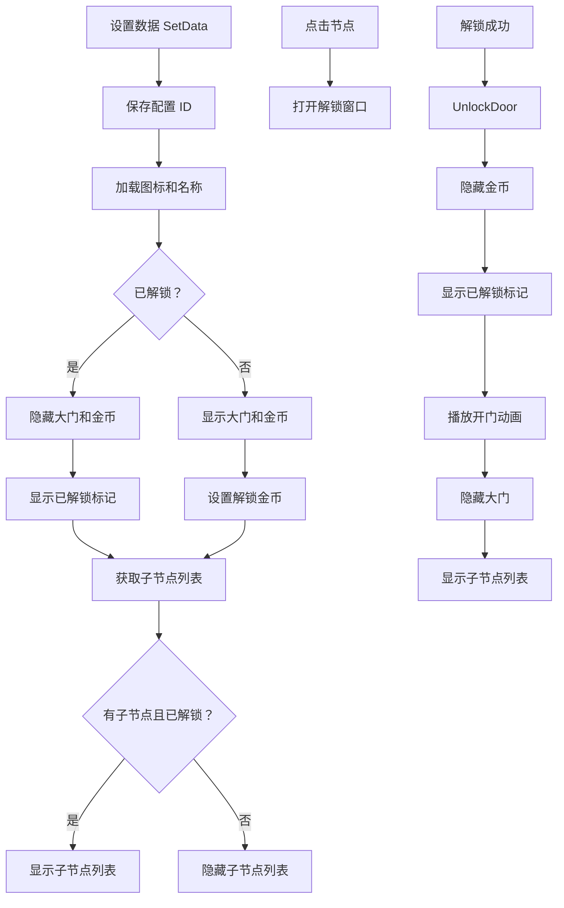

# TechnologyNode.cs - 科技树节点组件

## 📄 文件信息

| 属性 | 值 |
|------|------|
| 文件路径 | `Assets/Scripts/Code/Game/UIGame/UILobby/TechnologyNode.cs` |
| 命名空间 | `TaoTie` |
| 基类 | `UIBaseContainer` |
| 实现接口 | `IOnCreate` |

---

## 🎯 类说明

`TechnologyNode` 是科技树系统的节点组件，展示一个科技分类节点，包括节点图标、名称、解锁状态和子节点列表。未解锁的节点显示大门动画，解锁后显示子节点列表。

### 核心职责

- **节点展示**: 显示科技节点的图标、名称和解锁条件
- **解锁状态**: 区分已解锁/未解锁状态
- **子节点列表**: 解锁后显示该分类下的子科技节点
- **门动画**: 未解锁时显示关闭的大门动画

---

## 📋 字段说明

### UI 组件字段

| 字段名 | 类型 | 说明 |
|--------|------|------|
| `Items` | `UICopyGameObject` | 子节点列表容器 |
| `Icon` | `UIImage` | 科技节点图标 |
| `Title` | `UITextmesh` | 科技节点名称 |
| `Coin` | `UIButton` | 解锁金币按钮（未解锁时显示） |
| `Unlock` | `UIEmptyView` | 已解锁标记区域 |
| `Text` | `UITextmesh` | 解锁所需金币数量 |
| `Container` | `UIPointerClick` | 节点容器点击区域 |
| `Door` | `UIAnimator` | 大门动画控制器 |

### 数据字段

| 字段名 | 类型 | 说明 |
|--------|------|------|
| `configId` | `int` | 当前节点配置 ID |
| `Config` | `TechnologyTreeConfig` | 当前节点配置（只读属性） |
| `items` | `List<TechnologyTreeConfig>` | 子节点配置列表 |

---

## 🔧 方法说明

### 生命周期方法

#### `OnCreate()`
初始化组件 UI 组件和事件绑定。

```csharp
public void OnCreate()
{
    Container = AddComponent<UIPointerClick>("Content/Container");
    Items = AddComponent<UICopyGameObject>("Content/Items/Viewport/Content");
    Items.InitListView(0, GetItemsItemByIndex);
    Icon = AddComponent<UIImage>("Content/Container/Icon");
    Title = AddComponent<UITextmesh>("Content/Container/Text");
    Coin = AddComponent<UIButton>("Content/Container/Coin");
    Unlock = AddComponent<UIEmptyView>("Content/Container/Unlock");
    Text = AddComponent<UITextmesh>("Content/Container/Coin/Text");
    Door = AddComponent<UIAnimator>("Content/Items/Door");
    
    Coin.SetOnClick(OnClickContainer);
    Container.SetOnClick(OnClickContainer);
}
```

---

### 业务方法

#### `SetData(TechnologyTreeConfig config)`
设置科技节点数据。

**参数说明:**
- `config`: 科技树配置

**处理流程:**
1. 保存配置 ID
2. 加载节点图标
3. 设置节点名称
4. 检查解锁状态
5. 设置大门显示（未解锁时显示）
6. 设置金币按钮显示（未解锁时显示）
7. 设置已解锁标记显示（已解锁时显示）
8. 设置解锁所需金币
9. 获取子节点列表
10. 根据解锁状态和子节点数量设置列表显示

#### `UnlockDoor()`
播放解锁大门动画。

**返回:** `ETTask`

**处理流程:**
1. 隐藏金币按钮
2. 显示已解锁标记
3. 播放大门打开动画
4. 隐藏大门

---

### 事件处理方法

| 方法名 | 触发条件 | 功能说明 |
|--------|----------|----------|
| `GetItemsItemByIndex()` | 子节点列表项创建 | 创建/复用子节点组件 |
| `OnClickContainer()` | 点击节点容器 | 打开解锁窗口 |

#### `GetItemsItemByIndex(int index, GameObject obj)`
子节点列表项创建回调。

**处理流程:**
1. 获取或创建 `TechnologyNodeItem` 组件
2. 设置子节点数据（传入解锁状态）

#### `OnClickContainer()`
点击节点容器打开解锁窗口。

**处理流程:**
- 打开 `UIUnlockWin` 窗口，传入当前节点配置

---

## 🔄 流程图



---

## 💡 使用示例

### 在科技树界面中使用

```csharp
// 科技树主界面中设置节点数据
TechnologyTreeConfig rootConfig = TechnologyTreeConfigCategory.Instance.Get(rootId);
technologyNode.SetData(rootConfig);
```

### 解锁节点

```csharp
// 点击节点后打开解锁窗口
public void OnClickContainer()
{
    UIManager.Instance.OpenWindow<UIUnlockWin, TechnologyTreeConfig>(
        UIUnlockWin.PrefabPath, 
        Config
    ).Coroutine();
}

// 解锁成功后播放开门动画
public async ETTask UnlockDoor()
{
    Coin.SetActive(false);
    Unlock.SetActive(true);
    await Door.Play("Black_Door_Open");
    Door.SetActive(false);
}
```

### 子节点列表

```csharp
// 子节点创建回调
public void GetItemsItemByIndex(int index, GameObject obj)
{
    var item = Items.GetUIItemView<TechnologyNodeItem>(obj);
    if (item == null)
    {
        item = Items.AddItemViewComponent<TechnologyNodeItem>(obj);
    }
    // 传入父节点的解锁状态
    item.SetData(items[index], PlayerDataManager.Instance.IsUnlock(configId));
}
```

---

## 🔗 相关文档

- [TechnologyNodeItem.cs.md](./TechnologyNodeItem.cs.md) - 科技树子节点组件
- [UIUnlockWin.cs.md](./UIUnlockWin.cs.md) - 解锁确认窗口
- [TechnologyTreeConfig.cs.md](../../../Config/TechnologyTreeConfig.cs.md) - 科技树配置
- [PlayerDataManager.cs.md](../../Data/PlayerDataManager.cs.md) - 玩家数据管理器
- [UICopyGameObject.cs.md](../../../UIComponent/UICopyGameObject.cs.md) - 复制游戏对象组件

---

*最后更新：2026-03-02*
