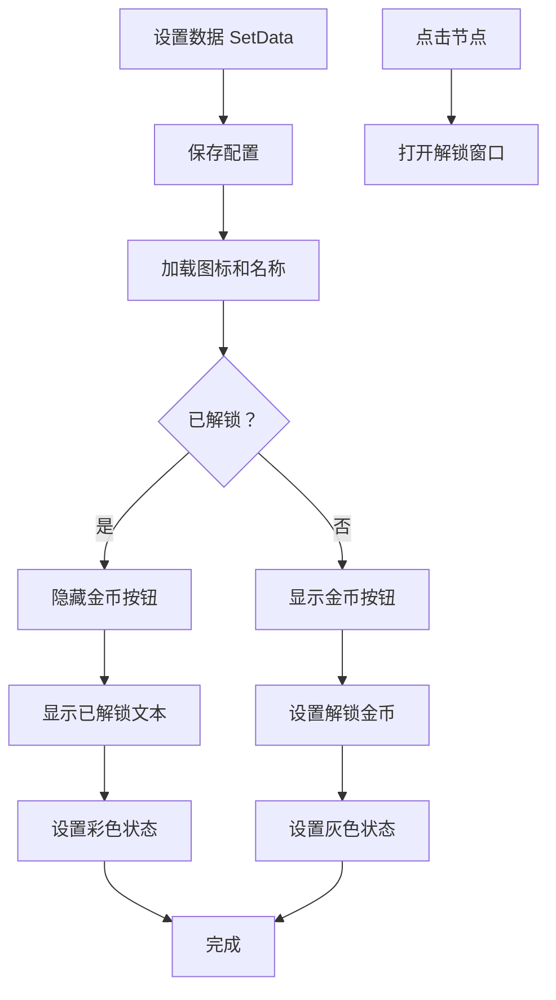

# TechnologyNodeItem.cs - 科技树子节点组件

## 📄 文件信息

| 属性 | 值 |
|------|------|
| 文件路径 | `Assets/Scripts/Code/Game/UIGame/UILobby/TechnologyNodeItem.cs` |
| 命名空间 | `TaoTie` |
| 基类 | `UIBaseContainer` |
| 实现接口 | `IOnCreate` |

---

## 🎯 类说明

`TechnologyNodeItem` 是科技树子节点组件，展示单个科技项目的图标、名称、解锁条件和状态。未解锁的科技显示灰色遮罩和解锁金币，已解锁的科技显示正常状态和"已解锁"标记。

### 核心职责

- **科技展示**: 显示科技图标、名称
- **解锁条件**: 显示解锁所需金币
- **状态管理**: 区分已解锁/未解锁状态（灰色/彩色）
- **解锁入口**: 点击打开解锁窗口

---

## 📋 字段说明

### UI 组件字段

| 字段名 | 类型 | 说明 |
|--------|------|------|
| `PointerClick` | `UIPointerClick` | 点击区域 |
| `Bg` | `UIImage` | 背景图片 |
| `Bg2` | `UIImage` | 内层背景图片 |
| `Icon` | `UIImage` | 科技图标 |
| `Title` | `UITextmesh` | 科技名称 |
| `Money` | `UITextmesh` | 解锁所需金币 |
| `Coin` | `UIButton` | 金币按钮（未解锁时显示） |
| `UnLock` | `UITextmesh` | 已解锁文本（已解锁时显示） |

### 数据字段

| 字段名 | 类型 | 说明 |
|--------|------|------|
| `config` | `TechnologyTreeConfig` | 当前科技配置 |

---

## 🔧 方法说明

### 生命周期方法

#### `OnCreate()`
初始化组件 UI 组件和事件绑定。

```csharp
public void OnCreate()
{
    PointerClick = AddComponent<UIPointerClick>();
    Bg = AddComponent<UIImage>("Bg");
    Bg2 = AddComponent<UIImage>("Bg/Bg");
    Icon = AddComponent<UIImage>("Bg/Icon");
    Title = AddComponent<UITextmesh>("Bg/Text");
    Money = AddComponent<UITextmesh>("Bg/Coin/Text");
    Coin = AddComponent<UIButton>("Bg/Coin");
    UnLock = AddComponent<UITextmesh>("Bg/Unlock");
    
    PointerClick.SetOnClick(OnClickSelf);
    Coin.SetOnClick(OnClickSelf);
}
```

---

### 业务方法

#### `SetData(TechnologyTreeConfig config, bool canUnlock)`
设置科技节点数据。

**参数说明:**
- `config`: 科技树配置
- `canUnlock`: 父节点是否已解锁（影响是否可解锁）

**处理流程:**
1. 保存配置
2. 加载科技图标
3. 设置科技名称
4. 检查解锁状态
5. 显示/隐藏金币按钮
6. 显示/隐藏已解锁文本
7. 设置灰色状态（未解锁时灰色）
8. 设置解锁所需金币

**灰色效果:**
- `Bg` 背景灰色
- `Icon` 图标灰色
- `Bg2` 内层背景灰色
- `Title` 文本灰色

---

### 事件处理方法

| 方法名 | 触发条件 | 功能说明 |
|--------|----------|----------|
| `OnClickSelf()` | 点击科技节点 | 打开解锁窗口 |

#### `OnClickSelf()`
点击科技节点打开解锁窗口。

**处理流程:**
- 打开 `UIUnlockWin` 窗口，传入当前科技配置

---

## 🔄 流程图



---

## 💡 使用示例

### 在父节点列表中创建子节点

```csharp
// TechnologyNode.cs 中的子节点列表回调
public void GetItemsItemByIndex(int index, GameObject obj)
{
    var item = Items.GetUIItemView<TechnologyNodeItem>(obj);
    if (item == null)
    {
        item = Items.AddItemViewComponent<TechnologyNodeItem>(obj);
    }
    // 传入父节点的解锁状态
    item.SetData(items[index], PlayerDataManager.Instance.IsUnlock(configId));
}
```

### 设置科技数据

```csharp
public void SetData(TechnologyTreeConfig config, bool canUnlock)
{
    this.config = config;
    
    // 加载图标
    Icon.SetSpritePath(config.Icon).Coroutine();
    
    // 设置名称
    Title.SetText(I18NManager.Instance.I18NGetText(config));
    
    // 检查解锁状态
    bool isUnlock = PlayerDataManager.Instance.IsUnlock(config.Id);
    
    // 显示/隐藏 UI
    Coin.SetActive(!isUnlock);
    UnLock.SetActive(isUnlock);
    
    // 设置灰色状态
    Bg.SetImageGray(!isUnlock).Coroutine();
    Icon.SetImageGray(!isUnlock).Coroutine();
    Bg2.SetImageGray(!isUnlock).Coroutine();
    Title.SetTextGray(!isUnlock);
    
    // 设置解锁金币
    if (!isUnlock)
    {
        if (config.UnlockType == 1)
        {
            Money.SetNum(config.UnlockValue);
        }
        else
        {
            Log.Error("解锁类型不对 TechnologyTreeConfig id=" + config.Id);
        }
    }
}
```

---

## 🔗 相关文档

- [TechnologyNode.cs.md](./TechnologyNode.cs.md) - 科技树父节点组件
- [UIUnlockWin.cs.md](./UIUnlockWin.cs.md) - 解锁确认窗口
- [TechnologyTreeConfig.cs.md](../../../Config/TechnologyTreeConfig.cs.md) - 科技树配置
- [PlayerDataManager.cs.md](../../Data/PlayerDataManager.cs.md) - 玩家数据管理器
- [UIImage.cs.md](../../../UIComponent/UIImage.cs.md) - Image UI 组件

---

*最后更新：2026-03-02*
