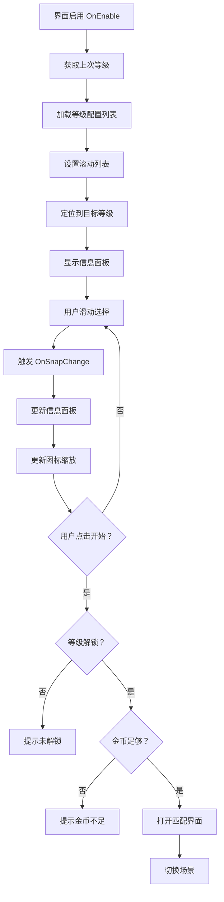

# UIAuctionSelectView.cs - 拍卖选择界面

## 📄 文件信息

| 属性 | 值 |
|------|------|
| 文件路径 | `Assets/Scripts/Code/Game/UIGame/UILobby/UIAuctionSelectView.cs` |
| 命名空间 | `TaoTie` |
| 基类 | `UIBaseView` |
| 实现接口 | `IOnCreate`, `IOnEnable`, `IOnEnable<int>`, `IOnWidthPaddingChange`, `IUpdate` |

---

## 🎯 类说明

`UIAuctionSelectView` 是拍卖场选择界面，玩家在这里选择要进入的拍卖场等级。界面以横向滚动列表展示所有可用的拍卖场，显示每个拍卖场的等级、入场费用等信息。

### 核心职责

- **拍卖场列表展示**: 使用 `UILoopListView2` 展示可横向滚动的拍卖场列表
- **等级选择**: 支持滑动选择不同等级的拍卖场
- **入场检查**: 检查玩家等级和金币是否满足入场条件
- **相机动画**: 选择拍卖场后移动相机到对应场景
- **中心聚焦**: 滚动时自动聚焦到中心选中的拍卖场

---

## 📋 字段说明

### UI 组件字段

| 字段名 | 类型 | 说明 |
|--------|------|------|
| `Start` | `UIButton` | 开始竞拍按钮 |
| `Hide` | `UIAnimator` | 底部信息面板动画控制器 |
| `Title` | `UITextmesh` | 拍卖场名称标题 |
| `ScrollView` | `UILoopListView2` | 横向滚动列表 |
| `Back` | `UIButton` | 返回按钮 |
| `PriceText` | `UITextmesh` | 入场费用文本 |
| `Price` | `UIEmptyView` | 入场费用区域（免费时隐藏） |
| `UICommonView` | `UIAnimator` | 通用视图动画控制器 |
| `Center` | `UIEmptyView` | 中心标记区域 |
| `Hand` | `UIAnimator` | 手势引导动画 |

### 数据字段

| 字段名 | 类型 | 说明 |
|--------|------|------|
| `levelConfigs` | `List<LevelConfig>` | 拍卖场等级配置列表 |

---

## 🔧 方法说明

### 生命周期方法

#### `OnCreate()`
初始化界面 UI 组件和滚动列表。

```csharp
public void OnCreate()
{
    Hand = AddComponent<UIAnimator>("UICommonView/Bg/Content/Hide/btnStart/btnStart/Hand");
    Center = AddComponent<UIEmptyView>("UICommonView/Bg/Content/ScrollView/Viewport/Center");
    UICommonView = AddComponent<UIAnimator>("UICommonView");
    ScrollView = AddComponent<UILoopListView2>("UICommonView/Bg/Content/ScrollView");
    ScrollView.InitListView(0, GetContentItemByIndex);
    ScrollView.SetOnSnapChange(OnSnapChange);
    Back = AddComponent<UIButton>("UICommonView/Bg/Close");
    Start = AddComponent<UIButton>("UICommonView/Bg/Content/Hide/btnStart/btnStart");
    Title = AddComponent<UITextmesh>("UICommonView/Bg/Content/Hide/Title/Text");
    Hide = AddComponent<UIAnimator>("UICommonView/Bg/Content/Hide");
    PriceText = AddComponent<UITextmesh>("UICommonView/Bg/Content/Hide/Price/Value");
    Price = AddComponent<UIEmptyView>("UICommonView/Bg/Content/Hide/Price");
    
    // 设置滚动事件
    ScrollView.SetOnSnapOverAction((a, b) => { Hide.SetActive(true); });
    ScrollView.SetOnBeginDragAction((a) => { BeginDrag().Coroutine(); Hand.SetActive(false); });
}
```

#### `OnEnable()`
界面启用时初始化拍卖场列表。

**主要功能:**
1. 播放打开音效
2. 获取上次选择的等级或玩家最高等级
3. 调用 `OnEnable(int)` 加载数据
4. 隐藏手势引导
5. 播放信息面板显示动画

#### `OnEnable(int id)`
根据指定等级 ID 初始化界面。

**参数说明:**
- `id`: 要选中的拍卖场等级 ID

**处理流程:**
1. 显示手势引导
2. 绑定返回按钮事件
3. 加载所有可见的等级配置
4. 设置滚动列表项数量
5. 定位到指定等级
6. 设置当前选中等级数据

---

### 业务方法

#### `BeginDrag()`
处理开始拖拽事件，隐藏信息面板。

**返回:** `ETTask`

**处理流程:**
1. 检查信息面板是否显示
2. 播放关闭动画
3. 隐藏信息面板

#### `Update()`
每帧更新，根据_item_位置缩放图标。

**主要功能:**
- 计算每个_item_相对于中心的偏移
- 根据偏移量缩放图标（越靠近中心越大）

#### `SetCurData(LevelConfig lv)`
设置当前选中等级的显示数据。

**参数说明:**
- `lv`: 等级配置

**主要功能:**
1. 设置入场费用文本
2. 设置拍卖场名称
3. 根据费用决定是否显示费用区域

#### `OnClickBtnStartAsync()`
处理开始竞拍逻辑。

**处理流程:**
1. 获取当前选中的等级配置
2. 检查玩家等级是否解锁
3. 检查玩家金币是否足够
4. 打开匹配界面 `UIMatchView`
5. 切换场景到对应拍卖场

---

### 事件处理方法

| 方法名 | 触发条件 | 功能说明 |
|--------|----------|----------|
| `OnSnapChange()` | 滚动选中项变化 | 更新信息面板显示 |
| `GetContentItemByIndex()` | 列表项创建 | 创建/复用拍卖场项组件 |
| `OnClickBack()` | 点击返回按钮 | 关闭界面返回大厅 |
| `OnClickCloseAsync()` | 关闭界面 | 打开大厅界面并播放关闭动画 |
| `OnClickStart()` | 点击开始按钮 | 检查条件后进入匹配 |

---

## 🔄 流程图



---

## 💡 使用示例

### 打开拍卖选择界面

```csharp
// 从大厅打开拍卖选择界面（默认上次等级）
UIManager.Instance.OpenWindow<UIAuctionSelectView>(UIAuctionSelectView.PrefabPath).Coroutine();
```

### 打开指定等级的拍卖选择

```csharp
// 从任务详情打开指定等级的拍卖选择
int levelId = 5; // 目标等级 ID
UIManager.Instance.OpenWindow<UIAuctionSelectView, int>(
    UIAuctionSelectView.PrefabPath, 
    levelId
).Coroutine();
```

### 从大厅直接开始

```csharp
// 大厅的开始按钮直接打开拍卖选择
public void OnClickBtnStart()
{
    CloseSelf().Coroutine();
    UIManager.Instance.OpenWindow<UIAuctionSelectView>(UIAuctionSelectView.PrefabPath).Coroutine();
}
```

---

## 🔗 相关文档

- [UILobbyView.cs.md](./UILobbyView.cs.md) - 大厅主界面
- [UIMatchView.cs.md](./UIMatchView.cs.md) - 匹配界面
- [LevelConfig.cs.md](../../../Config/LevelConfig.cs.md) - 等级配置
- [SceneManager.cs.md](../../Scene/SceneManager.cs.md) - 场景管理器
- [AuctionSelectItem.cs.md](./AuctionSelectItem.cs.md) - 拍卖场选择项组件

---

*最后更新：2026-03-02*
