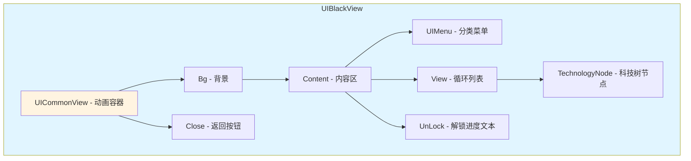

# UIBlackView.cs 注解文档

## 文件基本信息

| 属性 | 值 |
|------|-----|
| **文件名** | UIBlackView.cs |
| **路径** | Assets/Scripts/Code/Game/UIGame/UILobby/UIBlackView.cs |
| **所属模块** | 游戏 UI → UILobby (大厅 UI) |
| **文件职责** | 黑名单/科技树界面视图，展示科技树节点和解锁进度 |

---

## 类/结构体说明

### UIBlackView

| 属性 | 说明 |
|------|------|
| **职责** | 黑名单界面视图，展示科技树容器和节点解锁状态 |
| **泛型参数** | 无 |
| **继承关系** | `UIBaseView` |
| **实现的接口** | `IOnCreate`, `IOnEnable`, `IOnDisable`, `II18N`, `IOnWidthPaddingChange`, `IOnEnable<int>` |

**设计模式**: MVC 视图模式 + 对象池组件

```csharp
public class UIBlackView : UIBaseView, IOnCreate, IOnEnable, IOnDisable, II18N, IOnWidthPaddingChange, IOnEnable<int>
{
    public static string PrefabPath => "UIGame/UILobby/Prefabs/UIBlackView.prefab";
}
```

---

## 字段与属性（按重要程度排序）

| 名称 | 类型 | 访问级别 | 说明 |
|------|------|----------|------|
| `PrefabPath` | `string` | `public static` | Prefab 资源路径 |
| `UIMenu` | `UIMenu` | `public` | 菜单组件，用于切换科技树分类 |
| `View` | `UILoopListView2` | `public` | 循环列表视图，展示科技树容器 |
| `Back` | `UIButton` | `public` | 返回按钮 |
| `UnLock` | `UITextmesh` | `public` | 解锁进度文本 |
| `UICommonView` | `UIAnimator` | `public` | 公共视图动画组件 |
| `CurMenu` | `MenuPara` | `private` | 当前选中的菜单项 |
| `menus` | `List<MenuPara>` | `private` | 菜单数据列表 |
| `list` | `List<TechnologyTreeConfig>` | `private` | 科技树配置列表 |

---

## 方法说明（按重要程度排序）

### OnCreate()

**签名**:
```csharp
public void OnCreate()
```

**职责**: 创建视图时初始化组件

**核心逻辑**:
```
1. 添加 UIAnimator 组件 (UICommonView)
2. 添加 UIMenu 组件
3. 添加 UILoopListView2 组件并初始化
4. 添加返回按钮
5. 添加解锁进度文本并设置国际化 key
```

**调用者**: UIManager (窗口创建时)

---

### OnEnable(int id) / OnEnable()

**签名**:
```csharp
public void OnEnable(int id)
public void OnEnable()
```

**职责**: 启用视图时初始化数据和事件

**核心逻辑**:
```
1. 播放打开音效
2. 注册 UnlockTreeNode 消息监听
3. 绑定返回按钮点击事件
4. 刷新语言 (OnLanguageChange)
5. 设置活动菜单索引
```

**调用者**: UIManager (窗口启用时)

---

### OnDisable()

**签名**:
```csharp
public void OnDisable()
```

**职责**: 禁用视图时清理事件

**核心逻辑**:
```
1. 移除 UnlockTreeNode 消息监听
```

**调用者**: UIManager (窗口禁用时)

---

### OnLanguageChange()

**签名**:
```csharp
public void OnLanguageChange()
```

**职责**: 语言切换时更新菜单数据

**核心逻辑**:
```
1. 清空菜单列表
2. 获取科技树等级配置
3. 为每个等级创建菜单项 (包含红点标记)
4. 设置 UIMenu 数据
```

**调用者**: OnEnable(), I18NManager (语言切换时)

---

### OnMenuItemChange(MenuPara para)

**签名**:
```csharp
public void OnMenuItemChange(MenuPara para)
```

**职责**: 菜单项切换时刷新数据

**核心逻辑**:
```
1. 保存当前菜单
2. 刷新数据 (RefreshData)
3. 刷新红点数量
```

**调用者**: UIMenu

---

### RefreshData(bool resetPos)

**签名**:
```csharp
private void RefreshData(bool resetPos)
```

**职责**: 刷新科技树节点数据和解锁进度

**核心逻辑**:
```
1. 获取当前分类的科技树容器列表
2. 计算解锁进度 (解锁数/总数)
3. 更新解锁进度文本
4. 设置列表项数量
5. 刷新显示项
6. 播放进入动画 (如果需要)
```

**调用者**: OnMenuItemChange(), UnlockContainerAsync()

---

### GetViewItemByIndex()

**签名**:
```csharp
public LoopListViewItem2 GetViewItemByIndex(LoopListView2 listView, int index)
```

**职责**: 循环列表项创建/复用回调

**核心逻辑**:
```
1. 检查索引有效性
2. 创建或复用列表项
3. 获取或添加 TechnologyNode 组件
4. 设置节点数据
5. 返回列表项
```

**调用者**: UILoopListView2

---

### OnClickBack()

**签名**:
```csharp
public void OnClickBack()
```

**职责**: 返回按钮点击处理

**核心逻辑**:
```
1. 调用 OnClickCloseAsync
```

**调用者**: UIButton (Back)

---

### OnClickCloseAsync()

**签名**:
```csharp
public async ETTask OnClickCloseAsync()
```

**职责**: 关闭视图异步流程

**核心逻辑**:
```
1. 打开大厅主界面 (UILobbyView)
2. 播放关闭动画
3. 关闭当前窗口
```

**调用者**: OnClickBack()

---

### UnlockContainer(int id)

**签名**:
```csharp
private void UnlockContainer(int id)
```

**职责**: 解锁容器消息处理

**核心逻辑**:
```
1. 调用 UnlockContainerAsync
```

**调用者**: Messager (UnlockTreeNode 消息)

---

### UnlockContainerAsync(int id)

**签名**:
```csharp
private async ETTask UnlockContainerAsync(int id)
```

**职责**: 解锁容器异步处理

**核心逻辑**:
```
1. 查找对应容器节点
2. 调用节点解锁动画 (node.UnlockDoor())
3. 刷新数据
```

**调用者**: UnlockContainer()

---

### CanMenuItemChange(MenuPara para)

**签名**:
```csharp
private bool CanMenuItemChange(MenuPara para)
```

**职责**: 检查菜单项是否可切换

**核心逻辑**:
```
1. 获取科技树配置
2. 检查解锁类型:
   - 类型 2: 检查是否已进入过竞拍
   - 其他: 检查是否已解锁
3. 如果未解锁，打开解锁确认窗口
4. 返回是否可切换
```

**调用者**: UIMenu

---

## 界面结构

### UI 层级图



---

## 使用示例

### 示例 1: 打开黑名单界面

```csharp
// 打开黑名单界面 (默认第一个分类)
await UIManager.Instance.OpenWindow<UIBlackView>(UIBlackView.PrefabPath);

// 打开黑名单界面 (指定分类 ID)
await UIManager.Instance.OpenWindow<UIBlackView, int>(UIBlackView.PrefabPath, categoryId);
```

### 示例 2: 监听节点解锁

```csharp
// 当节点解锁时，发送消息
Messager.Instance.Broadcast(0, MessageId.UnlockTreeNode, nodeId);
// UIBlackView 会自动更新对应节点的解锁状态
```

---

## 与其他模块的交互

```mermaid
graph TD
    subgraph UIBlackView["UIBlackView"]
        V[视图组件]
        M[菜单 UIMenu]
        L[列表 UILoopListView2]
    end
    
    subgraph Systems["游戏系统"]
        Tech[TechnologyTreeConfig]
        Player[PlayerDataManager]
        RedDot[RedDotManager]
    end
    
    subgraph UI["其他 UI"]
        Lobby[UILobbyView]
        Unlock[UIUnlockWin]
        Node[TechnologyNode]
    end
    
    V --> M
    V --> L
    M --> Tech
    L --> Node
    V --> Player
    V --> RedDot
    V --> Lobby
    V --> Unlock
    
    note right of V "黑名单界面展示科技树<br/>容器和节点解锁状态"
    
    style UIBlackView fill:#e1f5ff
    style Systems fill:#fff4e1
    style UI fill:#e8f5e9
```

---

## 阅读指引

### 建议的阅读顺序

1. **理解界面作用** - 黑名单/科技树界面用于展示解锁进度
2. **看字段定义** - 了解 UIMenu/View/UnLock 等组件
3. **重点看 OnCreate/OnEnable** - 理解初始化和事件绑定
4. **深入 RefreshData** - 理解数据刷新和进度计算
5. **了解解锁流程** - 理解节点解锁的消息处理

### 最值得学习的技术点

1. **双 OnEnable 重载**: 支持带参数和不带参数的启用
2. **循环列表复用**: UILoopListView2 高效展示大量节点
3. **红点集成**: 与 RedDotManager 集成显示未读提示
4. **解锁进度计算**: 动态计算并显示解锁百分比
5. **动画序列**: PlayEnterAnim 实现节点依次进入动画

---

## 相关文档

- [UILobbyView.cs.md](./UILobbyView.cs.md) - 大厅主界面
- [TechnologyNode.cs.md](./TechnologyNode.cs.md) - 科技树节点组件
- [TechnologyNodeItem.cs.md](./TechnologyNodeItem.cs.md) - 科技树子节点组件
- [UIUnlockWin.cs.md](./UIUnlockWin.cs.md) - 解锁确认窗口
- [UIMenu.cs.md](../../UICommon/UIMenu.cs.md) - 菜单组件
- [UILoopListView2.cs.md](../../../Module/UIComponent/UILoopListView2.cs.md) - 循环列表组件

---

*文档生成时间：2026-03-02 | OpenClaw AI 助手*
