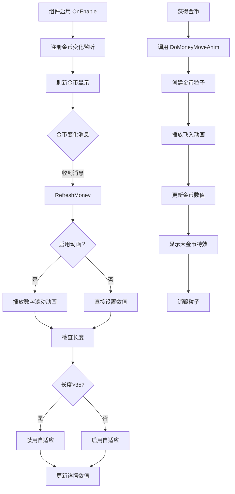

# UICashGroup.cs - 金币显示组件

## 📄 文件信息

| 属性 | 值 |
|------|------|
| 文件路径 | `Assets/Scripts/Code/Game/UIGame/UILobby/UICashGroup.cs` |
| 命名空间 | `TaoTie` |
| 基类 | `UIBaseContainer` |
| 实现接口 | `IOnCreate`, `IOnEnable`, `IOnDisable`, `IOnWidthPaddingChange` |

---

## 🎯 类说明

`UICashGroup` 是金币显示组件，用于在界面中展示玩家的金币数量。支持金币变化监听、数字滚动动画、3D 金币飞入动画等功能。通常作为容器组件嵌入到其他 UI 视图中使用。

### 核心职责

- **金币显示**: 显示当前玩家金币数量
- **数字动画**: 金币变化时播放数字滚动动画
- **详情展示**: 支持点击展开显示完整金币数值
- **金币飞入动画**: 支持 2D/3D 金币飞入效果
- **消息监听**: 监听金币变化消息自动刷新

---

## 📋 字段说明

### UI 组件字段

| 字段名 | 类型 | 说明 |
|--------|------|------|
| `TextCash` | `UITextmesh` | 金币数量显示文本 |
| `FrameCash` | `UIPointerClick` | 详情框点击区域 |
| `Details` | `UIMonoBehaviour<ContentSizeFitter>` | 详情框（自适应内容） |
| `IconMoney` | `UIImage` | 金币图标 |
| `DetailsNum` | `UITextmesh` | 详情框内的完整金币数值 |
| `MoneyShow` | `UIAnimator` | 大金币特效动画控制器 |

### 属性字段

| 字段名 | 类型 | 说明 |
|--------|------|------|
| `ShowNum` | `BigNumber` | 当前显示的金币数值（只读属性） |

---

## 🔧 方法说明

### 生命周期方法

#### `OnCreate()`
初始化组件 UI 组件和事件绑定。

```csharp
public void OnCreate()
{
    MoneyShow = AddComponent<UIAnimator>("IconCash/LargeMoney");
    IconMoney = AddComponent<UIImage>("IconCash/IconMoney");
    TextCash = AddComponent<UITextmesh>("TextCash");
    Details = AddComponent<UIMonoBehaviour<ContentSizeFitter>>("FrameCash/Details");
    FrameCash = AddComponent<UIPointerClick>("FrameCash");
    DetailsNum = AddComponent<UITextmesh>("FrameCash/Details/DetailsNum");
    
    FrameCash.SetOnClick(OnClickShowDetails);
}
```

#### `OnEnable()`
组件启用时注册消息监听并刷新显示。

**主要功能:**
1. 隐藏大金币特效和详情框
2. 绑定详情框点击事件
3. 注册金币变化消息监听
4. 刷新金币显示

#### `OnDisable()`
组件禁用时移除消息监听。

**主要功能:**
- 移除 `MessageId.ChangeMoney` 消息监听

---

### 业务方法

#### `SetShowNum(BigNumber num)`
设置显示的金币数值。

**参数说明:**
- `num`: 要显示的金币数值

#### `OnClickShowDetails()`
切换详情框显示/隐藏状态。

**主要功能:**
1. 播放点击音效
2. 切换详情框的 active 状态

#### `RefreshMoney(BigNumber money)` / `RefreshMoney(BigNumber money, bool anim)`
刷新金币显示。

**参数说明:**
- `money`: 新的金币数值
- `anim`: 是否播放数字滚动动画（默认 true）

**处理流程:**
1. 根据 `anim` 参数决定是否播放数字动画
2. 检查数值长度，超过 35 字符时禁用自适应
3. 设置详情框数值
4. 更新 `ShowNum` 属性

---

### 金币飞入动画方法

#### `DoMoneyMoveAnim(BigNumber add, Vector3 startPos)`
单个金币飞入动画。

**参数说明:**
- `add`: 增加的金币数量
- `startPos`: 金币起始位置（3D 世界坐标）

**返回:** `ETTask`

**处理流程:**
1. 实例化金币图标
2. 设置父节点和初始位置
3. 播放飞入动画（500ms）
4. 动画结束时更新金币数值
5. 显示大金币特效
6. 销毁金币图标

#### `DoMoneyMoveAnim(BigNumber add, Vector3 startPos, int total, float size)`
多个金币飞入动画（环形散开）。

**参数说明:**
- `add`: 总金币数量
- `startPos`: 金币起始中心位置
- `total`: 金币粒子数量
- `size`: 散开半径系数

**返回:** `ETTask`

**处理流程:**
1. 创建多个金币粒子
2. 计算环形散开的起始位置
3. 随机排序起始位置
4. 依次飞入（间隔 50ms）
5. 先向外散开再向中心汇聚
6. 动画结束时更新金币数值

#### `DoMoneyMoveAnim(BigNumber[] add, Vector3[] startPos, int total)`
多个金币从不同位置飞入。

**参数说明:**
- `add`: 每个粒子的金币数量数组
- `startPos`: 每个粒子的起始位置数组
- `total`: 粒子总数

**返回:** `ETTask`

#### `DoMoneyMoveAnim3D(BigNumber[] add, Vector3[] startPos, int total)`
3D 金币飞入动画（带屏幕坐标转换）。

**参数说明:**
- `add`: 每个粒子的金币数量数组
- `startPos`: 每个粒子的 3D 世界坐标起始位置
- `total`: 粒子总数

**返回:** `ETTask`

**特殊处理:**
- 将 3D 世界坐标转换为 UI 局部坐标

#### `DoMoneyMoveAnim(BigNumber add, Vector3 startPos, Vector2 size, int total)`
矩形区域散开的金币飞入动画。

**参数说明:**
- `add`: 总金币数量
- `startPos`: 金币起始中心位置
- `size`: 矩形区域大小
- `total`: 金币粒子数量

**返回:** `ETTask`

---

## 🔄 流程图



---

## 💡 使用示例

### 在 UI 视图中使用

```csharp
public class UITopView : UIBaseView, IOnCreate
{
    public UICashGroup CashGroup;
    
    public void OnCreate()
    {
        // 添加金币显示组件
        CashGroup = AddComponent<UICashGroup>("Top/IconCash");
    }
}
```

### 播放金币飞入动画

```csharp
// 单个金币飞入
Vector3 startPos = someGameObject.transform.position;
BigNumber reward = 1000;
await cashGroup.DoMoneyMoveAnim(reward, startPos);

// 多个金币飞入（从多个宝盒）
BigNumber[] rewards = new BigNumber[] { 100, 200, 300 };
Vector3[] positions = new Vector3[] { box1.position, box2.position, box3.position };
await cashGroup.DoMoneyMoveAnim(rewards, positions, rewards.Length);

// 环形散开飞入
await cashGroup.DoMoneyMoveAnim(totalReward, centerPosition, 20, 1.5f);
```

### 手动刷新金币显示

```csharp
// 不播放动画直接设置
cashGroup.SetShowNum(new BigNumber(999999));

// 带动画刷新
var money = PlayerDataManager.Instance.TotalMoney;
cashGroup.RefreshMoney(money, true);
```

---

## 🔗 相关文档

- [UITopView.cs.md](../UITT/UITopView.cs.md) - 顶部 UI 视图
- [UIBaseContainer.cs.md](../../../UI/UIBaseContainer.cs.md) - UI 容器基类
- [BigNumber.cs.md](../../../Core/Object/BigNumber.cs.md) - 大数类型
- [PlayerDataManager.cs.md](../../Data/PlayerDataManager.cs.md) - 玩家数据管理器
- [Messager.cs.md](../../../Core/Messager.cs.md) - 消息系统

---

*最后更新：2026-03-02*
