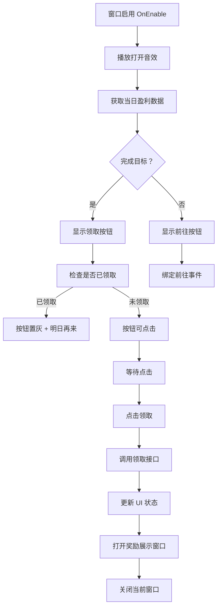

# UIDailyWin.cs - 每日任务奖励窗口

## 📄 文件信息

| 属性 | 值 |
|------|------|
| 文件路径 | `Assets/Scripts/Code/Game/UIGame/UILobby/UIDailyWin.cs` |
| 命名空间 | `TaoTie` |
| 基类 | `UIBaseView` |
| 实现接口 | `IOnCreate`, `IOnEnable` |

---

## 🎯 类说明

`UIDailyWin` 是每日任务奖励领取窗口，展示玩家当日盈利进度和可领取的奖励。当玩家完成每日任务要求后，可以在此窗口领取奖励。

### 核心职责

- **进度展示**: 显示当日盈利进度（当前值/目标值）
- **奖励预览**: 展示可领取的奖励物品和数量
- **奖励领取**: 处理奖励领取逻辑
- **状态管理**: 区分已领取/未领取状态

---

## 📋 字段说明

### UI 组件字段

| 字段名 | 类型 | 说明 |
|--------|------|------|
| `Close` | `UIButton` | 关闭按钮 |
| `Text` | `UITextmesh` | 进度文本（当前/目标） |
| `Image` | `UIImage` | 奖励物品图标 |
| `Text2` | `UITextmesh` | 奖励数量文本 |
| `ButtonGet` | `UIButton` | 领取按钮 |
| `ButtonGo` | `UIButton` | 前往竞拍按钮 |
| `GetText` | `UITextmesh` | 领取按钮文本 |
| `UICommonWin` | `UIAnimator` | 通用窗口动画控制器 |

---

## 🔧 方法说明

### 生命周期方法

#### `OnCreate()`
初始化窗口 UI 组件。

```csharp
public void OnCreate()
{
    UICommonWin = AddComponent<UIAnimator>("UICommonWin");
    Close = AddComponent<UIButton>("UICommonWin/Win/Close");
    Text = AddComponent<UITextmesh>("UICommonWin/Win/Content/Bg/Details/Text");
    Image = AddComponent<UIImage>("UICommonWin/Win/Content/Bg/Rewards/Title/Image");
    Text2 = AddComponent<UITextmesh>("UICommonWin/Win/Content/Bg/Rewards/Text");
    ButtonGet = AddComponent<UIButton>("UICommonWin/Win/Content/ButtonGet");
    ButtonGo = AddComponent<UIButton>("UICommonWin/Win/Content/ButtonGo");
    GetText = AddComponent<UITextmesh>("UICommonWin/Win/Content/ButtonGet/Text");
}
```

#### `OnEnable()`
窗口启用时初始化数据和事件绑定。

**主要功能:**
1. 播放打开音效
2. 获取当日盈利数据和配置
3. 设置进度文本（带颜色区分）
4. 设置奖励图标和数量
5. 根据完成状态显示对应按钮
6. 绑定按钮点击事件

---

### 业务方法

#### `CloseSelf()`
关闭窗口，播放关闭动画和音效。

**返回:** `ETTask`

```csharp
public override async ETTask CloseSelf()
{
    SoundManager.Instance.PlaySound("Audio/Sound/Win_Close.mp3");
    await UICommonWin.Play("UIWin_Close");
    await base.CloseSelf();
}
```

---

### 事件处理方法

| 方法名 | 触发条件 | 功能说明 |
|--------|----------|----------|
| `OnClickClose()` | 点击关闭按钮 | 关闭窗口 |
| `OnClickGo()` | 点击前往按钮 | 关闭当前窗口并打开拍卖选择界面 |
| `OnClickButtonGet()` | 点击领取按钮 | 领取每日任务奖励 |

#### `OnClickButtonGetAsync()`
异步处理奖励领取逻辑。

**处理流程:**
1. 调用 `PlayerDataManager.Instance.ReceiveWinRewards()` 领取奖励
2. 更新按钮状态为灰色（已领取）
3. 更新按钮文本为"明日再来"
4. 关闭窗口
5. 打开奖励展示窗口 `UIRewardsView`

---

## 🔄 流程图



---

## 💡 使用示例

### 打开每日任务窗口

```csharp
// 从大厅或其他界面打开每日任务窗口
UIManager.Instance.OpenWindow<UIDailyWin>(UIDailyWin.PrefabPath).Coroutine();
```

### 程序化刷新

```csharp
// 当玩家完成竞拍后刷新每日任务进度
var dailyWin = UIManager.Instance.GetView<UIDailyWin>(1);
if (dailyWin != null)
{
    // 重新启用窗口以刷新数据
    dailyWin.OnEnable();
}
```

---

## 🔗 相关文档

- [UILobbyView.cs.md](./UILobbyView.cs.md) - 大厅主界面
- [UIRewardsView.cs.md](./UIRewardsView.cs.md) - 奖励展示窗口
- [UIAuctionSelectView.cs.md](./UIAuctionSelectView.cs.md) - 拍卖选择界面
- [PlayerDataManager.cs.md](../../Data/PlayerDataManager.cs.md) - 玩家数据管理器
- [RestaurantConfigCategory.cs.md](../../../Config/RestaurantConfigCategory.cs.md) - 餐厅配置

---

*最后更新：2026-03-02*
