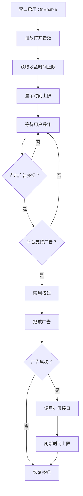

# UIExpandWin.cs - 收益时间扩展窗口

## 📄 文件信息

| 属性 | 值 |
|------|------|
| 文件路径 | `Assets/Scripts/Code/Game/UIGame/UILobby/UIExpandWin.cs` |
| 命名空间 | `TaoTie` |
| 基类 | `UIBaseView` |
| 实现接口 | `IOnCreate`, `IOnEnable` |

---

## 🎯 类说明

`UIExpandWin` 是餐厅收益时间扩展窗口，展示当前收益时间上限，并提供看广告扩展收益时间上限的功能。

### 核心职责

- **时间上限展示**: 显示当前餐厅收益的最大累计时间
- **广告扩展**: 支持看广告扩展收益时间上限

---

## 📋 字段说明

### UI 组件字段

| 字段名 | 类型 | 说明 |
|--------|------|------|
| `Close` | `UIButton` | 关闭按钮 |
| `Desc` | `UITextmesh` | 收益时间描述文本 |
| `ButtonAd` | `UIButton` | 看广告扩展按钮 |
| `UICommonWin` | `UIAnimator` | 通用窗口动画控制器 |

---

## 🔧 方法说明

### 生命周期方法

#### `OnCreate()`
初始化窗口 UI 组件和国际化文本。

```csharp
public void OnCreate()
{
    UICommonWin = AddComponent<UIAnimator>("UICommonWin");
    Close = AddComponent<UIButton>("UICommonWin/Win/Close");
    Desc = AddComponent<UITextmesh>("UICommonWin/Win/Content/Desc");
    ButtonAd = AddComponent<UIButton>("UICommonWin/Win/Content/ButtonAd");
    
    Desc.SetI18NKey(I18NKey.Text_Restaurant_Profit_Hour);
}
```

#### `OnEnable()`
窗口启用时初始化数据和事件绑定。

**主要功能:**
1. 播放打开音效
2. 绑定按钮点击事件
3. 设置当前收益时间上限文本

---

### 业务方法

#### `CloseSelf()`
关闭窗口，播放关闭动画和音效。

**返回:** `ETTask`

#### `PlayAdAsync()`
播放广告以扩展收益时间上限。

**返回:** `ETTask`

**处理流程:**
1. 禁用广告按钮防止重复点击
2. 调用广告 SDK 播放广告
3. 广告成功后调用 `PlayerDataManager.Instance.Expand()`
4. 恢复按钮状态
5. 刷新收益时间上限文本

---

### 事件处理方法

| 方法名 | 触发条件 | 功能说明 |
|--------|----------|----------|
| `OnClickClose()` | 点击关闭按钮 | 关闭窗口 |
| `OnClickButtonAd()` | 点击广告按钮 | 播放广告扩展收益时间 |

---

## 🔄 流程图



---

## 💡 使用示例

### 打开扩展窗口

```csharp
// 从收益窗口打开扩展窗口
UIManager.Instance.OpenWindow<UIExpandWin>(UIExpandWin.PrefabPath).Coroutine();
```

### 扩展收益时间

```csharp
// 玩家点击广告按钮后
public void OnClickButtonAd()
{
    if (AdManager.Instance.PlatformHasAD())
    {
        ButtonAd.SetInteractable(false);
        PlayAdAsync().Coroutine();
    }
}

private async ETTask PlayAdAsync()
{
    try
    {
        var res = await AdManager.Instance.PlayAd();
        if (res)
        {
            // 扩展收益时间上限
            PlayerDataManager.Instance.Expand();
        }
    }
    catch (Exception ex)
    {
        Log.Error(ex);
    }
    finally
    {
        ButtonAd.SetInteractable(true);
        Desc.SetI18NText(PlayerDataManager.Instance.GetMaxDeltaTime());
    }
}
```

---

## 🔗 相关文档

- [UIProfitWin.cs.md](./UIProfitWin.cs.md) - 餐厅收益窗口
- [PlayerDataManager.cs.md](../../Data/PlayerDataManager.cs.md) - 玩家数据管理器
- [AdManager.cs.md](../../../Manager/AdManager.cs.md) - 广告管理器

---

*最后更新：2026-03-02*
