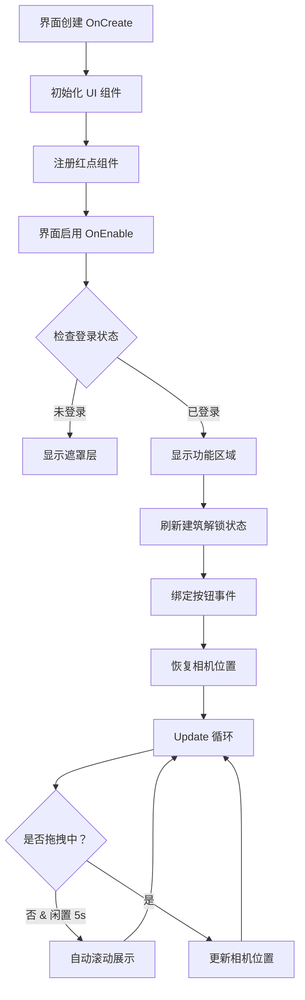

# UILobbyView.cs - 游戏大厅主界面

## 📄 文件信息

| 属性 | 值 |
|------|------|
| 文件路径 | `Assets/Scripts/Code/Game/UIGame/UILobby/UILobbyView.cs` |
| 命名空间 | `TaoTie` |
| 基类 | `UIBaseView` |
| 实现接口 | `IOnCreate`, `IOnEnable`, `IOnEnable<bool>`, `IUpdate`, `IOnWidthPaddingChange` |

---

## 🎯 类说明

`UILobbyView` 是游戏的主大厅界面，负责展示家园场景中的各个功能入口。玩家可以在这里访问收藏馆、酒吧、服装店、黑色拍卖行、市场、餐厅、股票等功能模块。

### 核心职责

- **场景导航**: 通过水平滚动视图展示家园中的各个建筑
- **功能入口**: 提供所有游戏系统的访问入口
- **相机联动**: UI 滚动与 3D 相机位置同步
- **SDK 集成**: 支持多平台 SDK 功能（分享、收藏、关注等）
- **红点管理**: 管理各功能模块的红点提示

---

## 📋 字段说明

### UI 组件字段

| 字段名 | 类型 | 说明 |
|--------|------|------|
| `btnStart` | `UIButton` | 开始竞拍按钮 |
| `Animator` | `UIAnimator` | 界面动画控制器 |
| `btnCollection` | `UIButton` | 收藏馆按钮 |
| `btnBar` | `UIButton` | 酒吧按钮 |
| `btnCloth` | `UIButton` | 服装店按钮 |
| `btnBlack` | `UIButton` | 黑色拍卖行按钮 |
| `btnMarket` | `UIButton` | 市场按钮 |
| `btnRestaurant` | `UIButton` | 餐厅按钮 |
| `btnStock` | `UIButton` | 股票按钮 |
| `btnSetting` | `UIButton` | 设置按钮 |
| `btnRank` | `UIRankBtn` | 排行榜按钮 |
| `btnDailyTask` | `UIButton` | 每日任务按钮 |
| `btnSidebar` | `UIButton` | 侧边栏奖励按钮 |
| `btnGameGroup` | `UIButton` | 游戏组按钮 (SDK) |
| `btnShare` | `UIButton` | 分享按钮 (SDK) |
| `btnRecommend` | `UIButton` | 推荐按钮 (SDK) |
| `btnCollect` | `UIButton` | 收藏按钮 (SDK) |
| `btnFollow` | `UIButton` | 关注按钮 (SDK) |
| `btnDesktop` | `UIButton` | 桌面按钮 (SDK) |
| `eventTrigger` | `UIEventTrigger` | 滚动视图事件触发器 |
| `ScrollRect` | `ScrollRect` | 滚动视图组件 |
| `Mask` | `UIPointerClick` | 遮罩层（登录前显示） |
| `Bottom` | `UIEmptyView` | 底部按钮区域 |
| `Mid` | `UIEmptyView` | 中间功能区域 |
| `collector` | `ReferenceCollector` | 场景引用收集器 |

### 状态字段

| 字段名 | 类型 | 说明 |
|--------|------|------|
| `isDraging` | `bool` | 是否正在拖拽滚动 |
| `lastDragTime` | `long` | 上次拖拽时间戳 |
| `len` | `float` | 滚动内容总长度 |
| `panding` | `float` | 滚动视口宽度 |
| `moveTurn` | `bool` | 自动滚动方向标记 |
| `startPos` | `Vector2` | 点击起始位置 |

---

## 🔧 方法说明

### 生命周期方法

#### `OnCreate()`
界面创建时初始化所有 UI 组件和红点组件。

```csharp
public void OnCreate()
{
    // 初始化 UI 组件
    Animator = AddComponent<UIAnimator>();
    Mid = AddComponent<UIEmptyView>("Mid");
    Bottom = AddComponent<UIEmptyView>("Bottom");
    Mask = AddComponent<UIPointerClick>("Mask");
    // ... 初始化所有按钮
    
    // 注册红点组件
    AddComponent<UIRedDot,string>("Bottom/Collection/Icon/RedDot","Collection");
    AddComponent<UIRedDot,string>("Bottom/Bar/Icon/RedDot","Bar");
    // ... 注册所有红点
}
```

#### `OnEnable()` / `OnEnable(bool isCloth)`
界面启用时刷新状态并绑定事件。

**参数说明:**
- `isCloth`: 是否从服装店返回

**主要功能:**
1. 刷新餐厅收益红点
2. 刷新第三方平台按钮显示
3. 刷新建筑解锁状态
4. 绑定所有按钮点击事件
5. 根据登录状态显示/隐藏 UI 区域
6. 恢复相机位置

#### `Update()`
每帧更新，处理自动滚动和相机联动。

**主要功能:**
1. 自动来回滚动展示（闲置 5 秒后触发）
2. 同步 UI 滚动位置与 3D 相机位置
3. 处理场景点击事件（射线检测）

---

### 业务方法

#### `Refresh3rdBtns()`
根据当前平台刷新第三方 SDK 按钮的显示状态。

**平台支持:**
- `UNITY_WEBGL_WeChat`: 微信小游戏
- `UNITY_WEBGL_TT`: 抖音小游戏
- `UNITY_WEBGL_TAPTAP`: TapTap
- `UNITY_WEBGL_BILIGAME`: B 站游戏
- `UNITY_WEBGL_KS`: 快手小游戏

#### `Refresh()`
刷新建筑解锁状态，根据餐厅等级显示/隐藏对应功能按钮。

#### `Move2Building(string name, bool isEnter)`
移动相机到指定建筑并播放入场动画。

**参数说明:**
- `name`: 建筑名称（如 "Collection", "Restaurant"）
- `isEnter`: 是否播放入场动画

**返回:** `ETTask`

---

### 事件处理方法

| 方法名 | 触发条件 | 功能说明 |
|--------|----------|----------|
| `OnClickLogin()` | 点击登录遮罩 | 执行登录流程 |
| `OnClickBtnStart()` | 点击开始按钮 | 打开拍卖选择界面 |
| `OnClickCollection()` | 点击收藏馆 | 显示未开放提示 |
| `OnClickBar()` | 点击酒吧 | 显示未开放提示 |
| `OnClickCloth()` | 点击服装店 | 检查解锁后进入角色创建 |
| `OnClickBtnBlack()` | 点击黑色拍卖行 | 预加载并打开黑色拍卖界面 |
| `OnClickBtnMarket()` | 点击市场 | 检查解锁后打开市场界面 |
| `OnClickBtnRestaurant()` | 点击餐厅 | 预加载并打开洗碗界面 |
| `OnClickStock()` | 点击股票 | 显示未开放提示 |
| `OnClickSetting()` | 点击设置 | 打开设置窗口 |
| `OnClickRank()` | 点击排行榜 | 获取排名数据并打开排行榜 |
| `OnClickSidebar()` | 点击侧边栏 | 打开侧边栏奖励窗口 |
| `OnClickDailyTask()` | 点击每日任务 | 检查解锁后打开每日任务窗口 |
| `OnClickGameGroup()` | 点击游戏组 | 调用 SDK 游戏组功能 |
| `OnClickShare()` | 点击分享 | 调用 SDK 全局分享 |
| `OnClickRecommend()` | 点击推荐 | 调用 SDK 推荐功能 |
| `OnClickCollect()` | 点击收藏 | 调用 SDK 收藏功能 |
| `OnClickFollow()` | 点击关注 | 调用 SDK 关注功能 |
| `OnClickDesktop()` | 点击桌面 | 调用 SDK 桌面功能 |
| `OnBeginDrag()` | 开始拖拽 | 标记拖拽状态 |
| `OnEndDrag()` | 结束拖拽 | 记录拖拽结束时间 |

---

## 🔄 流程图



---

## 💡 使用示例

### 打开大厅界面

```csharp
// 从其他界面返回大厅
await UIManager.Instance.OpenWindow<UILobbyView>(UILobbyView.PrefabPath);
```

### 从服装店返回

```csharp
// 从角色创建场景返回，自动定位到服装店
await UIManager.Instance.OpenWindow<UILobbyView>(UILobbyView.PrefabPath, true);
```

### 刷新建筑状态

```csharp
// 当餐厅等级提升后刷新解锁状态
var lobbyView = UIManager.Instance.GetView<UILobbyView>(1);
lobbyView?.Refresh();
```

---

## 🔗 相关文档

- [UIManager.cs.md](../../../UI/UIManager.cs.md) - UI 管理器
- [UIBaseView.cs.md](../../../UI/UIBaseView.cs.md) - UI 视图基类
- [SceneManager.cs.md](../../Scene/SceneManager.cs.md) - 场景管理器
- [CreateScene.cs.md](../../Scene/CreateScene.cs.md) - 角色创建场景
- [UIMarketView.cs.md](./UIMarketView.cs.md) - 市场界面
- [UIWashDishView.cs.md](./UIWashDishView.cs.md) - 餐厅洗碗界面
- [UIBlackView.cs.md](./UIBlackView.cs.md) - 黑色拍卖行界面

---

*最后更新：2026-03-02*
