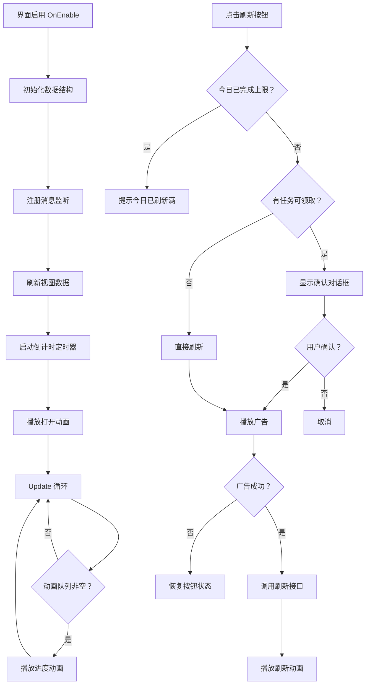

# UIMarketView.cs - 市场界面

## 📄 文件信息

| 属性 | 值 |
|------|------|
| 文件路径 | `Assets/Scripts/Code/Game/UIGame/UILobby/UIMarketView.cs` |
| 命名空间 | `TaoTie` |
| 基类 | `UIBaseView` |
| 实现接口 | `IOnCreate`, `IOnEnable`, `IOnDisable`, `IOnWidthPaddingChange`, `IUpdate` |

---

## 🎯 类说明

`UIMarketView` 是游戏的市场界面，展示玩家的每日任务列表和任务进度奖励。玩家可以在这里查看当前可用的任务、完成任务进度、领取阶段奖励，并通过看广告刷新任务列表。

### 核心职责

- **任务列表展示**: 使用 `UICopyGameObject` 展示可滚动任务列表
- **进度追踪**: 实时更新任务完成进度
- **阶段奖励**: 展示任务进度对应的阶段奖励
- **进度动画**: 任务完成时播放进度条动画和特效
- **任务刷新**: 支持看广告刷新每日任务
- **定时刷新**: 每日固定时间自动刷新任务

---

## 📋 字段说明

### UI 组件字段

| 字段名 | 类型 | 说明 |
|--------|------|------|
| `RefreshText` | `UITextmesh` | 刷新时间文本（如"05:00"） |
| `TimeDown` | `UITextmesh` | 距离下次刷新倒计时 |
| `RefreshButton` | `UIButton` | 刷新任务按钮（看广告） |
| `Middle` | `UICopyGameObject` | 任务列表容器（可滚动） |
| `Progress` | `UISlider` | 任务进度条 |
| `Rewards` | `UICopyGameObject` | 阶段奖励列表容器 |
| `Text` | `UITextmesh` | 已完成任务数量文本 |
| `Close` | `UIButton` | 关闭按钮 |
| `UICommonView` | `UIAnimator` | 通用视图动画控制器 |
| `Max` | `UIImage` | 进度已满标记 |
| `ForbidClickImage` | `UIImage` | 禁止点击遮罩 |

### 数据字段

| 字段名 | 类型 | 说明 |
|--------|------|------|
| `_QueueTaskItemDatas` | `Queue<TaskItemData>` | 进度动画队列 |
| `_IsProgressAnim` | `bool` | 是否正在播放进度动画 |
| `timerId` | `long` | 倒计时定时器 ID |
| `lockTasks` | `HashSet<int>` | 锁定任务 ID 集合（已刷新锁定的任务） |
| `overTaskCount` | `int` | 已完成任务数量 |
| `datas` | `List<TaskConfig>` | 当前任务配置列表 |

### 内部类

#### `UIMarketViewUpdateTimer`
市场界面更新定时器，每秒更新刷新倒计时。

```csharp
[Timer(TimerType.UIMarketView)]
public class UIMarketViewUpdateTimer : ATimer<UIMarketView>
{
    public override void Run(UIMarketView self)
    {
        try
        {
            self.UpdateTimeDown();
        }
        catch (Exception e)
        {
            Log.Error($"move timer error: UIMarketView\n{e}");
        }
    }
}
```

---

## 🔧 方法说明

### 生命周期方法

#### `OnCreate()`
初始化界面 UI 组件和列表视图。

```csharp
public void OnCreate()
{
    UICommonView = AddComponent<UIAnimator>("UICommonView");
    Close = AddComponent<UIButton>("UICommonView/Bg/Close");
    RefreshText = AddComponent<UITextmesh>("UICommonView/Bg/Content/Top/RefreshText");
    TimeDown = AddComponent<UITextmesh>("UICommonView/Bg/Content/Top/TimeDown");
    RefreshButton = AddComponent<UIButton>("UICommonView/Bg/Content/Top/RefreshButton");
    Middle = AddComponent<UICopyGameObject>("UICommonView/Bg/Content/Middle/Viewport/Content");
    Middle.InitListView(0, OnGetItemByIndex);
    Progress = AddComponent<UISlider>("UICommonView/Bg/Content/Bottom/Progress");
    Rewards = AddComponent<UICopyGameObject>("UICommonView/Bg/Content/Bottom/Progress/Rewards");
    Rewards.InitListView(0, GetRewardsItemByIndex);
    Text = AddComponent<UITextmesh>("UICommonView/Bg/Content/Bottom/Over/Text");
    Max = AddComponent<UIImage>("UICommonView/Bg/Content/Bottom/Progress/Max");
    ForbidClickImage = AddComponent<UIImage>("ForbidClick");
    
    RefreshText.SetI18NKey(I18NKey.Text_Market_RereshTime);
    Text.SetI18NKey(I18NKey.Text_Market_OverCount);
}
```

#### `OnEnable()`
界面启用时初始化数据和定时器。

**主要功能:**
1. 播放打开音效
2. 初始化数据结构和状态
3. 绑定按钮点击事件
4. 设置刷新时间文本
5. 注册任务进度更新消息监听
6. 刷新视图数据
7. 启动倒计时定时器（1 秒间隔）
8. 播放打开动画

#### `OnDisable()`
界面禁用时清理资源。

**主要功能:**
1. 移除消息监听
2. 移除定时器
3. 清空动画队列

#### `Update()`
每帧更新，处理进度动画队列。

**主要功能:**
- 当不正在播放动画且队列中有待处理项时，触发进度动画

---

### 业务方法

#### `UpdateTimeDown()`
更新距离下次任务刷新的倒计时显示。

**显示格式:**
- 小时 > 0: 显示 `HH:mm`
- 小时 = 0: 显示 `mm:ss`

#### `PlayOpenAnim()`
播放界面打开动画，延迟后播放任务项动画。

**返回:** `ETTask`

#### `PlayItemAnim()`
播放任务项依次出现的动画。

**处理流程:**
1. 设置任务列表项数量
2. 刷新所有显示项
3. 先隐藏所有项
4. 依次显示每项（间隔 50ms）

#### `RefreshView()`
刷新任务视图数据。

**处理流程:**
1. 清空任务列表
2. 获取玩家每日任务 ID 列表
3. 加载任务配置并排序
4. 统计已完成任务数量
5. 设置阶段奖励列表
6. 计算并设置进度条

#### `TaskCompare(TaskConfig task1, TaskConfig task2)`
任务排序比较函数。

**排序规则:**
1. 锁定任务优先
2. 未完成优先于已完成
3. 进度满的优先
4. 容器等级高的优先
5. 稀有度高的优先

#### `ProgressAnim(float completedTaskCount, int listCount, int showIndex)`
播放进度条动画和奖励特效。

**参数说明:**
- `completedTaskCount`: 已完成任务数量
- `listCount`: 总阶段数
- `showIndex`: 触发的奖励索引（-1 表示无）

**处理流程:**
1. 计算新旧进度值
2. 插值动画过渡（300ms）
3. 如果触发奖励，播放任务完成特效
4. 刷新奖励列表显示

#### `RefreshTask()`
外部调用的任务刷新方法（消息回调）。

**主要功能:**
- 刷新任务列表显示

#### `OnClickTask()`
任务完成时调用，将进度更新加入队列。

#### `OnTaskComplete()`
任务完成时播放完成特效。

#### `ForbidClick(bool isActive)`
设置禁止点击遮罩状态。

---

### 事件处理方法

| 方法名 | 触发条件 | 功能说明 |
|--------|----------|----------|
| `OnClickRefreshButton()` | 点击刷新按钮 | 检查条件后播放广告刷新任务 |
| `OnClickRefreshButtonAsync()` | 广告成功后 | 调用刷新接口并播放动画 |
| `OnClickBack()` | 点击返回按钮 | 关闭市场界面返回大厅 |
| `OnClickCloseAsync()` | 关闭界面 | 打开大厅界面并播放关闭动画 |
| `OnGetItemByIndex()` | 列表项创建 | 创建/复用任务项组件 |
| `GetRewardsItemByIndex()` | 奖励项创建 | 创建/复用阶段奖励组件 |

---

## 🔄 流程图



---

## 💡 使用示例

### 打开市场界面

```csharp
// 从大厅打开市场界面
UIManager.Instance.OpenWindow<UIMarketView>(UIMarketView.PrefabPath).Coroutine();
```

### 刷新任务列表

```csharp
// 当任务进度更新时刷新显示
var marketView = UIManager.Instance.GetView<UIMarketView>(1);
marketView?.RefreshTask();
```

### 禁止点击（加载时）

```csharp
// 在刷新任务时禁止用户操作
marketView.ForbidClick(true);
// ... 刷新操作 ...
marketView.ForbidClick(false);
```

### 任务完成通知

```csharp
// 当任务完成时，通过消息通知市场界面刷新
Messager.Instance.Broadcast(0, MessageId.UpdateTaskStep, null);
```

---

## 🔗 相关文档

- [UILobbyView.cs.md](./UILobbyView.cs.md) - 大厅主界面
- [DailyTaskItem.cs.md](./DailyTaskItem.cs.md) - 每日任务项组件
- [DailyTaskRewards.cs.md](./DailyTaskRewards.cs.md) - 每日任务阶段奖励
- [UITaskDetailsWin.cs.md](./UITaskDetailsWin.cs.md) - 任务详情窗口
- [PlayerDataManager.cs.md](../../Data/PlayerDataManager.cs.md) - 玩家数据管理器
- [TaskConfig.cs.md](../../../Config/TaskConfig.cs.md) - 任务配置

---

*最后更新：2026-03-02*
