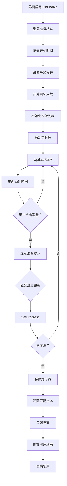

# UIMatchView.cs - 匹配界面

## 📄 文件信息

| 属性 | 值 |
|------|------|
| 文件路径 | `Assets/Scripts/Code/Game/UIGame/UILobby/UIMatchView.cs` |
| 命名空间 | `TaoTie` |
| 基类 | `UIBaseView` |
| 实现接口 | `IOnCreate`, `IOnEnable<int>`, `IOnDisable`, `IOnBeforeCloseWin` |

---

## 🎯 类说明

`UIMatchView` 是拍卖场匹配界面，在进入拍卖场景前显示匹配进度。界面展示当前匹配的玩家数量、匹配时间，并提供准备按钮供玩家确认准备就绪。

### 核心职责

- **匹配进度展示**: 显示当前匹配到的玩家数量
- **匹配计时**: 显示已匹配时间
- **玩家头像**: 展示已匹配玩家的头像
- **准备确认**: 玩家点击准备按钮确认就绪
- **黑屏转场**: 匹配完成后播放黑屏转场动画

---

## 📋 字段说明

### UI 组件字段

| 字段名 | 类型 | 说明 |
|--------|------|------|
| `Match` | `UITextmesh` | 匹配时间文本 |
| `Center` | `UICopyGameObject` | 玩家头像列表容器 |
| `Count` | `UITextmesh` | 匹配进度文本（如"3/9"） |
| `btn_start` | `UIButton` | 准备按钮 |
| `LoadingScreen` | `UIEmptyView` | 加载屏幕区域 |
| `MaskImage` | `UIImage` | 黑屏遮罩图片 |
| `Lv` | `UITextmesh` | 拍卖场等级标题 |
| `Ready` | `UITextmesh` | 准备就绪提示文本 |

### 常量定义

| 常量名 | 类型 | 值 | 说明 |
|--------|------|------|------|
| `MAX_COUNT` | `int` | `9` | 最大玩家数量 |
| `animTime` | `float` | `200f` | 黑屏动画时间（毫秒） |

### 数据字段

| 字段名 | 类型 | 说明 |
|--------|------|------|
| `items` | `UserItem[]` | 玩家头像项数组 |
| `startTime` | `long` | 匹配开始时间戳 |
| `timer` | `long` | 更新定时器 ID |
| `count` | `int` | 目标玩家数量 |
| `isAnime` | `bool` | 是否正在播放动画 |

### 内部类

#### `UIMatchViewTimer`
匹配界面更新定时器，每秒更新匹配时间显示。

```csharp
[Timer(TimerType.UIMatchUpdate)]
public class UIMatchViewTimer : ATimer<UIMatchView>
{
    public override void Run(UIMatchView self)
    {
        try
        {
            self.Update();
        }
        catch (Exception e)
        {
            Log.Error($"move timer error: UIMatchView\n{e}");
        }
    }
}
```

---

## 🔧 方法说明

### 生命周期方法

#### `OnCreate()`
初始化界面 UI 组件和列表容器。

```csharp
public void OnCreate()
{
    Ready = AddComponent<UITextmesh>("View/Ready");
    Lv = AddComponent<UITextmesh>("View/Title/Text");
    MaskImage = AddComponent<UIImage>("Mask");
    LoadingScreen = AddComponent<UIEmptyView>("View");
    Match = AddComponent<UITextmesh>("View/Match");
    Center = AddComponent<UICopyGameObject>("View/Center");
    Center.InitListView(0, GetCenterItemByIndex);
    Count = AddComponent<UITextmesh>("View/Count");
    btn_start = AddComponent<UIButton>("View/StartBtn");
}
```

#### `OnEnable(int levelId)`
界面启用时初始化匹配数据。

**参数说明:**
- `levelId`: 拍卖场等级 ID

**处理流程:**
1. 重置玩家准备状态
2. 隐藏准备提示
3. 显示匹配时间和准备按钮
4. 记录开始时间
5. 设置拍卖场等级标题
6. 计算目标玩家数量
7. 初始化玩家头像列表
8. 绑定准备按钮事件
9. 启动更新定时器

#### `OnDisable()`
界面禁用时清理定时器。

**主要功能:**
- 移除更新定时器

#### `Update()`
每秒更新匹配时间显示。

**主要功能:**
- 计算并显示已匹配时间（秒）

---

### 业务方法

#### `OnBeforeDisable()`
界面关闭前播放黑屏转场动画。

**返回:** `ETTask`

**处理流程:**
1. 渐变到黑屏（200ms）
2. 隐藏加载屏幕
3. 渐变回透明（200ms）

#### `SetProgress(float progress)`
更新匹配进度。

**参数说明:**
- `progress`: 匹配进度（0-1）

**处理流程:**
1. 进度满时移除定时器并隐藏匹配文本
2. 计算当前匹配到的玩家数量
3. 更新进度文本
4. 依次显示玩家头像

#### `LoadingAnim(bool isToBlack)`
播放加载黑屏动画。

**参数说明:**
- `isToBlack`: true=变黑，false=变亮

**返回:** `ETTask`

**处理流程:**
1. 设置加载屏幕状态
2. 设置初始透明度
3. 插值动画过渡（200ms）
4. 根据方向设置最终状态

---

### 事件处理方法

| 方法名 | 触发条件 | 功能说明 |
|--------|----------|----------|
| `GetCenterItemByIndex()` | 列表项创建 | 创建/复用玩家头像项组件 |
| `OnClickbtn_start()` | 点击准备按钮 | 标记玩家准备就绪 |

---

## 🔄 流程图



---

## 💡 使用示例

### 打开匹配界面

```csharp
// 从拍卖选择界面打开匹配界面
int levelId = 5; // 目标等级 ID
await UIManager.Instance.OpenWindow<UIMatchView, int>(
    UIMatchView.PrefabPath, 
    levelId, 
    UILayerNames.TipLayer
);
```

### 更新匹配进度

```csharp
// 当服务器通知匹配进度更新时
var matchView = UIManager.Instance.GetView<UIMatchView>(1);
float progress = 0.5f; // 50% 匹配进度
matchView?.SetProgress(progress);
```

### 播放加载动画

```csharp
// 匹配完成后播放黑屏转场
var matchView = UIManager.Instance.GetView<UIMatchView>(1);
await matchView.LoadingAnim(true); // 变黑

// ... 切换场景 ...

await matchView.LoadingAnim(false); // 变亮
```

### 玩家准备

```csharp
// 玩家点击准备按钮
public void OnClickbtn_start()
{
    Ready.SetActive(true);      // 显示"准备就绪"提示
    btn_start.SetActive(false); // 隐藏准备按钮
    IAuctionManager.UserReady = true; // 标记全局准备状态
}
```

---

## 🔗 相关文档

- [UIAuctionSelectView.cs.md](./UIAuctionSelectView.cs.md) - 拍卖选择界面
- [UserItem.cs.md](./UserItem.cs.md) - 玩家头像项组件
- [IAuctionManager.cs.md](../../Manager/IAuctionManager.cs.md) - 拍卖管理器接口
- [SceneManager.cs.md](../../Scene/SceneManager.cs.md) - 场景管理器
- [LevelConfig.cs.md](../../../Config/LevelConfig.cs.md) - 等级配置

---

*最后更新：2026-03-02*
