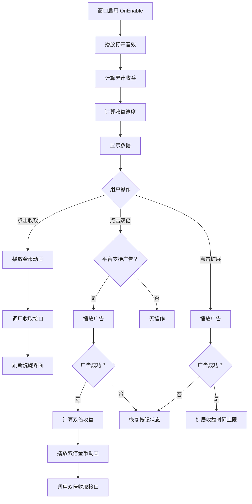

# UIProfitWin.cs - 餐厅收益窗口

## 📄 文件信息

| 属性 | 值 |
|------|------|
| 文件路径 | `Assets/Scripts/Code/Game/UIGame/UILobby/UIProfitWin.cs` |
| 命名空间 | `TaoTie` |
| 基类 | `UIBaseView` |
| 实现接口 | `IOnCreate`, `IOnEnable` |

---

## 🎯 类说明

`UIProfitWin` 是餐厅收益结算窗口，展示玩家餐厅的累计收益、收益速度，并提供收取收益和看广告加倍的功能。

### 核心职责

- **收益展示**: 显示累计收益金额和每小时收益速度
- **收益收取**: 处理收益收取逻辑，带金币飞入动画
- **广告加倍**: 支持看广告双倍收取收益
- **时间扩展**: 支持看广告扩展收益时间上限

---

## 📋 字段说明

### UI 组件字段

| 字段名 | 类型 | 说明 |
|--------|------|------|
| `Close` | `UIButton` | 关闭按钮 |
| `Desc` | `UITextmesh` | 收益时间描述（如"过去 3 小时收益"） |
| `ButtonExpand` | `UIButton` | 扩展时间按钮（看广告） |
| `Button` | `UIButton` | 收取收益按钮 |
| `ButtonAd` | `UIButton` | 双倍收取按钮（看广告） |
| `Text` | `UITextmesh` | 收益金额文本 |
| `Speed` | `UITextmesh` | 收益速度文本（如"1000/小时"） |
| `UICommonWin` | `UIAnimator` | 通用窗口动画控制器 |

### 状态字段

| 字段名 | 类型 | 说明 |
|--------|------|------|
| `anim` | `bool` | 是否正在播放收益动画（防止重复触发） |

---

## 🔧 方法说明

### 生命周期方法

#### `OnCreate()`
初始化窗口 UI 组件和国际化文本。

```csharp
public void OnCreate()
{
    UICommonWin = AddComponent<UIAnimator>("UICommonWin");
    Close = AddComponent<UIButton>("UICommonWin/Win/Close");
    Desc = AddComponent<UITextmesh>("UICommonWin/Win/Content/Bg/Desc/Desc");
    ButtonExpand = AddComponent<UIButton>("UICommonWin/Win/Content/Bg/Desc/ButtonExpand");
    Button = AddComponent<UIButton>("UICommonWin/Win/Content/Button");
    ButtonAd = AddComponent<UIButton>("UICommonWin/Win/Content/ButtonAd");
    Text = AddComponent<UITextmesh>("UICommonWin/Win/Content/Bg/Details/Text");
    Speed = AddComponent<UITextmesh>("UICommonWin/Win/Content/Bg/Speed");
    
    // 设置国际化文本
    Speed.SetI18NKey(I18NKey.Text_Profit_Speed);
    Desc.SetI18NKey(I18NKey.Text_Restaurant_Profit_Hour);
}
```

#### `OnEnable()`
窗口启用时初始化数据和事件绑定。

**主要功能:**
1. 播放打开音效
2. 绑定所有按钮点击事件
3. 设置收益时间描述
4. 计算并显示累计收益
5. 计算并显示收益速度

#### `Update(BigNumber value)`
外部调用更新收益数值（带动画）。

**参数说明:**
- `value`: 新的收益值

---

### 业务方法

#### `CloseSelf()`
关闭窗口，播放关闭动画和音效。

**返回:** `ETTask`

#### `PlayAdAsync()`
播放广告以扩展收益时间上限。

**处理流程:**
1. 禁用扩展按钮防止重复点击
2. 调用广告 SDK 播放广告
3. 广告成功后调用 `PlayerDataManager.Instance.Expand()`
4. 恢复按钮状态
5. 更新收益时间描述

#### `OnClickButtonAsync()`
处理收益收取逻辑。

**处理流程:**
1. 关闭当前窗口
2. 获取顶部 UI 视图 `UITopView`
3. 播放金币飞入动画（从窗口位置飞到顶部金币显示区）
4. 调用 `PlayerDataManager.Instance.GetProfit()` 收取收益
5. 刷新洗碗界面（如果有打开）

#### `OnClickButtonAdAsync()`
处理双倍收益收取逻辑（看广告）。

**处理流程:**
1. 检查平台是否支持广告
2. 播放广告
3. 广告成功后计算双倍收益
4. 播放双倍金币飞入动画
5. 调用 `PlayerDataManager.Instance.GetProfit(2)` 收取双倍收益
6. 刷新洗碗界面

---

### 事件处理方法

| 方法名 | 触发条件 | 功能说明 |
|--------|----------|----------|
| `OnClickClose()` | 点击关闭按钮 | 关闭窗口 |
| `OnClickButtonExpand()` | 点击扩展按钮 | 播放广告扩展收益时间 |
| `OnClickButton()` | 点击收取按钮 | 收取累计收益 |
| `OnClickButtonAd()` | 点击双倍按钮 | 播放广告双倍收取收益 |

---

## 🔄 流程图



---

## 💡 使用示例

### 打开收益窗口

```csharp
// 从餐厅界面打开收益窗口
UIManager.Instance.OpenWindow<UIProfitWin>(UIProfitWin.PrefabPath).Coroutine();
```

### 外部更新收益数值

```csharp
// 当收益变化时更新窗口显示
var profitWin = UIManager.Instance.GetView<UIProfitWin>(1);
if (profitWin != null)
{
    var newProfit = PlayerDataManager.Instance.CalculateProfit();
    profitWin.Update(newProfit);
}
```

### 从洗碗界面触发

```csharp
// 在洗碗界面点击收益按钮时
public void OnClickProfit()
{
    UIManager.Instance.OpenWindow<UIProfitWin>(UIProfitWin.PrefabPath).Coroutine();
}
```

---

## 🔗 相关文档

- [UILobbyView.cs.md](./UILobbyView.cs.md) - 大厅主界面
- [UIWashDishView.cs.md](./UIWashDishView.cs.md) - 餐厅洗碗界面
- [UITopView.cs.md](../UITT/UITopView.cs.md) - 顶部 UI 视图（金币显示）
- [PlayerDataManager.cs.md](../../Data/PlayerDataManager.cs.md) - 玩家数据管理器
- [AdManager.cs.md](../../../Manager/AdManager.cs.md) - 广告管理器

---

*最后更新：2026-03-02*
