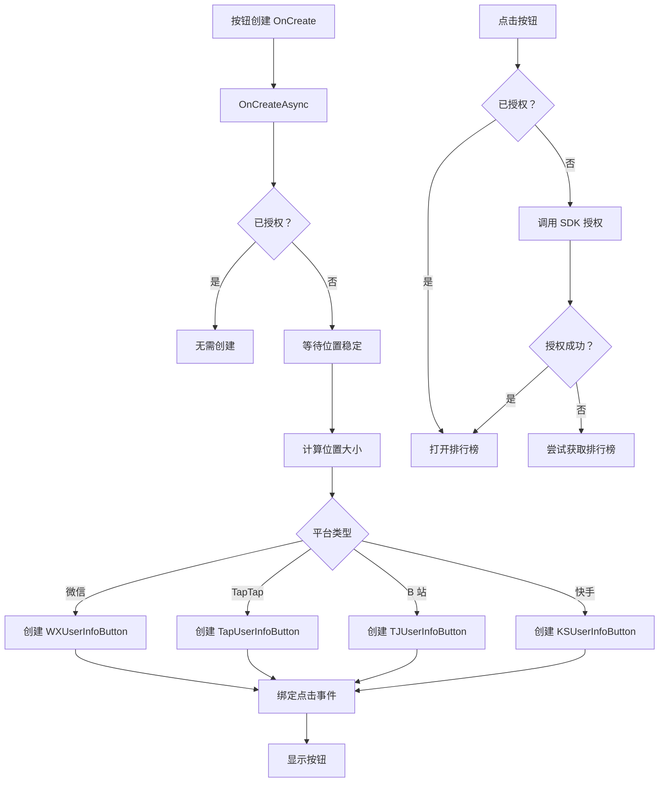

# UIRankBtn.cs - 排行榜按钮（SDK 集成）

## 📄 文件信息

| 属性 | 值 |
|------|------|
| 文件路径 | `Assets/Scripts/Code/Game/UIGame/UILobby/UIRankBtn.cs` |
| 命名空间 | `TaoTie` |
| 基类 | `UIButton` |
| 实现接口 | `IOnCreate`, `IOnEnable`, `IOnDisable` |

---

## 🎯 类说明

`UIRankBtn` 是集成各平台 SDK 用户信息按钮的排行榜按钮。在微信、TapTap、B 站、快手等小游戏平台上，点击按钮会调用平台原生的用户信息授权按钮，授权成功后再打开排行榜界面。

### 核心职责

- **SDK 集成**: 集成各平台 SDK 的用户信息按钮
- **授权流程**: 处理平台用户授权流程
- **排行榜入口**: 授权成功后打开排行榜界面

### 支持平台

- `UNITY_WEBGL_WeChat`: 微信小游戏
- `UNITY_WEBGL_TAPTAP`: TapTap 小游戏
- `UNITY_WEBGL_BILIGAME`: B 站游戏
- `UNITY_WEBGL_MINIHOST`: 迷你宿主
- `UNITY_WEBGL_KS`: 快手小游戏

---

## 📋 字段说明

### 平台特定字段

| 字段名 | 类型 | 说明 |
|--------|------|------|
| `btn` | `WXUserInfoButton` / `TapUserInfoButton` / `TJUserInfoButton` / `KSUserInfoButton` | 平台原生用户信息按钮（条件编译） |

---

## 🔧 方法说明

### 生命周期方法

#### `OnCreate()`
异步创建平台原生按钮。

**处理流程:**
1. 调用 `OnCreateAsync()`
2. 等待按钮位置稳定
3. 计算按钮在屏幕上的位置和大小
4. 创建平台原生用户信息按钮
5. 绑定点击事件

#### `OnEnable()`
界面启用时显示平台按钮。

**主要功能:**
- 调用平台按钮的 `Show()` 方法

#### `OnDisable()`
界面禁用时隐藏平台按钮。

**主要功能:**
- 调用平台按钮的 `Hide()` 方法

#### `OnDestroy()`
销毁时清理平台按钮。

**主要功能:**
- 调用平台按钮的 `Destroy()` 方法
- 清空引用

---

### 业务方法

#### `OnClickBtnAsync()`
处理按钮点击事件，先进行 SDK 授权。

**返回:** `ETTask`

**处理流程:**
1. 检查是否已授权
2. 未授权时调用 `SDKManager.Instance.Auth()`
3. 授权失败时尝试获取排行榜
4. 授权成功后调用基类点击方法

#### `OnCreateAsync()`
异步创建平台原生按钮。

**返回:** `ETTask`

**处理流程:**
1. 检查是否已授权（已授权则无需创建）
2. 等待按钮位置稳定
3. 计算按钮在屏幕上的位置和大小
4. 根据平台创建对应的用户信息按钮
5. 绑定点击回调

---

## 🔄 流程图



---

## 💡 使用示例

### 在大厅界面使用

```csharp
// UILobbyView.cs 中添加排行榜按钮
public UIRankBtn btnRank;

public void OnCreate()
{
    // ... 其他初始化
    btnRank = AddComponent<UIRankBtn>("Mid/Left/btn_rank");
    btnRank.SetOnClick(OnClickRank);
}

public void OnClickRank()
{
    OnClickRankAsync().Coroutine();
}

private async ETTask OnClickRankAsync()
{
    // 预加载资源
    var task1 = GameObjectPoolManager.GetInstance().PreLoadGameObjectAsync(UIRankView.PrefabPath, 0);
    // 获取排名数据
    var task2 = APIManager.Instance.GetRankInfo(PlayerManager.Instance.Uid);
    
    await UIManager.Instance.OpenWindow<UINetView>(UINetView.PrefabPath);
    var list = await task2;
    await task1;
    await UIManager.Instance.CloseWindow<UINetView>();
    
    CloseSelf().Coroutine();
    UIManager.Instance.OpenWindow<UIRankView, RankList>(UIRankView.PrefabPath, list).Coroutine();
}
```

### SDK 授权检查

```csharp
// SDKManager 中的授权检查
public async Task<bool> Auth()
{
#if UNITY_WEBGL_WeChat || UNITY_WEBGL_TAPTAP || UNITY_WEBGL_BILIGAME
    // 调用平台授权接口
    return await PlatformAuth();
#else
    return true;
#endif
}
```

---

## 🔗 相关文档

- [UILobbyView.cs.md](./UILobbyView.cs.md) - 大厅主界面
- [UIRankView.cs.md](./UIRankView.cs.md) - 排行榜界面
- [SDKManager.cs.md](../../../Manager/SDKManager.cs.md) - SDK 管理器
- [UIButton.cs.md](../../../UIComponent/UIButton.cs.md) - UI 按钮基类

---

*最后更新：2026-03-02*
