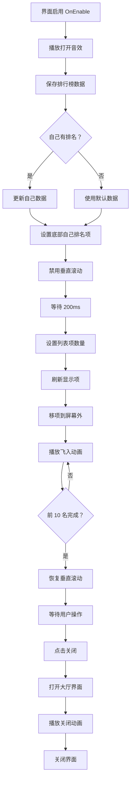

# UIRankView.cs - 排行榜界面

## 📄 文件信息

| 属性 | 值 |
|------|------|
| 文件路径 | `Assets/Scripts/Code/Game/UIGame/UILobby/UIRankView.cs` |
| 命名空间 | `TaoTie` |
| 基类 | `UIBaseView` |
| 实现接口 | `IOnCreate`, `IOnEnable<RankList>`, `IOnWidthPaddingChange` |

---

## 🎯 类说明

`UIRankView` 是游戏排行榜界面，展示全服玩家的财富排名。界面显示前 100 名玩家的排名、头像、昵称和财富值，并在底部单独显示当前玩家的排名信息。

### 核心职责

- **排行榜展示**: 使用 `UILoopListView2` 展示可滚动的排名列表
- **排名动画**: 前 10 名玩家依次飞入的动画效果
- **自己排名**: 在底部固定显示当前玩家的排名
- **头像加载**: 支持在线头像 URL 加载

---

## 📋 字段说明

### UI 组件字段

| 字段名 | 类型 | 说明 |
|--------|------|------|
| `Close` | `UIButton` | 关闭按钮 |
| `ScrollView` | `UILoopListView2` | 排行榜滚动列表 |
| `RankItem` | `RankItem` | 底部自己排名项组件 |
| `UICommonView` | `UIAnimator` | 通用视图动画控制器 |

### 数据字段

| 字段名 | 类型 | 说明 |
|--------|------|------|
| `list` | `RankInfo[]` | 排行榜数据数组 |

---

## 🔧 方法说明

### 生命周期方法

#### `OnCreate()`
初始化界面 UI 组件和滚动列表。

```csharp
public void OnCreate()
{
    UICommonView = AddComponent<UIAnimator>("UICommonView");
    Close = AddComponent<UIButton>("UICommonView/Bg/Close");
    ScrollView = AddComponent<UILoopListView2>("UICommonView/Bg/Content/ScrollView");
    ScrollView.InitListView(0, GetScrollViewItemByIndex);
    RankItem = AddComponent<RankItem>("UICommonView/Bg/Content/RankItem");
}
```

#### `OnEnable(RankList data)`
界面启用时初始化排行榜数据。

**参数说明:**
- `data`: 排行榜数据（包含排名列表和自己排名）

**处理流程:**
1. 播放打开音效
2. 保存排行榜数据
3. 绑定关闭按钮事件
4. 重置列表项数量为 0
5. 如果自己有排名，更新自己的数据
6. 设置底部自己排名项
7. 异步播放列表动画

#### `OnEnableAsync()`
异步播放排行榜列表动画。

**返回:** `ETTask`

**处理流程:**
1. 禁用垂直滚动
2. 等待 200ms
3. 设置列表项数量
4. 刷新所有显示项
5. 将所有项移到左侧屏幕外（x = -1000）
6. 依次飞入前 10 名（每项延迟 100ms）
7. 恢复垂直滚动

---

### 业务方法

#### `GetScrollViewItemByIndex()`
滚动列表项创建/复用回调。

**参数说明:**
- `listView`: 列表视图
- `index`: 项索引

**返回:** `LoopListViewItem2`

**处理流程:**
1. 创建或复用列表项
2. 添加 `RankItem` 组件（如果首次）
3. 获取排名数据
4. 设置项数据
5. 设置项宽度为列表宽度
6. 返回列表项

---

### 事件处理方法

| 方法名 | 触发条件 | 功能说明 |
|--------|----------|----------|
| `OnClickClose()` | 点击关闭按钮 | 关闭排行榜界面 |
| `OnClickCloseAsync()` | 关闭界面 | 打开大厅界面并播放关闭动画 |

---

## 🔄 流程图



---

## 💡 使用示例

### 打开排行榜界面

```csharp
// 从大厅打开排行榜界面
RankList rankData = await APIManager.Instance.GetRankInfo(PlayerManager.Instance.Uid);
UIManager.Instance.OpenWindow<UIRankView, RankList>(
    UIRankView.PrefabPath, 
    rankData
).Coroutine();
```

### 排行榜数据结构

```csharp
// RankList 数据结构示例
public class RankList
{
    public RankInfo[] list;  // 排名列表
    public int my;           // 自己的排名（1-based）
}

// RankInfo 数据结构示例
public class RankInfo
{
    public long uid;         // 用户 ID
    public string NickName;  // 昵称
    public string Avatar;    // 头像 URL
    public long Money;       // 财富值
    public long RankValue;   // 排名值
}
```

### 获取排行榜数据

```csharp
// 从 API 获取排行榜数据
private async ETTask OnClickRankAsync()
{
    using ListComponent<ETTask<bool>> tasks = ListComponent<ETTask<bool>>.Create();
    tasks.Add(I18NManager.Instance.AddSystemFonts());
    tasks.Add(TimerManager.Instance.WaitAsync(5000));
    var task1 = GameObjectPoolManager.GetInstance().PreLoadGameObjectAsync(UIRankView.PrefabPath, 0);
    var task2 = APIManager.Instance.GetRankInfo(PlayerManager.Instance.Uid);
    
    await UIManager.Instance.OpenWindow<UINetView>(UINetView.PrefabPath);
    await ETTaskHelper.WaitAny(tasks);
    
    var list = await task2;
    await task1;
    await UIManager.Instance.CloseWindow<UINetView>();
    
    CloseSelf().Coroutine();
    UIManager.Instance.OpenWindow<UIRankView, RankList>(UIRankView.PrefabPath, list).Coroutine();
}
```

---

## 🔗 相关文档

- [UILobbyView.cs.md](./UILobbyView.cs.md) - 大厅主界面
- [RankItem.cs.md](./RankItem.cs.md) - 排行榜项组件
- [UINetView.cs.md](../UILoading/UINetView.cs.md) - 网络加载界面
- [APIManager.cs.md](../../../Manager/APIManager.cs.md) - API 管理器

---

*最后更新：2026-03-02*
