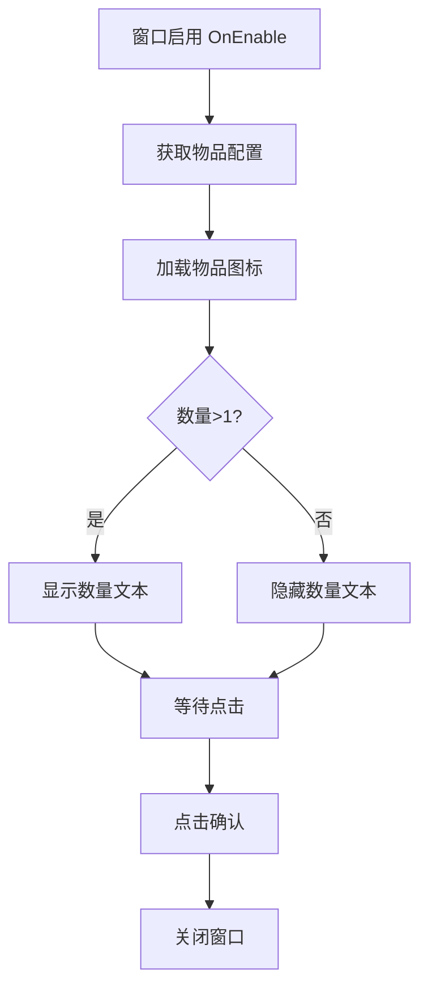

# UIRewardsView.cs - 奖励展示窗口

## 📄 文件信息

| 属性 | 值 |
|------|------|
| 文件路径 | `Assets/Scripts/Code/Game/UIGame/UILobby/UIRewardsView.cs` |
| 命名空间 | `TaoTie` |
| 基类 | `UIBaseView` |
| 实现接口 | `IOnCreate`, `IOnEnable<int, long>` |

---

## 🎯 类说明

`UIRewardsView` 是简单的奖励展示窗口，用于在玩家获得奖励时弹窗展示奖励物品图标和数量。通常在完成任务、领取每日奖励等场景下使用。

### 核心职责

- **奖励展示**: 显示奖励物品的图标和数量
- **确认关闭**: 点击确认后关闭窗口

---

## 📋 字段说明

### UI 组件字段

| 字段名 | 类型 | 说明 |
|--------|------|------|
| `Icon` | `UIImage` | 奖励物品图标 |
| `Get` | `UIButton` | 确认按钮 |
| `Count` | `UITextmesh` | 奖励数量文本（数量>1 时显示） |

---

## 🔧 方法说明

### 生命周期方法

#### `OnCreate()`
初始化窗口 UI 组件。

```csharp
public void OnCreate()
{
    Icon = AddComponent<UIImage>("Icon");
    Get = AddComponent<UIButton>("Get");
    Count = AddComponent<UITextmesh>("Icon/Text");
}
```

#### `OnEnable(int id, long count)`
窗口启用时设置奖励数据。

**参数说明:**
- `id`: 物品 ID
- `count`: 物品数量

**处理流程:**
1. 根据物品 ID 获取配置
2. 加载物品图标
3. 绑定确认按钮事件
4. 根据数量决定是否显示数量文本
5. 设置数量文本

---

### 事件处理方法

| 方法名 | 触发条件 | 功能说明 |
|--------|----------|----------|
| `OnClickGet()` | 点击确认按钮 | 关闭窗口 |

---

## 🔄 流程图



---

## 💡 使用示例

### 打开奖励展示窗口

```csharp
// 完成任务后展示奖励
int rewardItemId = 1001;
long rewardCount = 5000;
await UIManager.Instance.OpenWindow<UIRewardsView, int, long>(
    UIRewardsView.PrefabPath, 
    rewardItemId, 
    rewardCount,
    UILayerNames.TipLayer
);
```

### 从每日任务领取奖励

```csharp
// UIDailyWin.cs 中领取奖励后
var conf = RestaurantConfigCategory.Instance.GetByLv(PlayerDataManager.Instance.RestaurantLv, out _);
await UIManager.Instance.OpenWindow<UIRewardsView, int, long>(
    UIRewardsView.PrefabPath, 
    conf.RewardsType, 
    conf.RewardsCount,
    UILayerNames.TipLayer
);
```

---

## 🔗 相关文档

- [UIDailyWin.cs.md](./UIDailyWin.cs.md) - 每日任务奖励窗口
- [UITaskDetailsWin.cs.md](./UITaskDetailsWin.cs.md) - 任务详情窗口
- [ItemConfig.cs.md](../../../Config/ItemConfig.cs.md) - 物品配置
- [UIBaseView.cs.md](../../../UI/UIBaseView.cs.md) - UI 视图基类

---

*最后更新：2026-03-02*
