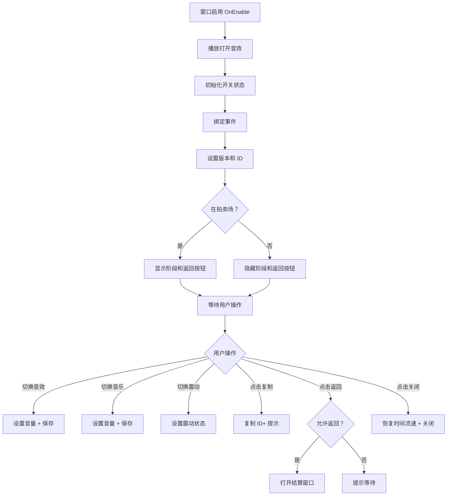

# UISettingWin.cs - 设置窗口

## 📄 文件信息

| 属性 | 值 |
|------|------|
| 文件路径 | `Assets/Scripts/Code/Game/UIGame/UILobby/UISettingWin.cs` |
| 命名空间 | `TaoTie` |
| 基类 | `UIBaseView` |
| 实现接口 | `IOnCreate`, `IOnEnable`, `IOnEnable<bool>`, `IOnDisable` |

---

## 🎯 类说明

`UISettingWin` 是游戏设置窗口，提供音效、音乐、震动开关设置，以及版本信息、用户 ID 显示和复制功能。支持在拍卖场中显示当前阶段信息和返回大厅功能。

### 核心职责

- **音效设置**: 控制音效开关
- **音乐设置**: 控制背景音乐开关
- **震动设置**: 控制手机震动反馈开关
- **信息展示**: 显示游戏版本、用户 ID、当前阶段
- **ID 复制**: 支持复制用户 ID 到剪贴板
- **返回大厅**: 在拍卖场中支持返回大厅

---

## 📋 字段说明

### UI 组件字段

| 字段名 | 类型 | 说明 |
|--------|------|------|
| `Close` | `UIButton` | 关闭按钮 |
| `Sound` | `UISliderToggle` | 音效开关 |
| `Music` | `UISliderToggle` | 音乐开关 |
| `Vibrate` | `UISliderToggle` | 震动开关 |
| `Version` | `UITextmesh` | 游戏版本文本 |
| `UID` | `UITextmesh` | 用户 ID 文本 |
| `Back` | `UIButton` | 返回大厅按钮 |
| `Copy` | `UIButton` | 复制 ID 按钮 |
| `Stage` | `UIEmptyView` | 当前阶段区域（拍卖场中显示） |
| `StageText` | `UITextmesh` | 当前阶段文本 |
| `UICommonWin` | `UIAnimator` | 通用窗口动画控制器 |

### 状态字段

| 字段名 | 类型 | 说明 |
|--------|------|------|
| `canBack` | `bool` | 是否允许返回（拍卖场中控制） |

---

## 🔧 方法说明

### 生命周期方法

#### `OnCreate()`
初始化窗口 UI 组件和国际化文本。

```csharp
public void OnCreate()
{
    UICommonWin = AddComponent<UIAnimator>("UICommonSmallWin");
    Stage = AddComponent<UIEmptyView>("UICommonSmallWin/Win/Stage");
    StageText = AddComponent<UITextmesh>("UICommonSmallWin/Win/Stage/Text");
    Copy = AddComponent<UIButton>("UICommonSmallWin/Win/Content/Uid/Copy");
    Close = AddComponent<UIButton>("UICommonSmallWin/Win/Close");
    Sound = AddComponent<UISliderToggle>("UICommonSmallWin/Win/Content/Sound/SliderToggle");
    Music = AddComponent<UISliderToggle>("UICommonSmallWin/Win/Content/Music/SliderToggle");
    Vibrate = AddComponent<UISliderToggle>("UICommonSmallWin/Win/Content/Vir/SliderToggle");
    Version = AddComponent<UITextmesh>("UICommonSmallWin/Win/Content/Version");
    UID = AddComponent<UITextmesh>("UICommonSmallWin/Win/Content/Uid");
    Back = AddComponent<UIButton>("UICommonSmallWin/Win/Content/Bottom/Back");
    
    StageText.SetI18NKey(I18NKey.Text_Game_Stage);
    UID.SetI18NKey(I18NKey.Text_UID);
    Version.SetI18NKey(I18NKey.Text_Version);
}
```

#### `OnEnable()` / `OnEnable(bool showBack)`
窗口启用时初始化设置状态。

**参数说明:**
- `showBack`: 是否显示返回按钮（拍卖场中为 true）

**处理流程:**
1. 播放打开音效
2. 初始化音效、音乐、震动开关状态
3. 绑定所有按钮和开关事件
4. 设置返回按钮显示状态
5. 设置当前阶段文本（如果在拍卖场）
6. 设置版本号和用户 ID
7. 绑定复制按钮事件

#### `OnDisable()`
窗口禁用时保存设置缓存。

**主要功能:**
- 调用 `CacheManager.Instance.Save()` 保存设置

---

### 业务方法

#### `CloseSelf()`
关闭窗口，播放关闭动画和音效，恢复游戏时间流速。

**返回:** `ETTask`

#### `OnClickBackAsync()`
处理返回大厅逻辑（拍卖场中）。

**返回:** `ETTask`

**处理流程:**
1. 检查是否在拍卖场
2. 检查是否允许返回
3. 禁用返回按钮防止重复点击
4. 打开结算窗口 `UIReportWin`
5. 关闭设置窗口

---

### 事件处理方法

| 方法名 | 触发条件 | 功能说明 |
|--------|----------|----------|
| `OnSoundToggleChange(bool val)` | 音效开关变化 | 设置音效音量并保存 |
| `OnMusicToggleChange(bool val)` | 音乐开关变化 | 设置音乐音量并保存 |
| `OnVibrateToggleChange(bool val)` | 震动开关变化 | 设置震动开关状态 |
| `OnClickBack()` | 点击返回按钮 | 返回大厅（拍卖场中） |
| `OnClickContinue()` | 点击关闭按钮 | 关闭窗口，恢复游戏时间 |
| `OnClickCopy()` | 点击复制按钮 | 复制用户 ID 到剪贴板 |

---

## 🔄 流程图



---

## 💡 使用示例

### 打开设置窗口

```csharp
// 从大厅打开设置窗口
UIManager.Instance.OpenWindow<UISettingWin>(UISettingWin.PrefabPath).Coroutine();
```

### 在拍卖场中打开设置窗口

```csharp
// 在拍卖场中打开设置窗口（显示返回按钮）
UIManager.Instance.OpenWindow<UISettingWin, bool>(
    UISettingWin.PrefabPath, 
    true  // showBack = true
).Coroutine();
```

### 保存设置

```csharp
// 音效开关变化时
public void OnSoundToggleChange(bool val)
{
    var data = val ? SoundManager.DEFAULTVALUE : 0;
    SoundManager.Instance.SetSoundVolume(data);
    CacheManager.Instance.SetInt(CacheKeys.SoundVolume, data);
}
```

---

## 🔗 相关文档

- [UILobbyView.cs.md](./UILobbyView.cs.md) - 大厅主界面
- [UIReportWin.cs.md](../UITT/UIReportWin.cs.md) - 结算窗口
- [SoundManager.cs.md](../../../Manager/SoundManager.cs.md) - 音效管理器
- [CacheManager.cs.md](../../../Manager/CacheManager.cs.md) - 缓存管理器
- [IAuctionManager.cs.md](../../Manager/IAuctionManager.cs.md) - 拍卖管理器接口

---

*最后更新：2026-03-02*
