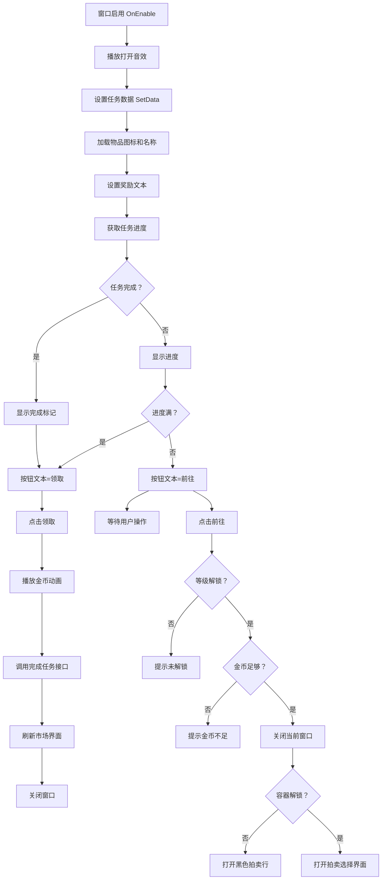

# UITaskDetailsWin.cs - 任务详情窗口

## 📄 文件信息

| 属性 | 值 |
|------|------|
| 文件路径 | `Assets/Scripts/Code/Game/UIGame/UILobby/UITaskDetailsWin.cs` |
| 命名空间 | `TaoTie` |
| 基类 | `UIBaseView` |
| 实现接口 | `IOnCreate`, `IOnEnable<TaskConfig>`, `IOnEnable<RestaurantTask>` |

---

## 🎯 类说明

`UITaskDetailsWin` 是任务详情展示窗口，用于显示单个任务的详细信息，包括任务目标、进度、奖励等。支持两种数据源：`TaskConfig`（市场日常任务）和 `RestaurantTask`（餐厅专属任务）。

### 核心职责

- **任务信息展示**: 显示任务图标、名称、描述、目标数量
- **进度跟踪**: 显示当前完成进度
- **奖励预览**: 展示任务奖励类型和数量
- **掉落展示**: 显示任务物品的容器等级和品质
- **任务完成**: 处理任务完成和奖励领取
- **广告加速**: 支持看广告快速完成任务进度

---

## 📋 字段说明

### UI 组件字段

| 字段名 | 类型 | 说明 |
|--------|------|------|
| `Close` | `UIButton` | 关闭按钮 |
| `Icon` | `UIImage` | 任务物品图标 |
| `Rewards` | `UITextmesh` | 奖励标题文本 |
| `RewardsVal` | `UITextmesh` | 奖励数值文本 |
| `DropPointer` | `UIPointerClick` | 掉落信息点击区域 |
| `Drop` | `UITextmesh` | 掉落信息文本（容器等级 + 品质） |
| `Button1` | `UIButton` | 广告加速按钮 |
| `ButtonText2` | `UITextmesh` | 按钮 2 文本 |
| `Button2` | `UIButton` | 主操作按钮（前往/领取） |
| `Title` | `UITextmesh` | 窗口标题 |
| `Need` | `UITextmesh` | 进度文本（当前/目标） |
| `Desc` | `UITextmesh` | 任务描述 |
| `Over` | `UIEmptyView` | 完成标记区域 |
| `Name` | `UITextmesh` | 物品名称 |
| `High` | `UIEmptyView` | 稀有度标记区域 |
| `UICommonWin` | `UIAnimator` | 通用窗口动画控制器 |

### 数据字段

| 字段名 | 类型 | 说明 |
|--------|------|------|
| `Config` | `TaskConfig` | 当前任务配置（只读属性） |
| `uiTask` | `RestaurantTask` | 餐厅任务数据（可为 null） |

---

## 🔧 方法说明

### 生命周期方法

#### `OnCreate()`
初始化窗口 UI 组件和国际化文本。

```csharp
public void OnCreate()
{
    UICommonWin = AddComponent<UIAnimator>("UICommonWin");
    High = AddComponent<UIEmptyView>("UICommonWin/Win/Content/Item/Rare/High");
    Icon = AddComponent<UIImage>("UICommonWin/Win/Content/Item/Rare/Icon");
    Rewards = AddComponent<UITextmesh>("UICommonWin/Win/Content/Desc/Details/Title");
    RewardsVal = AddComponent<UITextmesh>("UICommonWin/Win/Content/Desc/Details/Text");
    Close = AddComponent<UIButton>("UICommonWin/Win/Close");
    Drop = AddComponent<UITextmesh>("UICommonWin/Win/Content/Desc/Drop");
    DropPointer = AddComponent<UIPointerClick>("UICommonWin/Win/Content/Desc/Drop");
    Button1 = AddComponent<UIButton>("UICommonWin/Win/Content/Bottom/Button1");
    ButtonText2 = AddComponent<UITextmesh>("UICommonWin/Win/Content/Bottom/Button2/Text");
    Button2 = AddComponent<UIButton>("UICommonWin/Win/Content/Bottom/Button2");
    Need = AddComponent<UITextmesh>("UICommonWin/Win/Content/Desc/Progress");
    Title = AddComponent<UITextmesh>("UICommonWin/Win/Title");
    Desc = AddComponent<UITextmesh>("UICommonWin/Win/Content/Desc/Desc");
    Over = AddComponent<UIEmptyView>("UICommonWin/Win/Over");
    Name = AddComponent<UITextmesh>("UICommonWin/Win/Content/Item/Table/Text");
    
    Need.SetI18NKey(I18NKey.Text_Task_Need);
}
```

#### `OnEnable(TaskConfig data)` / `OnEnable(RestaurantTask data)`
窗口启用时初始化任务数据。

**参数说明:**
- `data`: 任务配置或餐厅任务数据

**主要功能:**
1. 播放打开音效
2. 设置 `uiTask` 标记（区分任务来源）
3. 调用 `SetData()` 初始化界面

#### `SetData(TaskConfig data)`
设置任务数据并刷新界面显示。

**处理流程:**
1. 保存任务配置
2. 设置稀有度标记显示
3. 根据物品类型加载图标和名称
4. 根据奖励类型设置奖励文本
5. 设置窗口标题（区分日常任务/餐厅任务）
6. 获取任务进度状态
7. 设置按钮显示和文本
8. 设置掉落信息（容器等级 + 品质颜色）
9. 检查容器解锁状态

---

### 业务方法

#### `CloseSelf()`
关闭窗口，播放关闭动画和音效。

**返回:** `ETTask`

#### `OnClickComplexAsync()`
处理任务完成逻辑。

**处理流程:**
1. 关闭当前窗口
2. 播放金币飞入动画（如果奖励是金币）
3. 调用 `PlayerDataManager.Instance.ComplexTask()` 完成任务
4. 刷新市场界面（如果是市场任务）
5. 再次关闭窗口

#### `OnClickBtnStartAsync()`
处理前往竞拍逻辑。

**处理流程:**
1. 获取任务物品对应的容器配置
2. 检查玩家等级是否解锁该容器
3. 检查玩家金币是否足够进入拍卖
4. 关闭当前窗口和市场界面
5. 如果容器未解锁，打开黑色拍卖行引导
6. 如果容器已解锁，打开拍卖选择界面

#### `OnClickAdGetAsync()`
处理广告加速逻辑。

**处理流程:**
1. 播放广告
2. 广告成功后调用 `PlayerDataManager.Instance.AddTaskStep()` 增加任务进度
3. 刷新界面数据
4. 关闭窗口

---

### 事件处理方法

| 方法名 | 触发条件 | 功能说明 |
|--------|----------|----------|
| `OnClickClose()` | 点击关闭按钮 | 关闭窗口 |
| `OnClickGoButton()` | 点击主按钮 | 根据状态执行领取或前往 |
| `OnClickDrop()` | 点击掉落信息 | 前往竞拍界面 |
| `OnClickAdButton()` | 点击广告按钮 | 播放广告加速任务 |

---

## 🔄 流程图



---

## 💡 使用示例

### 打开任务详情窗口（市场任务）

```csharp
// 从市场界面打开任务详情
TaskConfig taskConfig = TaskConfigCategory.Instance.Get(taskId);
UIManager.Instance.OpenWindow<UITaskDetailsWin, TaskConfig>(
    UITaskDetailsWin.PrefabPath, 
    taskConfig
).Coroutine();
```

### 打开任务详情窗口（餐厅任务）

```csharp
// 从餐厅界面打开任务详情
RestaurantTask restaurantTask = GetRestaurantTask();
UIManager.Instance.OpenWindow<UITaskDetailsWin, RestaurantTask>(
    UITaskDetailsWin.PrefabPath, 
    restaurantTask
).Coroutine();
```

### 刷新任务进度

```csharp
// 当任务进度变化时刷新界面
var taskDetails = UIManager.Instance.GetView<UITaskDetailsWin>(1);
if (taskDetails != null)
{
    taskDetails.SetData(taskDetails.Config);
}
```

---

## 🔗 相关文档

- [UIMarketView.cs.md](./UIMarketView.cs.md) - 市场界面
- [UIAuctionSelectView.cs.md](./UIAuctionSelectView.cs.md) - 拍卖选择界面
- [UIBlackView.cs.md](./UIBlackView.cs.md) - 黑色拍卖行界面
- [TaskConfig.cs.md](../../../Config/TaskConfig.cs.md) - 任务配置
- [PlayerDataManager.cs.md](../../Data/PlayerDataManager.cs.md) - 玩家数据管理器

---

*最后更新：2026-03-02*
