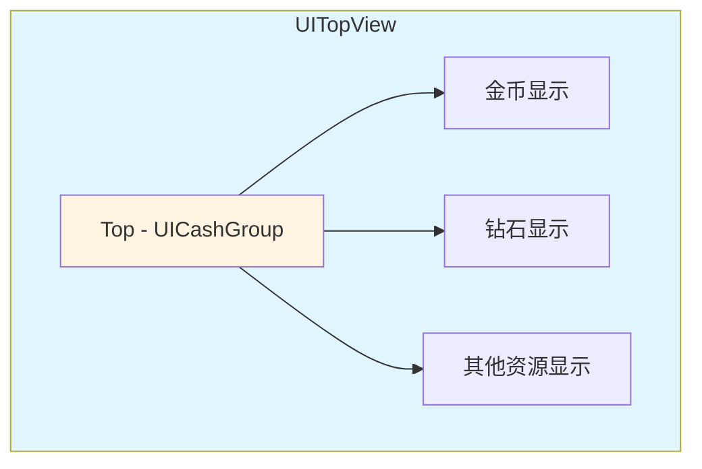

# UITopView.cs 注解文档

## 文件基本信息

| 属性 | 值 |
|------|-----|
| **文件名** | UITopView.cs |
| **路径** | Assets/Scripts/Code/Game/UIGame/UILobby/UITopView.cs |
| **所属模块** | 游戏 UI → UILobby (大厅 UI) |
| **文件职责** | 顶部信息栏视图，展示玩家金币、钻石等资源信息 |

---

## 类/结构体说明

### UITopView

| 属性 | 说明 |
|------|------|
| **职责** | 顶部信息栏视图，集成 UICashGroup 组件展示玩家资源 |
| **泛型参数** | 无 |
| **继承关系** | `UIBaseView` |
| **实现的接口** | `IOnCreate`, `IOnEnable`, `IOnWidthPaddingChange` |

**设计模式**: MVC 视图模式 + 组件组合

```csharp
public class UITopView : UIBaseView, IOnCreate, IOnEnable, IOnWidthPaddingChange
{
    public static string PrefabPath => "UIGame/UILobby/Prefabs/UITopView.prefab";
}
```

---

## 字段与属性（按重要程度排序）

| 名称 | 类型 | 访问级别 | 说明 |
|------|------|----------|------|
| `PrefabPath` | `string` | `public static` | Prefab 资源路径 |
| `Top` | `UICashGroup` | `public` | 顶部金币组组件，展示玩家资源 |

---

## 方法说明（按重要程度排序）

### OnCreate()

**签名**:
```csharp
public void OnCreate()
```

**职责**: 创建视图时初始化组件

**核心逻辑**:
```
1. 添加 UICashGroup 组件 (Top)
2. 设置组件路径引用
```

**调用者**: UIManager (窗口创建时)

---

### OnEnable()

**签名**:
```csharp
public void OnEnable()
```

**职责**: 启用视图时初始化

**核心逻辑**:
```
1. 当前实现为空 (资源数据由 UICashGroup 自行管理)
```

**调用者**: UIManager (窗口启用时)

---

## 界面结构

### UI 层级图



---

## UICashGroup 组件说明

### 功能特性

| 功能 | 说明 |
|------|------|
| **金币显示** | 展示玩家当前金币数量 |
| **钻石显示** | 展示玩家当前钻石数量 |
| **自动更新** | 监听玩家数据变化自动刷新 |
| **点击交互** | 点击可打开充值/获取窗口 |

### 数据绑定

UICashGroup 组件会自动:
1. 从 PlayerDataManager 获取玩家资源数据
2. 监听资源变化事件
3. 自动格式化显示 (如 1000 → "1,000")

---

## 使用示例

### 示例 1: 打开顶部信息栏

```csharp
// 打开顶部信息栏 (通常作为大厅 UI 的子窗口)
await UIManager.Instance.OpenWindow<UITopView>(UITopView.PrefabPath);
```

### 示例 2: 访问金币组件

```csharp
// 获取顶部视图
var topView = UIManager.Instance.GetWindow<UITopView>();

// 访问金币组件
var cashGroup = topView.Top;

// 刷新金币显示 (通常自动刷新)
// cashGroup.RefreshCash();
```

---

## 与其他模块的交互

```mermaid
graph TD
    subgraph UITopView["UITopView"]
        V[视图]
        CG[UICashGroup]
    end
    
    subgraph Systems["游戏系统"]
        Player[PlayerDataManager]
    end
    
    subgraph UI["其他 UI"]
        Recharge[充值窗口]
        Get[获取资源窗口]
    end
    
    V --> CG
    CG --> Player
    CG --> Recharge
    CG --> Get
    
    note right of V "顶部信息栏展示<br/>玩家资源信息"
    
    style UITopView fill:#e1f5ff
    style Systems fill:#fff4e1
    style UI fill:#e8f5e9
```

---

## 阅读指引

### 建议的阅读顺序

1. **理解视图作用** - 顶部信息栏用于展示玩家资源
2. **看字段定义** - 了解 Top 组件的作用
3. **了解 UICashGroup** - 查看 UICashGroup 组件文档

### 最值得学习的技术点

1. **组件组合**: 使用 UICashGroup 组件复用资源显示逻辑
2. **简洁设计**: 视图本身只负责组合子组件，逻辑下沉到组件
3. **自动更新**: 资源数据变化自动刷新显示

---

## 相关文档

- [UILobbyView.cs.md](./UILobbyView.cs.md) - 大厅主界面
- [UICashGroup.cs.md](./UICashGroup.cs.md) - 金币显示组件
- [PlayerDataManager.cs.md](../../../Module/Player/PlayerDataManager.cs.md) - 玩家数据管理器

---

*文档生成时间：2026-03-02 | OpenClaw AI 助手*
