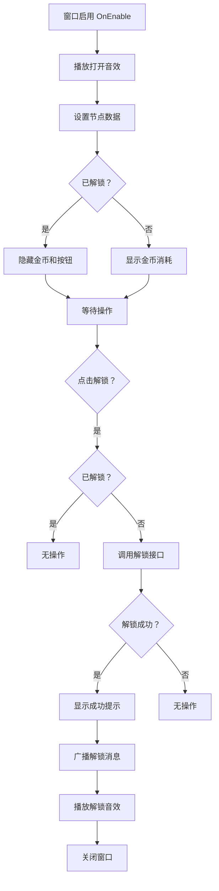

# UIUnlockWin.cs - 解锁确认窗口

## 📄 文件信息

| 属性 | 值 |
|------|------|
| 文件路径 | `Assets/Scripts/Code/Game/UIGame/UILobby/UIUnlockWin.cs` |
| 命名空间 | `TaoTie` |
| 基类 | `UIBaseView` |
| 实现接口 | `IOnCreate`, `IOnEnable<TechnologyTreeConfig>` |

---

## 🎯 类说明

`UIUnlockWin` 是科技树节点解锁确认窗口，展示待解锁的科技节点信息（图标、名称、描述）和解锁条件（金币消耗）。玩家确认后消耗金币解锁节点。

### 核心职责

- **节点信息展示**: 显示科技节点的图标、名称和描述
- **解锁条件展示**: 显示解锁所需的金币数量
- **解锁确认**: 处理解锁逻辑，消耗金币并解锁节点
- **状态管理**: 区分已解锁/未解锁状态

---

## 📋 字段说明

### UI 组件字段

| 字段名 | 类型 | 说明 |
|--------|------|------|
| `Close` | `UIButton` | 关闭按钮 |
| `Title` | `UITextmesh` | 科技节点名称 |
| `Button` | `UIButton` | 解锁按钮 |
| `Icon` | `UIImage` | 科技节点图标 |
| `Content` | `UITextmesh` | 科技节点描述 |
| `Coin` | `UIEmptyView` | 金币消耗区域（已解锁时隐藏） |
| `Text` | `UITextmesh` | 解锁所需金币数量 |
| `Mask` | `UIPointerClick` | 背景遮罩（点击关闭） |
| `UICommonWin` | `UIAnimator` | 通用窗口动画控制器 |

### 数据字段

| 字段名 | 类型 | 说明 |
|--------|------|------|
| `config` | `TechnologyTreeConfig` | 当前科技节点配置 |

---

## 🔧 方法说明

### 生命周期方法

#### `OnCreate()`
初始化窗口 UI 组件。

```csharp
public void OnCreate()
{
    UICommonWin = AddComponent<UIAnimator>("UICommonWin");
    Mask = AddComponent<UIPointerClick>("UICommonWin/Mask");
    Close = AddComponent<UIButton>("UICommonWin/Win/Close");
    Title = AddComponent<UITextmesh>("UICommonWin/Win/Content/IconBg/Table/Text");
    Button = AddComponent<UIButton>("UICommonWin/Win/Content/Button");
    Icon = AddComponent<UIImage>("UICommonWin/Win/Content/IconBg/Rare/Icon");
    Content = AddComponent<UITextmesh>("UICommonWin/Win/Content/Content");
    Coin = AddComponent<UIEmptyView>("UICommonWin/Win/Content/Coin");
    Text = AddComponent<UITextmesh>("UICommonWin/Win/Content/Coin/Text");
}
```

#### `OnEnable(TechnologyTreeConfig config)`
窗口启用时初始化科技节点数据。

**参数说明:**
- `config`: 科技树配置

**处理流程:**
1. 播放打开音效
2. 保存配置
3. 绑定关闭和解锁按钮事件
4. 设置节点名称、图标、描述
5. 检查是否已解锁
6. 已解锁时隐藏金币区域和解锁按钮
7. 未解锁时显示解锁所需金币

---

### 业务方法

#### `CloseSelf()`
关闭窗口，播放关闭动画和音效。

**返回:** `ETTask`

#### `OnClickButton()`
处理解锁按钮点击事件。

**处理流程:**
1. 检查是否已解锁（防止重复点击）
2. 调用解锁接口 `PlayerDataManager.Instance.UnlockTreeNode()`
3. 解锁成功后显示成功提示
4. 广播解锁消息
5. 播放解锁音效
6. 关闭窗口

---

### 事件处理方法

| 方法名 | 触发条件 | 功能说明 |
|--------|----------|----------|
| `OnClickClose()` | 点击关闭按钮 | 关闭窗口 |
| `OnClickButton()` | 点击解锁按钮 | 消耗金币解锁节点 |

---

## 🔄 流程图



---

## 💡 使用示例

### 打开解锁窗口

```csharp
// 从科技树界面打开解锁窗口
TechnologyTreeConfig config = TechnologyTreeConfigCategory.Instance.Get(nodeId);
UIManager.Instance.OpenWindow<UIUnlockWin, TechnologyTreeConfig>(
    UIUnlockWin.PrefabPath, 
    config
).Coroutine();
```

### 解锁成功后刷新

```csharp
// 监听解锁消息刷新科技树界面
Messager.Instance.AddListener<int>(0, MessageId.UnlockTreeNode, (nodeId) =>
{
    var techView = UIManager.Instance.GetView<UITechnologyView>(1);
    techView?.RefreshNode(nodeId);
});
```

---

## 🔗 相关文档

- [TechnologyTreeConfig.cs.md](../../../Config/TechnologyTreeConfig.cs.md) - 科技树配置
- [PlayerDataManager.cs.md](../../Data/PlayerDataManager.cs.md) - 玩家数据管理器
- [Messager.cs.md](../../../Core/Messager.cs.md) - 消息系统

---

*最后更新：2026-03-02*
