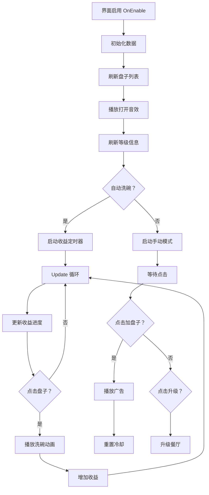

# UIWashDishView.cs - 餐厅洗碗界面

## 📄 文件信息

| 属性 | 值 |
|------|------|
| 文件路径 | `Assets/Scripts/Code/Game/UIGame/UILobby/UIWashDishView.cs` |
| 命名空间 | `TaoTie` |
| 基类 | `UIBaseView` |
| 实现接口 | `IOnCreate`, `IOnEnable` |

---

## 🎯 类说明

`UIWashDishView` 是餐厅洗碗小游戏界面，玩家通过点击盘子进行洗碗操作获得收益。界面支持手动洗碗、自动洗碗（解锁后）、看广告加速、餐厅升级等功能。

### 核心职责

- **洗碗操作**: 点击盘子进行洗碗，播放动画效果
- **收益展示**: 实时显示餐厅累计收益和收益进度
- **自动洗碗**: 支持解锁自动洗碗功能（离线收益）
- **广告加速**: 看广告快速添加盘子
- **餐厅升级**: 支持升级餐厅等级提升收益

---

## 📋 字段说明

### UI 组件字段

| 字段名 | 类型 | 说明 |
|--------|------|------|
| `UICommonView` | `UIAnimator` | 通用视图动画控制器 |
| `Talk` | `UITextmesh` | 对话文本 |
| `Dishes` | `UICopyGameObject` | 盘子列表容器 |
| `Close` | `UIButton` | 关闭按钮 |
| `Wash` | `UIEmptyView` | 洗碗动画区域 |
| `BtnAdd` | `UIButton` | 看广告加盘子按钮 |
| `BtnAddText` | `UITextmesh` | 加盘子按钮文本 |
| `BtnAuto` | `UIButton` | 自动洗碗解锁按钮 |
| `TextLv` | `UITextmesh` | 餐厅等级文本 |
| `Cost` | `UITextmesh` | 升级消耗文本 |
| `LevelUp` | `UIEmptyView` | 升级按钮区域 |
| `LevelMax` | `UIEmptyView` | 已达满级区域 |
| `From` / `To` | `UITextmesh` | 升级前后收益对比 |
| `BtnLevelUp` | `UIButton` | 升级按钮 |
| `PointerDish` | `UIPointerClick` | 盘子点击区域 |
| `Bubble` | `ParticleSystem` | 泡泡粒子特效 |
| `MoneyGroup` | `UIEmptyView` | 自动收益区域 |
| `Effect` | `UIEmptyView` | 收益特效 |
| `GetButton` | `UIButton` | 收益按钮 |
| `Slider` | `UISlider` | 收益进度条 |
| `ValueText` | `UITextmesh` | 收益数值文本 |
| `Speed` | `UITextmesh` | 收益速度文本 |
| `Mask` | `UIEmptyView` | 进度条遮罩 |
| `SliderAnim` | `UIAnimator` | 进度条动画 |
| `Fill` | `UIImage` | 进度条填充 |

### 常量定义

| 常量名 | 类型 | 值 | 说明 |
|--------|------|------|------|
| `DISH_COUNT` | `int` | `6` | 最大盘子数量 |
| `DURING` | `int` | `100` | 洗碗动画间隔 |
| `DishAdd` | `static int` | `10` | 广告添加盘子数量 |
| `DishAddDuring` | `static int` | - | 广告添加冷却时间（毫秒） |

### 数据字段

| 字段名 | 类型 | 说明 |
|--------|------|------|
| `timerId` | `long` | 自动收益更新定时器 ID |
| `timerId2` | `long` | 广告冷却倒计时定时器 ID |
| `step` | `int` | 洗碗步骤计数 |
| `isAnim` | `bool` | 是否正在播放动画 |
| `index` | `int` | 当前操作的盘子索引 |

### 内部类

#### `UIRestaurantViewUpdateTimer`
餐厅收益更新定时器，按固定间隔更新收益进度。

```csharp
[Timer(TimerType.UIRestaurantViewUpdate)]
public class UIRestaurantViewUpdateTimer : ATimer<UIWashDishView>
{
    public override void Run(UIWashDishView self)
    {
        try
        {
            self.Update();
        }
        catch (Exception e)
        {
            Log.Error($"move timer error: UIRestaurantView\n{e}");
        }
    }
}
```

#### `UIWashDishViewUpdateTimer`
广告冷却倒计时定时器，每秒更新按钮文本。

---

## 🔧 方法说明

### 生命周期方法

#### `OnCreate()`
初始化界面 UI 组件和事件绑定。

**主要功能:**
1. 初始化所有 UI 组件
2. 初始化盘子列表（6 个位置）
3. 绑定所有按钮点击事件
4. 注册红点组件
5. 设置国际化文本

#### `OnEnable()`
界面启用时初始化数据和定时器。

**处理流程:**
1. 检查餐厅等级，为 0 时自动升级
2. 停止泡泡粒子
3. 加载全局配置（盘子数量、冷却时间）
4. 刷新餐厅收益红点
5. 重置动画状态
6. 刷新盘子列表
7. 播放打开音效
8. 绑定所有事件
9. 刷新等级信息
10. 根据自动洗碗状态设置定时器
11. 立即更新收益显示

#### `OnEnableAsync()`
异步播放界面打开动画。

**返回:** `ETTask`

#### `CloseSelf()`
关闭界面，清理定时器并返回大厅。

**返回:** `ETTask`

---

### 业务方法

#### `Update()`
每帧更新收益进度条和状态。

**处理流程:**
1. 计算最大收益和当前收益
2. 根据收益比例切换金币图标
3. 更新进度条
4. 激活/失活速度特效
5. 激活进度条满特效
6. 更新收益文本
7. 刷新收益窗口（如果打开）
8. 激活收益特效（如果是顶层窗口）
9. 刷新餐厅收益红点

#### `UpdateAdd()`
每秒更新广告加盘子的冷却倒计时。

**处理流程:**
1. 计算距离冷却结束的时间
2. 冷却中显示倒计时
3. 冷却完成显示"点击加 N 个盘子"

#### `UpdateImmediate()`
立即更新收益显示（不等待定时器）。

#### `WashDish(int index)`
播放洗碗动画。

**参数说明:**
- `index`: 盘子索引

**返回:** `ETTask`

#### `RemoveDish(int index)`
播放移除盘子动画。

**参数说明:**
- `index`: 盘子索引

**返回:** `ETTask`

#### `RefreshLvInfo()`
刷新餐厅等级信息。

**处理流程:**
1. 获取当前和下一级餐厅配置
2. 设置升级按钮显示状态
3. 设置等级文本
4. 设置收益速度
5. 设置升级前后收益对比
6. 设置升级消耗

---

### 事件处理方法

| 方法名 | 触发条件 | 功能说明 |
|--------|----------|----------|
| `OnClickDish()` | 点击盘子区域 | 执行洗碗或移除盘子操作 |
| `OnClickAdd()` | 点击加盘子按钮 | 检查冷却后播放广告 |
| `OnClickAddAsync()` | 广告成功后 | 重置冷却时间并启动倒计时 |
| `OnClickGetButton()` | 点击收益按钮 | 打开收益窗口 |
| `OnClickClose()` | 点击关闭按钮 | 关闭界面返回大厅 |
| `OnSliderChange(float val)` | 进度条拖动 | 更新遮罩位置 |
| `OnGetItemByIndex()` | 列表项创建 | 设置盘子位置 |
| `OnClickLvUp()` | 点击升级按钮 | 升级餐厅等级 |
| `OnClickUnlockAuto()` | 点击自动解锁按钮 | 解锁自动洗碗功能 |

---

## 🔄 流程图



---

## 💡 使用示例

### 打开洗碗界面

```csharp
// 从大厅打开洗碗界面
public void OnClickBtnRestaurant()
{
    OnClickBtnRestaurantAsync().Coroutine();
}

private async ETTask OnClickBtnRestaurantAsync()
{
    using ListComponent<ETTask> task = ListComponent<ETTask>.Create();
    task.Add(GameObjectPoolManager.GetInstance().PreLoadGameObjectAsync(UIWashDishView.PrefabPath, 0));
    task.Add(Move2Building("Restaurant"));
    await ETTaskHelper.WaitAll(task);
    UIManager.Instance.OpenWindow<UIWashDishView>(UIWashDishView.PrefabPath).Coroutine();
}
```

### 刷新收益显示

```csharp
// 当收益变化时刷新界面
var washView = UIManager.Instance.GetView<UIWashDishView>(1);
washView?.UpdateImmediate();
```

### 洗碗操作

```csharp
// 点击盘子时
public void OnClickDish()
{
    if (isAnim) return; // 动画中禁止操作
    
    ShockManager.Instance.Vibrate(); // 震动反馈
    
    if (step % 2 == 0)
    {
        WashDish(index).Coroutine(); // 偶数步洗碗
    }
    else
    {
        RemoveDish(index).Coroutine(); // 奇数步移除
    }
    step++;
}
```

---

## 🔗 相关文档

- [UILobbyView.cs.md](./UILobbyView.cs.md) - 大厅主界面
- [UIProfitWin.cs.md](./UIProfitWin.cs.md) - 餐厅收益窗口
- [RestaurantConfig.cs.md](../../../Config/RestaurantConfig.cs.md) - 餐厅配置
- [PlayerDataManager.cs.md](../../Data/PlayerDataManager.cs.md) - 玩家数据管理器
- [AdManager.cs.md](../../../Manager/AdManager.cs.md) - 广告管理器

---

*最后更新：2026-03-02*
