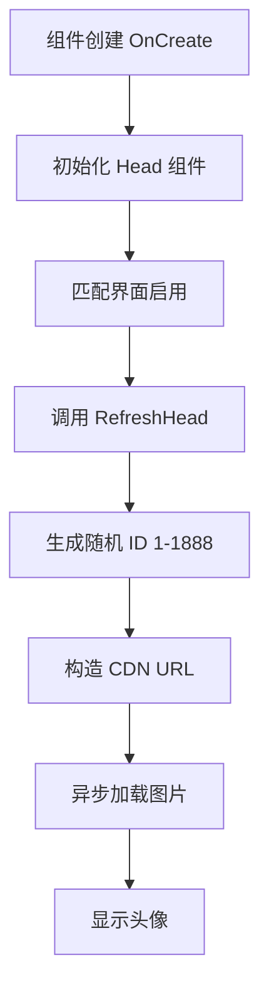

# UserItem.cs - 玩家头像项组件

## 📄 文件信息

| 属性 | 值 |
|------|------|
| 文件路径 | `Assets/Scripts/Code/Game/UIGame/UILobby/UserItem.cs` |
| 命名空间 | `TaoTie` |
| 基类 | `UIBaseContainer` |
| 实现接口 | `IOnCreate` |

---

## 🎯 类说明

`UserItem` 是玩家头像显示组件，用于在匹配界面中展示其他玩家的头像。头像从 CDN 随机加载，用于在匹配时展示其他玩家。

### 核心职责

- **头像显示**: 使用 `UIRawImage` 显示玩家头像
- **随机头像**: 从 CDN 随机加载头像图片

---

## 📋 字段说明

### UI 组件字段

| 字段名 | 类型 | 说明 |
|--------|------|------|
| `Head` | `UIRawImage` | 玩家头像 RawImage 组件 |

---

## 🔧 方法说明

### 生命周期方法

#### `OnCreate()`
初始化头像组件。

```csharp
public void OnCreate()
{
    Head = AddComponent<UIRawImage>("NameBg/RawImage");
}
```

---

### 业务方法

#### `RefreshHead()`
刷新头像，从 CDN 随机加载一张头像图片。

**处理流程:**
1. 生成随机头像 ID（1-1888）
2. 构造 CDN 头像 URL
3. 异步加载头像图片

**CDN 地址:** `https://cdn.hxwgame.cn/head/13 ({random}).jpg`

---

## 🔄 流程图



---

## 💡 使用示例

### 在匹配列表中创建玩家头像项

```csharp
// UIMatchView 中的玩家列表初始化
public void OnCreate()
{
    Center = AddComponent<UICopyGameObject>("View/Center");
    Center.InitListView(0, GetCenterItemByIndex);
}

// 列表项创建回调
public void GetCenterItemByIndex(int index, GameObject obj)
{
    var item = Center.GetUIItemView<UserItem>(obj);
    if (item == null)
    {
        item = Center.AddItemViewComponent<UserItem>(obj);
    }
    items[index] = item;
    item.SetActive(false);
}

// 当玩家匹配成功时显示头像
public void SetProgress(float progress)
{
    int current = (int)(Mathf.Clamp01(progress) * count);
    for (int i = 0; i < count; i++)
    {
        if (i < current)
        {
            if (!items[i].GetGameObject().activeSelf)
            {
                items[i].RefreshHead(); // 加载随机头像
            }
            items[i].SetActive(true);
        }
    }
}
```

---

## 🔗 相关文档

- [UIMatchView.cs.md](./UIMatchView.cs.md) - 匹配界面
- [UIRawImage.cs.md](../../../UIComponent/UIRawImage.cs.md) - RawImage UI 组件
- [UICopyGameObject.cs.md](../../../UIComponent/UICopyGameObject.cs.md) - 复制游戏对象组件

---

*最后更新：2026-03-02*
