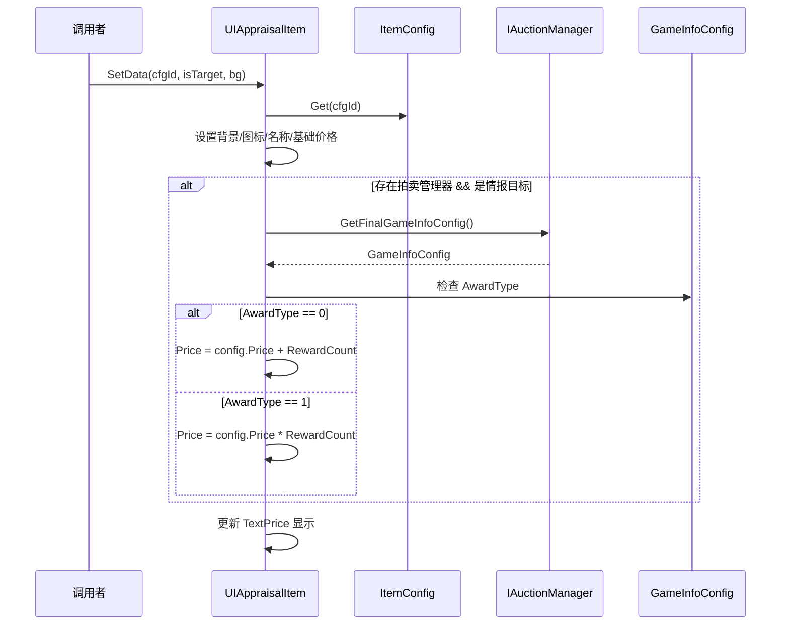

# UIAppraisalItem.cs - 鉴定物品项组件

## 📄 文件信息

| 属性 | 值 |
|------|------|
| **文件路径** | `Assets/Scripts/Code/Game/UIGame/UIMiniGame/UIAppraisalItem.cs` |
| **命名空间** | `TaoTie` |
| **基类** | `UIBaseContainer` |
| **实现接口** | `IOnCreate` |

---

## 🎯 类说明

`UIAppraisalItem` 是鉴定小游戏中的物品展示项组件，用于在鉴定界面中显示单个物品的图标、名称和价格信息。

### 核心职责

- **物品展示**: 显示物品的图标、名称和基础价格
- **情报加成**: 根据游戏情报配置动态调整显示价格
- **背景定制**: 支持自定义背景图片

---

## 📋 字段说明

### UI 组件字段

| 字段名 | 类型 | 说明 |
|--------|------|------|
| `Icon` | `UIImage` | 物品图标显示组件 |
| `Name` | `UITextmesh` | 物品名称文本 |
| `TextPrice` | `UITextmesh` | 物品价格文本 |
| `Bg` | `UIImage` | 背景图片组件 |

### 数据字段

| 字段名 | 类型 | 说明 |
|--------|------|------|
| `configId` | `int` | 物品配置 ID |
| `Config` | `ItemConfig` | 物品配置数据（只读属性） |

---

## 🔧 方法说明

### 生命周期方法

#### `OnCreate()`
组件创建时初始化所有 UI 组件。

```csharp
public void OnCreate()
{
    Bg = AddComponent<UIImage>();
    Icon = AddComponent<UIImage>("Icon");
    TextPrice = AddComponent<UITextmesh>("Bottom/TextPrice");
    Name = AddComponent<UITextmesh>("Name");
}
```

---

### 业务方法

#### `SetData(int cfgId, bool isTargetGameInfo, string bg)`
设置物品数据并更新显示。

**参数说明:**
- `cfgId`: 物品配置 ID
- `isTargetGameInfo`: 是否为情报目标物品
- `bg`: 背景图片资源路径（不含扩展名）

**核心逻辑:**
```
1. 保存 configId 并获取物品配置
2. 设置背景图片：$"UIGame/UIMiniGame/Atlas/{bg}.png"
3. 设置物品图标：config.ItemPic
4. 设置物品名称：I18N 国际化文本
5. 设置基础价格：config.Price
6. 如果存在拍卖管理器且是情报目标物品：
   - 获取最终情报配置
   - 根据奖励类型调整价格：
     * AwardType == 0: 价格 + RewardCount（加法）
     * AwardType == 1: 价格 × RewardCount（乘法）
```

**使用示例:**
```csharp
// 设置普通物品
item.SetData(1001, false, "bg_common");

// 设置情报目标物品（价格加成）
item.SetData(1002, true, "bg_rare");
```

---

## 📊 数据流程图



---

## 💡 使用场景

### 鉴定小游戏界面

```csharp
// 在鉴定界面中创建物品项
var item = UIManager.Instance.CreateComponent<UIAppraisalItem>(prefab);
item.SetData(configId, isTargetItem, "鉴定背景");
```

### 情报效果展示

```csharp
// 显示情报加成后的价格
// 基础价格：1000
// 情报加成：+500 (AwardType=0)
// 显示价格：1500

item.SetData(1001, true, "bg_rare");
// TextPrice 显示："1500"
```

---

## 🔗 相关文档

- [UICommonMiniGameView.cs.md](./UICommonMiniGameView.cs.md) - 小游戏通用视图基类
- [UIAuctionItem.cs.md](../UIAuction/UIAuctionItem.cs.md) - 拍卖物品项组件
- [ItemConfig.cs.md](../../../Module/Generate/Config/ItemConfig.cs.md) - 物品配置数据
- [GameInfoConfig.cs.md](../../../Module/Generate/Config/GameInfoConfig.cs.md) - 游戏情报配置

---

*文档由 OpenClaw AI 助手自动生成 | 基于静态代码分析*
