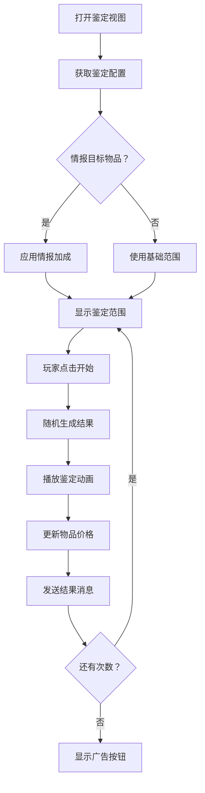

# UIAppraisalView.cs - 鉴定小游戏视图

## 📄 文件信息

| 属性 | 值 |
|------|------|
| 文件路径 | `Assets/Scripts/Code/Game/UIGame/UIMiniGame/UIAppraisalView.cs` |
| 命名空间 | `TaoTie` |
| 基类 | `UICommonMiniGameView` |
| 实现接口 | `IOnDisable` |

---

## 🎯 类说明

`UIAppraisalView` 是鉴定小游戏视图，玩家可以对宝盒中的物品进行鉴定，随机获得新的物品 ID 和价格。支持观看广告增加鉴定次数。

### 核心职责

- **鉴定展示**: 显示可鉴定物品的信息和鉴定范围
- **随机鉴定**: 在配置范围内随机生成鉴定结果
- **广告支持**: 支持观看广告获得额外鉴定次数
- **情报加成**: 应用情报对鉴定结果的加成效果
- **动画效果**: 播放鉴定过程的动画效果

---

## 📋 字段说明

### 枚举

#### `AppraisalState`
鉴定状态枚举。

| 值 | 说明 |
|------|------|
| `NotStart` | 未开始 |
| `During` | 进行中 |
| `PreOver` | 即将结束 |
| `Over` | 已结束 |

### UI 组件字段

| 字段名 | 类型 | 说明 |
|--------|------|------|
| `ScrollView` | `UILoopListView2` | 物品滚动列表 |
| `StartBtn` | `UIButton` | 开始鉴定按钮 |
| `AdBtn` | `UIButton` | 广告按钮 |
| `AdBtnText` | `UITextmesh` | 广告按钮文本 |
| `AnimBg/AnimBg2` | `UIImage` | 动画背景 |
| `Addon` | `UITextmesh` | 加成文本 |
| `Count` | `UITextmesh` | 剩余次数文本 |
| `Light` | `UIAnimator` | 目标高亮动画 |
| `Mask` | `UIEmptyView` | 遮罩层 |

### 数据字段

| 字段名 | 类型 | 说明 |
|--------|------|------|
| `state` | `AppraisalState` | 当前鉴定状态 |
| `config` | `SubIdentificationConfig` | 鉴定配置 |
| `newIndex` | `int` | 新的物品索引 |
| `randomResult` | `int` | 随机鉴定结果 |
| `ad` | `bool` | 是否通过广告获得 |
| `isTargetGameInfo` | `bool` | 是否是情报目标物品 |

### 配置字段

| 字段名 | 类型 | 说明 |
|--------|------|------|
| `DefaultAppraisalBg` | `string` | 默认鉴定背景颜色 |
| `ANIM_DURING` | `float` | 动画时长（毫秒） |

---

## 🔧 方法说明

### 生命周期方法

#### `OnCreate()`
视图创建时初始化所有 UI 组件。

#### `OnEnable(int id)`
视图启用时设置鉴定物品数据。

**参数说明:**
- `id`: 物品配置 ID

**主要功能:**
1. 获取鉴定配置
2. 计算鉴定范围（应用情报加成）
3. 重置状态
4. 绑定按钮事件

#### `OnDisable()`
视图禁用时清理资源。

---

### 业务方法

#### `OnClickStartBtn()`
开始鉴定。

**流程:**
1. 检查鉴定状态
2. 在配置范围内随机生成结果
3. 播放鉴定动画
4. 更新物品价格
5. 发送鉴定结果消息

#### `OnClickAdBtn()`
观看广告获得鉴定次数。

---

## 🔄 流程图



---

## 💡 使用示例

### 打开鉴定视图

```csharp
// 打开指定物品的鉴定视图
int itemId = boxEntity.ItemConfig.Id;
UIManager.Instance.OpenWindow<UIAppraisalView, int>(
    UIAppraisalView.PrefabPath,
    itemId
);
```

---

## 🔗 相关文档

- [UICommonMiniGameView.cs.md](./UICommonMiniGameView.cs.md) - 小游戏视图基类
- [SubIdentificationConfig.cs.md](../../../../Module/Generate/Config/SubIdentificationConfig.cs.md) - 鉴定配置表

---

*最后更新：2026-03-02*
