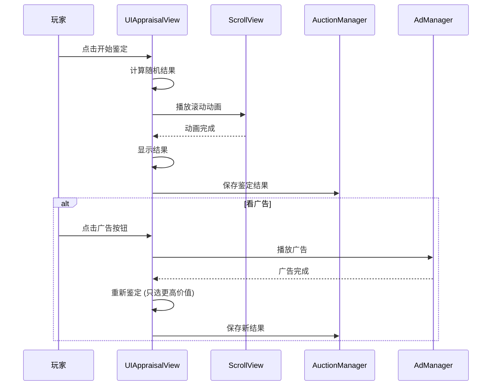

# UIAppraisalView.cs 注解文档

## 文件基本信息

| 属性 | 值 |
|------|-----|
| **文件名** | UIAppraisalView.cs |
| **路径** | Assets/Scripts/Code/Game/UIGame/UIMiniGame/UIAppraisalView.cs |
| **所属模块** | 游戏层 → UIGame/UIMiniGame |
| **文件职责** | 鉴定小游戏界面，玩家通过鉴定确定物品最终价值 |

---

## 类说明

### UIAppraisalView

| 属性 | 说明 |
|------|------|
| **职责** | 鉴定小游戏 UI，展示鉴定动画、结果和价格变化 |
| **继承关系** | 继承 `UICommonMiniGameView` |
| **实现的接口** | `IOnDisable` |

**游戏流程**:
1. 玩家点击开始鉴定
2. 滚动动画展示可能的结果
3. 随机确定最终结果
4. 显示价格变化（赚/亏）
5. 可选看广告重新鉴定

---

## 枚举：AppraisalState

| 值 | 名称 | 说明 |
|------|------|------|
| 0 | `NotStart` | 未开始 |
| 1 | `During` | 进行中（滚动动画） |
| 2 | `PreOver` | 即将结束（定位到结果） |
| 3 | `Over` | 结束（显示结果） |

---

## 字段与属性

| 名称 | 类型 | 访问级别 | 说明 |
|------|------|----------|------|
| `PrefabPath` | `string` | `public static` | 预制体路径 |
| `ScrollView` | `UILoopListView2` | `public` | 滚动列表（展示可能结果） |
| `StartBtn` | `UIButton` | `public` | 开始鉴定按钮 |
| `AdBtn` | `UIButton` | `public` | 看广告按钮 |
| `AdBtnText` | `UITextmesh` | `public` | 广告按钮文本 |
| `AnimBg` | `UIImage` | `public` | 动画背景 |
| `AnimBg2` | `UIImage` | `public` | 动画背景 2（遮罩） |
| `Addon` | `UITextmesh` | `public` | 加价文本 |
| `Count` | `UITextmesh` | `public` | 广告次数文本 |
| `Light` | `UIAnimator` | `public` | 高亮动画 |
| `Mask` | `UIEmptyView` | `public` | 遮罩层 |
| `state` | `AppraisalState` | `private` | 当前状态 |
| `config` | `SubIdentificationConfig` | `private` | 鉴定配置 |
| `randomResult` | `int` | `private` | 随机结果索引 |
| `ad` | `bool` | `private` | 是否看过广告 |
| `isTargetGameInfo` | `bool` | `private` | 是否是情报目标物品 |

---

## 核心方法说明

### OnCreate()

**职责**: 创建时初始化 UI 组件

**核心逻辑**:
```
1. 获取所有 UI 组件引用
2. 初始化滚动列表 ScrollView
3. 从配置获取动画时长和默认背景
4. 添加 UIAnimator 组件
```

---

### OnEnable()

**职责**: 启用时设置鉴定数据

**核心逻辑**:
```
1. 重置 UI 状态
2. 获取鉴定配置 SubIdentificationConfig
3. 检查是否是情报目标物品:
   - 是 → 应用情报加成 (固定值或倍率)
4. 设置按钮事件
5. 异步预加载所有结果物品图标
6. 显示价格范围
```

---

### OnClickStartBtnAsync()

**职责**: 处理开始鉴定（核心方法）

**核心逻辑**:
```
1. 设置状态 = During
2. 隐藏按钮，显示动画背景
3. 计算随机结果:
   - 根据权重随机选择
   - 看广告后只选择更高价值的结果
4. 播放滚动动画:
   - 加速 → 减速 → 停止
   - 时长 = ANIM_DURING (默认 3000ms)
   - 红绿背景交替闪烁
5. 定位到结果项
6. 显示最终结果和价格变化
7. 设置状态 = Over
```

**动画流程**:
```
开始 → 加速滚动 → 减速 → 定位结果 → 显示赚/亏
        ↓           ↓         ↓           ↓
     红绿闪烁    红绿闪烁   停止滚动   高亮结果
```

---

### OnClickAdBtnAsync()

**职责**: 处理看广告重新鉴定

**核心逻辑**:
```
1. 播放广告
2. 广告成功 → ad = true
3. 重新调用 OnClickStartBtnAsync()
   (这次只随机更高价值的结果)
```

---

### GetScrollViewItemByIndex()

**职责**: 滚动列表项渲染回调

**核心逻辑**:
```
1. 根据索引获取物品 ID
2. 获取稀有度图标
3. 如果是 PreOver 状态且是目标索引 → 使用最终结果
4. 获取或创建列表项
5. 设置数据 (物品 ID, 是否目标，背景)
6. 返回列表项
```

---

### OnDisable()

**职责**: 禁用时保存鉴定结果

**核心逻辑**:
```
1. 如果状态 = Over:
   - 保存结果到 IAuctionManager
   - 广播 SetChangeItemResult 事件
```

---

## 鉴定流程



---

## 使用示例

### 示例 1: 打开鉴定界面

```csharp
// 打开鉴定界面
UIManager.Instance.OpenWindow<UIAppraisalView, int>(
    UIAppraisalView.PrefabPath,
    itemId  // 要鉴定的物品 ID
);
```

### 示例 2: 监听鉴定结果

```csharp
// 注册事件
Messager.Instance.AddListener(0, MessageId.SetChangeItemResult, OnAppraisalResult);

void OnAppraisalResult(int itemId, int newResultId, bool isAppraisal)
{
    Log.Info($"鉴定完成：{itemId} → {newResultId}");
    
    // 更新物品信息
    UpdateItemInfo(itemId, newResultId);
}
```

---

## 设计说明

### 权重随机

```csharp
// 配置权重
config.Widget = [50, 30, 15, 5];  // 4 个结果的权重

// 随机算法
totalWidget = 50 + 30 + 15 + 5 = 100
range = Random(0, 100)

if range < 50 → 结果 0 (50% 概率)
else if range < 80 → 结果 1 (30% 概率)
else if range < 95 → 结果 2 (15% 概率)
else → 结果 3 (5% 概率)
```

### 广告机制

```
未看广告 → 正常随机 (可能赚可能亏)
    ↓ 看广告
已看广告 → 只随机更高价值的结果 (必赚或持平)
```

### 性能优化

```csharp
// 根据设备性能调整动画速度
if (PerformanceManager.Level != High)
{
    maxSpeed = 5;  // 低性能设备慢速
}
else
{
    maxSpeed = 20; // 高性能设备快速
}
```

---

## 相关文档

- [UICommonMiniGameView.cs.md](./UICommonMiniGameView.cs.md) - 小游戏 UI 基类
- [SubIdentificationConfig.cs.md](../../../Module/Config/SubIdentificationConfig.cs.md) - 鉴定配置
- [IAuctionManager.cs.md](../../System/Auction/IAuctionManager.cs.md) - 拍卖管理器

---

*文档生成时间：2026-03-02 | OpenClaw AI 助手*
