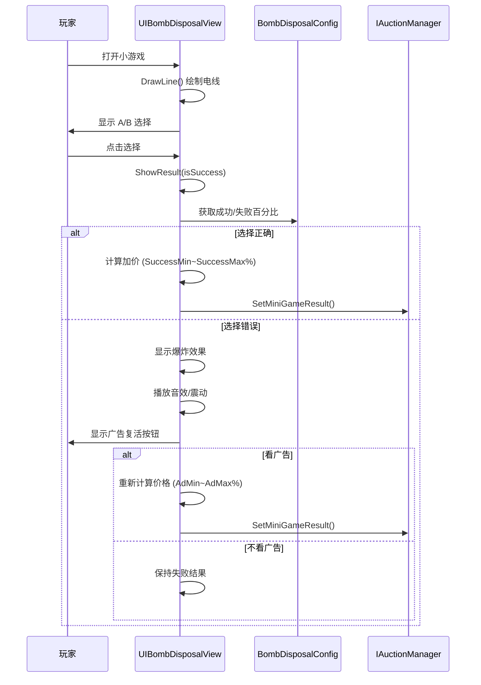

# UIBombDisposalView.cs - 拆弹小游戏视图

## 📄 文件信息

| 属性 | 值 |
|------|------|
| **文件路径** | `Assets/Scripts/Code/Game/UIGame/UIMiniGame/UIBombDisposalView.cs` |
| **命名空间** | `TaoTie` |
| **基类** | `UICommonMiniGameView` |
| **实现接口** | `IOnDisable` |

---

## 🎯 类说明

`UIBombDisposalView` 是拆弹小游戏的视图组件，玩家需要在两条线中选择正确的一条来拆除炸弹。使用情报后的全局价格作为基准进行奖惩。

### 核心职责

- **拆弹玩法**: 提供二选一的拆弹选择界面
- **动态绘制**: 随机生成电线连接图
- **奖惩计算**: 根据成功/失败计算价格变化
- **广告复活**: 支持看广告重新尝试

---

## 📋 字段说明

### UI 组件字段

| 字段名 | 类型 | 说明 |
|--------|------|------|
| `AdBtn` | `UIButton` | 广告按钮 |
| `AdBtnText` | `UITextmesh` | 广告按钮文本 |
| `Count` | `UITextmesh` | 广告次数显示 |
| `Explode` | `UIEmptyView` | 爆炸效果容器 |
| `LeftButton` | `UIButton` | 左侧选择按钮（A） |
| `RightButton` | `UIButton` | 右侧选择按钮（B） |
| `writeImage` | `UIRawImage` | 电线绘制区域 |
| `A` | `UITextmesh` | 左侧标识文本 |
| `B` | `UITextmesh` | 右侧标识文本 |

### 数据字段

| 字段名 | 类型 | 说明 |
|--------|------|------|
| `diffId` | `int` | 难度配置 ID |
| `Config` | `BombDisposalConfig` | 拆弹配置数据（只读属性） |
| `newPrice` | `BigNumber` | 新的价格变化值 |
| `texture2D` | `Texture2D` | 动态绘制的电线纹理 |
| `res` | `int` | 正确答案（0=左，1=右） |

---

## 🔧 方法说明

### 生命周期方法

#### `OnCreate()`
创建时初始化所有 UI 组件。

```csharp
public override void OnCreate()
{
    base.OnCreate();
    AdBtn = AddComponent<UIButton>("View/Bg/Content/Buttons/AdBtn");
    LeftButton = AddComponent<UIButton>("View/Bg/Content/Buttons/LeftBtn");
    RightButton = AddComponent<UIButton>("View/Bg/Content/Buttons/RightBtn");
    writeImage = AddComponent<UIRawImage>("View/Bg/Content/UIItem/RawImage");
    A = AddComponent<UITextmesh>("View/Bg/Content/A");
    B = AddComponent<UITextmesh>("View/Bg/Content/B");
    AdBtnText = AddComponent<UITextmesh>("View/Bg/Content/Buttons/AdBtn/Text");
    Explode = AddComponent<UIEmptyView>("View/Bg/Content/UIItem/Explode");
    Count = AddComponent<UITextmesh>("View/Bg/Content/Buttons/AdBtn/Count");
    Count.SetI18NKey(I18NKey.Text_TurnTable_Count);
    Range.SetI18NKey(I18NKey.Quarantine_Price_Range);
}
```

#### `OnEnable(int id)`
启用时初始化游戏状态并绘制电线。

**核心逻辑:**
```
1. 重置状态（Explode 隐藏、A/B 隐藏、newPrice=null）
2. 根据权重随机选择难度配置
3. 计算价格波动范围（基于配置百分比）
4. 绑定按钮点击事件
5. 调用 DrawLine() 绘制电线
```

#### `OnDisable()`
禁用时清理资源并提交结果。

```csharp
public void OnDisable()
{
    if (newPrice != null)
    {
        IAuctionManager.Instance.SetMiniGameResult(configId, newPrice);
        Messager.Instance.Broadcast(0, MessageId.SetChangePriceResult, configId, newPrice, false);
    }
    Explode.SetActive(false);
    Texture2D.DestroyImmediate(texture2D);
}
```

---

### 核心业务方法

#### `DrawLine()`
随机生成电线连接图。

**核心逻辑:**
```
1. 随机决定正确答案（res = 0 或 1）
2. 创建 512x512 的 Texture2D
3. 绘制线头：
   - 红色线头（正确答案）
   - 蓝色线头（错误答案）
   - 灰色线头（干扰项）
4. 绘制电线：
   - 每条线随机转折 7 次
   - 确保线之间不交叉（最小间距检测）
   - 正确答案的线连接到对应按钮
5. 应用纹理并设置 UI 位置
```

**技术要点:**
- 使用 HashSetComponent 记录历史位置避免重叠
- 线宽 3 像素，线头宽 12 像素
- 支持多条干扰线增加难度

#### `ShowResult(bool isSuccess)`
显示游戏结果。

**参数说明:**
- `isSuccess`: 是否选择正确

**核心逻辑:**
```
1. 根据成功/失败计算价格：
   - 成功：SuccessMin ~ SuccessMax 百分比
   - 失败：FailMin ~ FailMax 百分比
2. 如果失败：
   - 显示爆炸效果
   - 显示广告按钮
   - 播放爆炸音效和长震动
3. 隐藏选择按钮
4. 计算 newPrice = price - basePrice
5. 调用 SetItemWinLossWithContainer() 显示结果
```

---

### 事件处理方法

| 方法名 | 触发条件 | 功能说明 |
|--------|----------|----------|
| `OnClickRes0()` | 点击左侧按钮 | 选择答案 A，调用 ShowResult(res == 0) |
| `OnClickRes1()` | 点击右侧按钮 | 选择答案 B，调用 ShowResult(res == 1) |
| `OnClickAdButton()` | 点击广告按钮 | 播放广告并重新尝试 |

#### `OnClickAdBtnAsync()`
广告播放逻辑。

```csharp
public async ETTask OnClickAdBtnAsync()
{
    var res = await PlayAd();
    if (res)
    {
        // 广告成功：重新计算价格（使用 AdMin~AdMax 百分比）
        var price = Random.Range(config.AdMin, config.AdMax + 1) / 100f * basePrice;
        newPrice = price - basePrice;
        BigNumber.Round2Integer(newPrice);
        SetItemWinLossWithContainer(newPrice);
        AdBtn.SetActive(false);
        Count.SetI18NText(剩余广告次数);
    }
    else
    {
        AdBtn.SetInteractable(true);
    }
}
```

---

## 📊 游戏流程图



---

## 💡 使用示例

```csharp
// 打开拆弹小游戏
var view = await UIManager.Instance.OpenWindow<UIBombDisposalView>(
    UIBombDisposalView.PrefabPath, 
    UILayerNames.GameLayer,
    configId
);

// 游戏结果通过 Messager 广播
// MessageId.SetChangePriceResult: (configId, newPrice, false)
```

---

## ⚠️ 注意事项

| 问题 | 说明 | 解决方案 |
|------|------|----------|
| **纹理泄漏** | Texture2D 未及时销毁 | 在 OnDisable/OnDestroy 中调用 DestroyImmediate |
| **价格基准** | 使用情报后的全局价格 | 通过 GetBasePrice() 获取 |
| **广告次数** | 限制每日广告次数 | 检查 GameConst.PlayableMaxAdCount |

---

## 🔗 相关文档

- [UICommonMiniGameView.cs.md](./UICommonMiniGameView.cs.md) - 小游戏通用视图基类
- [BombDisposalConfig.cs.md](../../../Module/Generate/Config/BombDisposalConfig.cs.md) - 拆弹配置
- [IAuctionManager.cs.md](../../System/Auction/IAuctionManager.cs.md) - 拍卖管理器接口

---

*文档由 OpenClaw AI 助手自动生成 | 基于静态代码分析*
