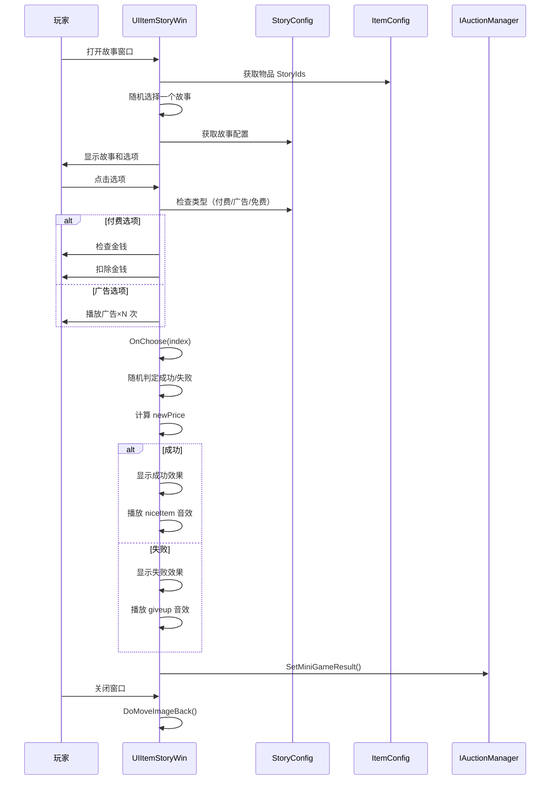

# UIItemStoryWin.cs - 物品故事窗口

## 📄 文件信息

| 属性 | 值 |
|------|------|
| **文件路径** | `Assets/Scripts/Code/Game/UIGame/UIMiniGame/UIItemStoryWin.cs` |
| **命名空间** | `TaoTie` |
| **基类** | `UIBaseView` |
| **实现接口** | `IOnCreate`, `IOnEnable<int, UIAuctionItem>`, `IOnDisable` |

---

## 🎯 类说明

`UIItemStoryWin` 是物品故事小游戏窗口，玩家通过选择不同选项来影响物品最终价格。每个物品有多个随机故事剧情，选择不同会导致价格涨跌。

### 核心职责

- **故事展示**: 显示物品的背景故事和选项
- **选择交互**: 提供多选项供玩家选择（付费/看广告/免费）
- **价格波动**: 根据选择结果计算价格变化
- **动画效果**: 物品图标移动动画和结果展示

---

## 📋 字段说明

### UI 组件字段

| 字段名 | 类型 | 说明 |
|--------|------|------|
| `Icon` | `UIImage` | 物品图标 |
| `Name` | `UITextmesh` | 物品名称 |
| `Price` | `UITextmesh` | 物品价格 |
| `Desc` | `UITextmesh` | 故事描述文本 |
| `Button1` / `Button2` | `UIButton` | 选项按钮 1 和 2 |
| `Button1Txt` / `Button2Txt` | `UITextmesh` | 按钮文本 |
| `Animator` | `UIAnimator` | 窗口动画控制器 |
| `Ad1` / `Ad2` | `UIImage` | 广告图标 |
| `Money1` / `Money2` | `UIEmptyView` | 付费选项容器 |
| `MoneyText1` / `MoneyText2` | `UITextmesh` | 付费金额文本 |
| `FailEx` | `UIEmptyView` | 失败效果容器 |
| `Success1` / `Success2` | `UIEmptyView` | 成功效果容器 |

### 数据字段

| 字段名 | 类型 | 说明 |
|--------|------|------|
| `Target` | `UIAuctionItem` | 目标物品项引用 |
| `endSize` | `Vector2` | 图标目标尺寸 |
| `configId` | `int` | 物品配置 ID（protected） |
| `ItemConfig` | `ItemConfig` | 物品配置数据（只读属性） |
| `storyId` | `int` | 当前故事 ID |
| `StoryConfig` | `StoryConfig` | 故事配置数据（只读属性） |
| `newPrice` | `BigNumber` | 新的价格 |
| `overAD1` / `overAD2` | `int` | 已观看广告次数 |

---

## 🔧 方法说明

### 生命周期方法

#### `OnCreate()`
创建时初始化所有 UI 组件。

```csharp
public void OnCreate()
{
    Animator = AddComponent<UIAnimator>();
    Success1 = AddComponent<UIEmptyView>("UIItem/Success");
    Success2 = AddComponent<UIEmptyView>("UIItem/Icon/Success");
    FailEx = AddComponent<UIEmptyView>("UIItem/Icon/Fail");
    Money1 = AddComponent<UIEmptyView>("Bottom/Button1/Money");
    Money2 = AddComponent<UIEmptyView>("Bottom/Button2/Money");
    MoneyText1 = AddComponent<UITextmesh>("Bottom/Button1/Money/Count");
    MoneyText2 = AddComponent<UITextmesh>("Bottom/Button2/Money/Count");
    Ad1 = AddComponent<UIImage>("Bottom/Button1/Ad");
    Ad2 = AddComponent<UIImage>("Bottom/Button2/Ad");
    Icon = AddComponent<UIImage>("UIItem/Icon");
    Price = AddComponent<UITextmesh>("UIItem/Bottom/TextPrice");
    Name = AddComponent<UITextmesh>("UIItem/Name");
    Desc = AddComponent<UITextmesh>("Desc/Desc");
    Button2 = AddComponent<UIButton>("Bottom/Button2");
    Button1 = AddComponent<UIButton>("Bottom/Button1");
    Button1Txt = AddComponent<UITextmesh>("Bottom/Button1/Text");
    Button2Txt = AddComponent<UITextmesh>("Bottom/Button2/Text");
    endSize = Icon.GetRectTransform().sizeDelta;
}
```

#### `OnEnable(int id, UIAuctionItem target)`
启用时初始化故事数据。

**核心逻辑:**
```
1. 保存 Target 引用并重置状态
2. 根据物品配置的 StoryIds 随机选择一个故事
3. 设置物品显示（图标、名称、价格）
4. 根据故事类型设置按钮：
   - Type == 0: 免费选项
   - Type == 1: 付费选项（显示金额）
   - Type == 2: 广告选项（显示广告图标和次数）
5. 如果只有一个选项，直接执行 OnChoose(0)
```

#### `OnDisable()`
禁用时提交结果。

```csharp
public void OnDisable()
{
    if (newPrice != null)
    {
        IAuctionManager.Instance.SetMiniGameResult(configId, newPrice);
        Messager.Instance.Broadcast(0, MessageId.SetChangePriceResult, configId, newPrice, false);
    }
}
```

#### `CloseSelf()`
关闭窗口时播放退出动画。

```csharp
public override async ETTask CloseSelf()
{
    using ListComponent<ETTask> tasks = ListComponent<ETTask>.Create();
    tasks.Add(Animator.Play("UIItemStoryWin_Quit"));
    tasks.Add(DoMoveImageBack());  // 物品图标移回原位
    await ETTaskHelper.WaitAll(tasks);
    await base.CloseSelf();
}
```

---

### 核心业务方法

#### `OnChoose(int index)`
执行选择并计算结果。

**参数说明:**
- `index`: 选择的选项索引（0 或 1）

**核心逻辑:**
```
1. 隐藏付费/广告 UI
2. 根据选择的成功率随机判定成功/失败
3. 成功：ResultSucc0/1 百分比范围
4. 失败：ResultFail0/1 百分比范围
5. 计算 newPrice = oldPrice × range / 100
6. 更新描述文本（成功/失败剧情）
7. 播放价格变化动画
8. 显示成功/失败效果
9. 播放对应音效（niceItem/giveup）
```

**价格计算公式:**
```csharp
// 成功示例：ResultSucc0 = [120, 150]
range = Random.Range(120, 150);  // 假设 135
newPrice = oldPrice * 135 / 100;  // 涨价 35%

// 失败示例：ResultFail0 = [50, 80]
range = Random.Range(50, 80);  // 假设 65
newPrice = oldPrice * 65 / 100;  // 跌价 35%
```

#### `DoMoveImage()` / `DoMoveImageBack()`
物品图标移动动画。

**动画流程:**
```
1. 隐藏目标物品图标
2. 从目标位置开始（UIAuctionItem 中的图标位置）
3. 1 秒内缓动到窗口中心位置
4. 尺寸从起始大小变到 endSize
```

---

### 事件处理方法

| 方法名 | 触发条件 | 功能说明 |
|--------|----------|----------|
| `OnClickButton1()` | 点击选项 1 | 调用 OnClickButton1Async() |
| `OnClickButton2()` | 点击选项 2 | 调用 OnClickButton2Async() |

#### `OnClickButton1Async()` / `OnClickButton2Async()`
处理选项点击逻辑。

**核心逻辑:**
```
1. 如果是付费选项（Type == 1）：
   - 检查金钱是否足够
   - 扣除对应金额
2. 如果是广告选项（Type == 2）：
   - 循环播放广告直到达到指定次数
   - 更新按钮文本显示进度
3. 如果已有结果（newPrice != null）：关闭窗口
4. 否则：执行 OnChoose(index)
```

---

## 📊 游戏流程图



---

## 💡 使用示例

```csharp
// 打开物品故事窗口
var win = await UIManager.Instance.OpenWindow<UIItemStoryWin, int, UIAuctionItem>(
    UIItemStoryWin.PrefabPath,
    UILayerNames.PopupLayer,
    configId,
    auctionItem
);

// 故事配置示例（StoryConfig）
/*
{
    "Id": 1001,
    "Type0": 1,       // 选项 1 类型：1=付费
    "Count0": 500,    // 付费金额
    "Choose0SuccessPercent": 70,  // 成功率 70%
    "ResultSucc0": [120, 150],    // 成功：120%~150%
    "ResultFail0": [50, 80],      // 失败：50%~80%
    
    "Type1": 2,       // 选项 2 类型：2=广告
    "Count1": 3,      // 需要看 3 次广告
    "Choose1SuccessPercent": 90,  // 成功率 90%
    "ResultSucc1": [110, 130],
    "ResultFail1": [70, 90]
}
*/
```

---

## ⚠️ 注意事项

| 问题 | 说明 | 解决方案 |
|------|------|----------|
| **物品无故事** | 物品配置的 StoryIds 为空 | 直接关闭窗口 |
| **金钱不足** | 付费选项金钱不够 | 显示 UIToast 提示 |
| **广告失败** | 广告播放中断 | 恢复按钮可交互状态 |
| **动画冲突** | 关闭时动画未完成 | 使用 ETTaskHelper.WaitAll 等待 |

---

## 🔗 相关文档

- [UIBaseView.cs.md](../../UI/UIBaseView.cs.md) - UI 视图基类
- [StoryConfig.cs.md](../../../Module/Generate/Config/StoryConfig.cs.md) - 故事配置
- [ItemConfig.cs.md](../../../Module/Generate/Config/ItemConfig.cs.md) - 物品配置
- [UIAuctionItem.cs.md](../UIAuction/UIAuctionItem.cs.md) - 拍卖物品项

---

*文档由 OpenClaw AI 助手自动生成 | 基于静态代码分析*
