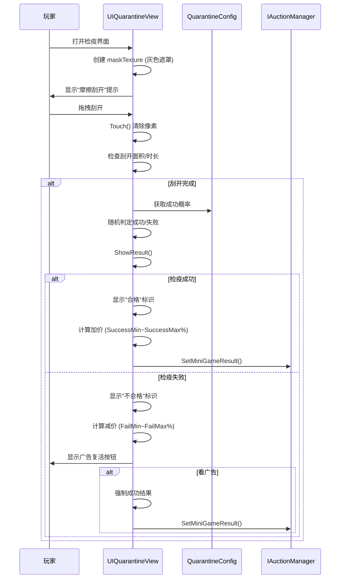

# UIQuarantineView.cs - 检疫小游戏视图

## 📄 文件信息

| 属性 | 值 |
|------|------|
| **文件路径** | `Assets/Scripts/Code/Game/UIGame/UIMiniGame/UIQuarantineView.cs` |
| **命名空间** | `TaoTie` |
| **基类** | `UICommonMiniGameView` |
| **实现接口** | `IOnDisable`, `IOnDestroy` |

---

## 🎯 类说明

`UIQuarantineView` 是检疫小游戏的视图组件，玩家通过摩擦屏幕来刮开检疫报告，根据检疫结果（合格/不合格）决定物品价格涨跌。使用情报后的全局价格作为基准。

### 核心职责

- **刮刮乐玩法**: 玩家摩擦屏幕刮开遮罩层
- **检疫判定**: 根据配置概率判定合格/不合格
- **价格计算**: 根据结果计算价格变化
- **广告复活**: 支持看广告重新检疫

---

## 📋 字段说明

### UI 组件字段

| 字段名 | 类型 | 说明 |
|--------|------|------|
| `Icon` | `UIImage` | 物品容器图标 |
| `StartButton` | `UIEventTrigger` | 开始刮开的触发器 |
| `Mask` | `UIRawImage` | 遮罩层（可刮开） |
| `MaskText` | `UITextmesh` | 遮罩层提示文本 |
| `AdBtn` | `UIButton` | 广告按钮 |
| `AdBtnText` | `UITextmesh` | 广告按钮文本 |
| `Qualified` | `UIImage` | 合格/不合格标识 |
| `Desc` | `UITextmesh` | 检疫描述文本 |
| `ResultText` | `UITextmesh` | 结果文本 |
| `Count` | `UITextmesh` | 广告次数显示 |
| `Hit` | `UIEmptyView` | 命中效果容器 |

### 数据字段

| 字段名 | 类型 | 说明 |
|--------|------|------|
| `Config` | `QuarantineConfig` | 检疫配置数据（只读属性） |
| `isSuccess` | `bool` | 是否检疫成功 |
| `newPrice` | `BigNumber` | 新的价格变化值 |
| `baseTexture` | `Texture` | 基础纹理（遮罩底图） |
| `maskTexture` | `Texture2D` | 动态遮罩纹理（可刮开） |
| `startDragTime` | `long` | 开始拖拽时间戳 |
| `totalDragTime` | `long` | 累计拖拽时长 |
| `lastCheckTime` | `long` | 上次检查时间 |
| `lastCheck` | `Vector2` | 上次检查位置 |
| `worldCorners` | `Vector3[]` | UI 世界坐标角点 |

### 常量

| 常量名 | 类型 | 值 | 说明 |
|--------|------|-----|------|
| `BASE_COLOR` | `Color` | `(0.447, 0.439, 0.396, 1)` | 遮罩基础颜色 |

---

## 🔧 方法说明

### 生命周期方法

#### `OnCreate()`
创建时初始化所有 UI 组件。

```csharp
public override void OnCreate()
{
    base.OnCreate();
    Hit = AddComponent<UIEmptyView>("View/Bg/Content/Report/Result/Qualified/Hit");
    Icon = AddComponent<UIImage>("View/Bg/Content/Report/Icon");
    StartButton = AddComponent<UIEventTrigger>("View/Bg/Content/Report/Result/Mask");
    MaskText = AddComponent<UITextmesh>("View/Bg/Content/Report/Result/Mask/Text (TMP)");
    Mask = AddComponent<UIRawImage>("View/Bg/Content/Report/Result/Mask");
    AdBtn = AddComponent<UIButton>("View/Bg/Content/Buttons/AdBtn");
    AdBtnText = AddComponent<UITextmesh>("View/Bg/Content/Buttons/AdBtn/Text");
    Qualified = AddComponent<UIImage>("View/Bg/Content/Report/Result/Qualified");
    Desc = AddComponent<UITextmesh>("View/Bg/Content/Report/Desc");
    ResultText = AddComponent<UITextmesh>("View/Bg/Content/Report/Result/Text");
    Desc.SetI18NKey(I18NKey.Text_Quarantine_Report_Desc);
    ResultText.SetI18NKey(I18NKey.Text_Quarantine_Report_Result);
    baseTexture = Mask.GetTexture();
    Count = AddComponent<UITextmesh>("View/Bg/Content/Buttons/AdBtn/Count");
    Count.SetI18NKey(I18NKey.Text_TurnTable_Count);
    Range.SetI18NKey(I18NKey.Quarantine_Price_Range);
}
```

#### `OnEnable(int id)`
启用时初始化检疫游戏。

**核心逻辑:**
```
1. 重置状态（隐藏 Hit、清空拖拽数据、newPrice=null）
2. 获取容器配置并设置图标
3. 绑定拖拽事件（PointerDown/Drag/PointerUp）
4. 计算价格波动范围
5. 创建 maskTexture 并填充 BASE_COLOR
6. 根据配置概率随机判定成功/失败
7. 设置合格/不合格标识（暂不显示）
```

#### `OnDisable()` / `OnDestroy()`
禁用/销毁时清理资源并提交结果。

```csharp
public void OnDisable()
{
    if (maskTexture != null)
    {
        GameObject.Destroy(maskTexture);
        maskTexture = null;
        Mask.SetTexture(baseTexture);
    }
    if (newPrice != null)
    {
        IAuctionManager.Instance.SetMiniGameResult(configId, newPrice);
        Messager.Instance.Broadcast(0, MessageId.SetChangePriceResult, configId, newPrice, false);
    }
}
```

---

### 核心业务方法

#### `OnBeginDrag()` / `OnDrag()` / `OnEndDrag()`
处理刮开操作。

**拖拽逻辑:**
```
1. OnBeginDrag: 记录开始时间，隐藏提示文本
2. OnDrag:
   - 将屏幕坐标转换为纹理坐标
   - 计算拖拽路径上的每个点（间隔 20 像素）
   - 调用 Touch() 刮开对应区域
   - 应用纹理更新
   - 检查是否满足完成条件：
     * 拖拽总时长 > 3000ms
     * 或刮开面积 > 50%
3. OnEndDrag: 累加拖拽时长，检查是否完成
```

#### `Touch(Vector2 position, Vector2 min, Vector2 max)`
刮开指定区域。

**核心逻辑:**
```
1. 将屏幕坐标转换为纹理坐标
2. 设置刮开半径（texture.width / 20）
3. 遍历圆形区域内的每个像素：
   - 计算距离中心的距离
   - 根据距离计算透明度（边缘渐变）
   - 设置像素为透明（Color.Lerp 到 clear）
```

#### `ShowResult()`
显示检疫结果。

**核心逻辑:**
```
1. 根据成功/失败计算价格：
   - 成功：SuccessMin ~ SuccessMax 百分比
   - 失败：FailMin ~ FailMax 百分比
2. 计算 newPrice = price - basePrice
3. 1 秒内淡出遮罩层
4. 显示合格/不合格标识
5. 显示结果文本（绿色加价/红色减价）
6. 隐藏 StartButton
7. 如果失败且可看广告，显示广告按钮
```

---

### 事件处理方法

| 方法名 | 触发条件 | 功能说明 |
|--------|----------|----------|
| `OnBeginDrag(PointerEventData)` | 开始拖拽 | 记录起始时间，隐藏提示 |
| `OnDrag(PointerEventData)` | 拖拽中 | 刮开遮罩，检查完成条件 |
| `OnEndDrag(PointerEventData)` | 结束拖拽 | 累加时长，检查是否完成 |
| `OnClickAdButton()` | 点击广告按钮 | 播放广告并重新检疫 |

#### `OnClickAdBtnAsync()`
广告播放逻辑。

```csharp
public async ETTask OnClickAdBtnAsync()
{
    var res = await PlayAd();
    if (res)
    {
        // 广告成功：强制成功结果
        Qualified.SetActive(false);
        Hit.SetActive(false);
        var price = Random.Range(config.SuccessMin, config.SuccessMax + 1) / 100f * basePrice;
        newPrice = price - basePrice;
        BigNumber.Round2Integer(newPrice);
        SetContainerWinLoss(newPrice + containerWinLoss - IAuctionManager.Instance.LastAuctionPrice);
        Qualified.SetSpritePath("qualified.png");
        Qualified.SetActive(true);
        ResultText 显示绿色加价文本;
        AdBtn.SetActive(false);
        StartButton.SetActive(false);
    }
    else
    {
        AdBtn.SetInteractable(true);
    }
}
```

---

## 📊 游戏流程图



---

## 💡 使用示例

```csharp
// 打开检疫小游戏
var view = await UIManager.Instance.OpenWindow<UIQuarantineView>(
    UIQuarantineView.PrefabPath,
    UILayerNames.GameLayer,
    configId
);

// 检疫配置示例（QuarantineConfig）
/*
{
    "Id": 1001,
    "Percent": 60,        // 基础成功率 60%
    "SuccessMin": 120,    // 成功最低加价 120%
    "SuccessMax": 150,    // 成功最高加价 150%
    "FailMin": 50,        // 失败最低减价 50%
    "FailMax": 80         // 失败最高减价 80%
}
*/
```

---

## ⚠️ 注意事项

| 问题 | 说明 | 解决方案 |
|------|------|----------|
| **纹理泄漏** | Texture2D 未及时销毁 | 在 OnDisable/OnDestroy 中销毁 |
| **刮开性能** | 每像素操作可能卡顿 | 限制刮开半径，降低采样密度 |
| **价格基准** | 使用情报后的全局价格 | 通过 GetBasePrice() 获取 |
| **强制结果** | 调试时可设置固定结果 | 检查 GameSetting.PlayableResult |

---

## 🔗 相关文档

- [UICommonMiniGameView.cs.md](./UICommonMiniGameView.cs.md) - 小游戏通用视图基类
- [QuarantineConfig.cs.md](../../../Module/Generate/Config/QuarantineConfig.cs.md) - 检疫配置
- [UIRepairView.cs.md](./UIRepairView.cs.md) - 修理小游戏（类似玩法）

---

*文档由 OpenClaw AI 助手自动生成 | 基于静态代码分析*
