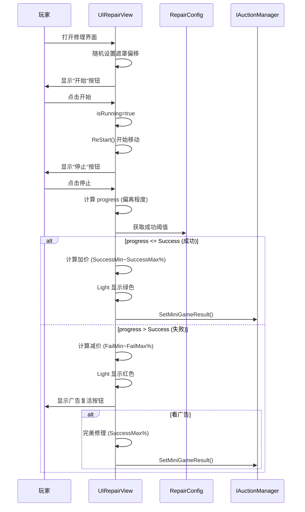

# UIRepairView.cs - 修理小游戏视图

## 📄 文件信息

| 属性 | 值 |
|------|------|
| **文件路径** | `Assets/Scripts/Code/Game/UIGame/UIMiniGame/UIRepairView.cs` |
| **命名空间** | `TaoTie` |
| **基类** | `UICommonMiniGameView` |
| **实现接口** | `IOnDisable`, `IUpdate` |

---

## 🎯 类说明

`UIRepairView` 是修理小游戏的视图组件，玩家通过点击开始/停止按钮来控制移动的光标，在最佳时机停止以获取最高修理效果。情报效果在游戏开始时就应用到物品上。

### 核心职责

- **时机判断玩法**: 移动光标在最佳时机停止
- **动态遮罩**: 模拟修理区域的视觉效果
- **价格计算**: 根据停止位置计算修理效果
- **广告复活**: 支持看广告获得完美修理

---

## 📋 字段说明

### UI 组件字段

| 字段名 | 类型 | 说明 |
|--------|------|------|
| `Item` | `UIImage` | 物品主图标 |
| `Mask` | `UIImage` | 遮罩层（损坏区域） |
| `RectMask` | `UIEmptyView` | 矩形遮罩容器 |
| `Child` | `UIEmptyView` | 子容器（移动部分） |
| `Icon` | `UIImage` | 子容器内图标 |
| `StartButton` | `UIButton` | 开始/停止按钮 |
| `AdBtn` | `UIButton` | 广告按钮 |
| `AdBtnText` | `UITextmesh` | 广告按钮文本 |
| `StartText` | `UITextmesh` | 开始按钮文本 |
| `Count` | `UITextmesh` | 广告次数显示 |
| `Light` | `UIImage` | 成功/失败光效 |

### 数据字段

| 字段名 | 类型 | 说明 |
|--------|------|------|
| `Config` | `RepairConfig` | 修理配置数据（只读属性） |
| `newPrice` | `BigNumber` | 新的价格 |
| `oldPrice` | `BigNumber` | 原始价格 |
| `isRunning` | `bool` | 是否正在运行 |
| `startTime` | `long` | 开始时间戳 |
| `startPos` | `Vector2` | 移动起始位置 |
| `endPos` | `Vector2` | 移动结束位置 |

---

## 🔧 方法说明

### 生命周期方法

#### `OnCreate()`
创建时初始化所有 UI 组件。

```csharp
public override void OnCreate()
{
    base.OnCreate();
    Light = AddComponent<UIImage>("View/Bg/Content/UIItem/Image/Light");
    StartText = AddComponent<UITextmesh>("View/Bg/Content/Buttons/StartBtn/Text");
    Item = AddComponent<UIImage>("View/Bg/Content/UIItem/Image/Icon");
    Mask = AddComponent<UIImage>("View/Bg/Content/UIItem/Image/Mask");
    RectMask = AddComponent<UIEmptyView>("View/Bg/Content/UIItem/Image/Icon/Child/Mask");
    Child = AddComponent<UIEmptyView>("View/Bg/Content/UIItem/Image/Icon/Child");
    Icon = AddComponent<UIImage>("View/Bg/Content/UIItem/Image/Icon/Child/Mask/Icon");
    StartButton = AddComponent<UIButton>("View/Bg/Content/Buttons/StartBtn");
    AdBtn = AddComponent<UIButton>("View/Bg/Content/Buttons/AdBtn");
    AdBtnText = AddComponent<UITextmesh>("View/Bg/Content/Buttons/AdBtn/Text");
    Count = AddComponent<UITextmesh>("View/Bg/Content/Buttons/AdBtn/Count");
    Count.SetI18NKey(I18NKey.Text_TurnTable_Count);
}
```

#### `OnEnable(int id)`
启用时初始化修理游戏。

**核心逻辑:**
```
1. 重置状态（隐藏 Light、newPrice=null、isRunning=false）
2. 获取物品价格并设置图标
3. 绑定按钮点击事件
4. 随机计算遮罩偏移位置：
   - 随机角度（0~360 度）
   - 随机距离（0.1~0.25 倍图标尺寸）
5. 设置遮罩大小（Config.Size%）
6. 计算价格波动范围
```

#### `Update()`
每帧更新移动光标位置。

**核心逻辑:**
```
1. 如果 isRunning 为 true：
   - 计算经过时间比例 during = (timeNow - startTime) / Config.During
   - 线性插值 Child 位置：Vector2.Lerp(startPos, endPos, during)
   - 如果超过 Config.During：调用 ReStart() 重新开始
```

#### `OnDisable()`
禁用时提交结果。

```csharp
public void OnDisable()
{
    if (newPrice != null)
    {
        IAuctionManager.Instance.SetMiniGameResult(configId, newPrice);
        Messager.Instance.Broadcast(0, MessageId.SetChangePriceResult, configId, newPrice, false);
    }
}
```

---

### 核心业务方法

#### `OnClickStartButton()`
点击开始按钮。

```csharp
public void OnClickStartButton()
{
    StartText.SetI18NKey(I18NKey.Text_Repair_Stop);  // 文本变为"停止"
    OnClickStartButtonAsync().Coroutine();
    StartButton.SetOnClick(OnClickStop);  // 切换为停止回调
}
```

#### `OnClickStop()`
点击停止按钮，计算结果。

**核心逻辑:**
```
1. 计算当前进度 during = (timeNow - startTime) / Config.During
2. 根据调试设置强制结果（可选）
3. 计算偏离中心的程度：progress = Mathf.Abs(during - 0.5f) * 200
   - 0.5 是最佳时机（中心位置）
   - progress 越小越接近中心
4. 调用 OnResult(progress)
5. 隐藏开始按钮
```

#### `OnResult(float progress)`
根据进度计算最终结果。

**参数说明:**
- `progress`: 偏离程度（0~100，0 为完美）

**核心逻辑:**
```
1. 限制 progress 在 0~100 范围
2. 设置 isRunning = false
3. 如果 progress > 0 且可看广告，显示广告按钮
4. 如果 progress <= Config.Success（成功范围）：
   - 计算成功系数：val = 1 - progress / Config.Success
   - newPrice = Lerp(SuccessMin, SuccessMax, val) / 100 * oldPrice
   - 设置 Light 为绿色
5. 否则（失败范围）：
   - 计算失败系数：val = (progress - Config.Success) / (100 - Config.Success)
   - newPrice = Lerp(FailMax, FailMin, val) / 100 * oldPrice
   - 设置 Light 为红色
6. 取整 newPrice
7. 调用 SetItemWinLossWithContainer() 显示结果
8. 显示 Light 光效
```

**价格计算示例:**
```csharp
// 配置：SuccessMin=120, SuccessMax=150, FailMin=50, FailMax=90, Success=30
// 场景 1：完美时机（progress=0）
val = 1 - 0/30 = 1
newPrice = Lerp(120, 150, 1) / 100 * oldPrice = 150% * oldPrice

// 场景 2：一般成功（progress=15）
val = 1 - 15/30 = 0.5
newPrice = Lerp(120, 150, 0.5) / 100 * oldPrice = 135% * oldPrice

// 场景 3：失败（progress=60）
val = (60-30) / (100-30) = 0.43
newPrice = Lerp(90, 50, 0.43) / 100 * oldPrice = 71% * oldPrice
```

#### `ReStart()`
重新开始移动。

```csharp
private void ReStart()
{
    startTime = TimerManager.Instance.GetTimeNow();
    var range = Random.Range(0, 360);  // 随机角度
    startPos = Quaternion.Euler(new Vector3(0, 0, range)) * Vector2.right * 500;
    endPos = -startPos;  // 对角线移动
}
```

#### `OnClickAdBtnAsync()`
广告播放逻辑。

```csharp
public async ETTask OnClickAdBtnAsync()
{
    var res = await PlayAd();
    if (res)
    {
        // 广告成功：完美修理
        Child.GetRectTransform().anchoredPosition = Vector2.zero;  // 中心位置
        newPrice = Config.SuccessMax / 100f * oldPrice;  // 最高加价
        BigNumber.Round2Integer(newPrice);
        AdBtn.SetActive(false);
        SetItemWinLossWithContainer(newPrice - oldPrice);
        StartButton.SetActive(false);
        Light.SetColor(GameConst.GREEN_COLOR);
    }
    else
    {
        AdBtn.SetInteractable(true);
    }
}
```

---

## 📊 游戏流程图



---

## 💡 使用示例

```csharp
// 打开修理小游戏
var view = await UIManager.Instance.OpenWindow<UIRepairView>(
    UIRepairView.PrefabPath,
    UILayerNames.GameLayer,
    configId
);

// 修理配置示例（RepairConfig）
/*
{
    "Id": 1001,
    "During": 2000,       // 移动周期 2 秒
    "Size": 30,           // 遮罩大小 30%
    "Success": 30,        // 成功阈值 30%（中心±15%）
    "SuccessMin": 120,    // 成功最低加价 120%
    "SuccessMax": 150,    // 成功最高加价 150%
    "FailMin": 50,        // 失败最低减价 50%
    "FailMax": 90,        // 失败最高减价 90%
    "AdMin": 130,         // 广告最低加价 130%
    "AdMax": 140          // 广告最高加价 140%
}
*/
```

---

## ⚠️ 注意事项

| 问题 | 说明 | 解决方案 |
|------|------|----------|
| **时机判断** | 中心位置是最佳时机 | progress = |during - 0.5| × 200 |
| **价格基准** | 情报在游戏开始时就应用 | GetItemPrice() 获取 |
| **广告次数** | 限制每日广告次数 | 检查 GameConst.PlayableMaxAdCount |
| **调试模式** | 可设置固定结果 | GameSetting.PlayableResult |

---

## 🔗 相关文档

- [UICommonMiniGameView.cs.md](./UICommonMiniGameView.cs.md) - 小游戏通用视图基类
- [RepairConfig.cs.md](../../../Module/Generate/Config/RepairConfig.cs.md) - 修理配置
- [UIQuarantineView.cs.md](./UIQuarantineView.cs.md) - 检疫小游戏（类似结构）

---

*文档由 OpenClaw AI 助手自动生成 | 基于静态代码分析*
