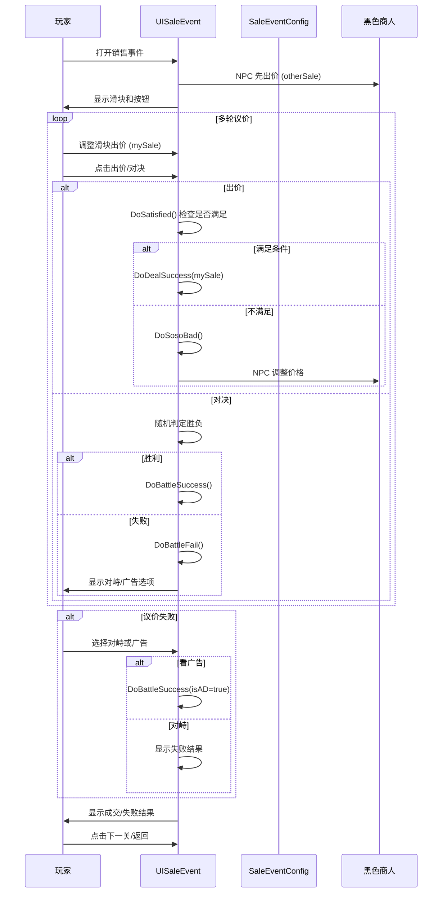

# UISaleEvent.cs - 销售事件小游戏视图

## 📄 文件信息

| 属性 | 值 |
|------|------|
| **文件路径** | `Assets/Scripts/Code/Game/UIGame/UIMiniGame/UISaleEvent.cs` |
| **命名空间** | `TaoTie` |
| **基类** | `UIBaseView` |
| **实现接口** | `IOnCreate`, `IOnEnable<BigNumber, long>`, `IOnDestroy`, `IOnDisable` |

---

## 🎯 类说明

`UISaleEvent` 是销售事件小游戏的视图组件，玩家与黑色拍卖行商人进行多轮议价，通过出价/抵抗/对决等方式决定最终成交价格。

### 核心职责

- **多轮议价**: 与 NPC 进行多轮价格谈判
- **滑块出价**: 通过滑块调整出价金额
- **对决机制**: 可选择与商人对决（随机胜负）
- **固定价格**: 满足条件时触发固定价格选项
- **广告复活**: 失败后可看广告逆转

---

## 📋 字段说明

### UI 组件字段

| 字段名 | 类型 | 说明 |
|--------|------|------|
| `TotalSaleText` | `UITextmesh` | 总销售额文本 |
| `MyScaleText` | `UITextmesh` | 我的出价文本 |
| `NoticText` | `UITextmesh` | 提示文本 |
| `LeftButtonText` / `RightButtonText` | `UITextmesh` | 左右按钮文本 |
| `TitleText` | `UITextmesh` | 标题文本 |
| `DealSuccessNoticeText` | `UITextmesh` | 交易成功提示 |
| `DealFailNoticeText` | `UITextmesh` | 交易失败提示 |
| `BattleSuccessText` | `UITextmesh` | 对决成功提示 |
| `BattleFailText` | `UITextmesh` | 对决失败提示 |
| `Name` | `UITextmesh` | 商人名称 |
| `TopMaskTurnaroundText` | `UITextmesh` | 顶部遮罩反转文本 |
| `Slider` | `UISlider` | 出价滑块 |
| `Add` / `Substract` | `UIPointerClick` | 加减按钮 |
| `Mask` | `UIPointerClick` | 遮罩点击区 |
| `BitButton` | `UIButton` | 出价按钮 |
| `BattleButton` | `UIButton` | 对决按钮 |
| `NextLevelButton` | `UIButton` | 下一关按钮 |
| `BackMainButton` | `UIButton` | 返回主界面按钮 |
| `WinImage` | `UIRawImage` | 胜利图片 |
| `Back2Image` / `Back3Image` | `UIImage` | 背景图片 |
| `ADIconImg` | `UIImage` | 广告图标 |
| `TopMaskTurnaroundImg` | `UIImage` | 顶部遮罩反转图片 |
| `Icon` | `UIImage` | 商人图标 |
| `animImg` | `UIImage` | 动画图片 |
| `Buttons` | `UIEmptyView` | 按钮容器 |
| `animator` | `UIAnimator` | 动画控制器 |
| `CashGroup` | `UICashGroup` | 金币显示组件 |
| `silderOffClick` | `UIPointerClick` | 滑块禁用点击区 |
| `animClick` | `UIPointerClick` | 动画点击区 |

### 数据字段

| 字段名 | 类型 | 说明 |
|--------|------|------|
| `blackId` | `long` | 黑色商人实体 ID |
| `BlackBoy` | `Bidder` | 黑色商人实体（只读属性） |
| `totalSale` | `BigNumber` | 总销售额 |
| `otherSale` | `float` | NPC 出价 |
| `mySale` | `float` | 玩家出价 |
| `isOver` | `bool` | 游戏是否结束 |
| `needChoose` | `bool` | 是否需要选择 |
| `isBattled` | `bool` | 是否已对决 |
| `isBattleing` | `bool` | 是否正在对决 |
| `saleCount` | `int` | 出价次数 |
| `task` | `ETTask<int>` | 异步任务 |
| `lastState` | `LastState` | 上一轮状态 |
| `currStepState` | `CurrStepState` | 当前阶段状态 |
| `Config` | `SaleEventConfig` | 销售事件配置 |

### 枚举类型

#### `SaleMode`
```csharp
enum SaleMode
{
    Buy,   // 购买模式
    Sell   // 销售模式
}
```

#### `LastState`
```csharp
enum LastState
{
    None = 0,  // 无
    Bad,       // 糟糕
    Soso       // 一般
}
```

#### `CurrStepState`
```csharp
enum CurrStepState
{
    None = 0,     // 无
    Deal,         // 议价阶段
    DealFail,     // 议价失败
    Face,         // 对峙阶段
    Fixed         // 固定价格
}
```

### 常量

| 常量名 | 类型 | 值 | 说明 |
|--------|------|-----|------|
| `PriceStep` | `float` | `0.1f` | 滑块步进值（从 GlobalConfig 读取） |

---

## 🔧 方法说明

### 生命周期方法

#### `OnCreate()`
创建时初始化所有 UI 组件。

```csharp
public void OnCreate()
{
    // 从 GlobalConfig 读取 PriceStep，默认 0.1f
    if (!GlobalConfigCategory.Instance.TryGetFloat("PriceStep", out PriceStep)) 
        PriceStep = 0.1f;
    
    // 初始化所有 UI 组件（省略详细代码）
    Name = AddComponent<UITextmesh>("UICommonWin/Win/Content/Back1/Name/Text (TMP)");
    Icon = AddComponent<UIImage>("UICommonWin/Win/Content/Back1/character");
    TotalSaleText = AddComponent<UITextmesh>("UICommonWin/Win/Content/Back2/Text (TMP)");
    // ... 更多组件初始化
}
```

#### `OnEnable(BigNumber totalSale, long blackId)`
启用时初始化销售事件。

**参数说明:**
- `totalSale`: 总销售额（基准价格）
- `blackId`: 黑色商人实体 ID

**核心逻辑:**
```
1. 保存 blackId 并获取商人配置
2. 重置所有状态标志
3. 设置 UI 初始状态（按钮可交互性、显示/隐藏）
4. 设置 TotalSaleText 和 MyScaleText
5. 初始化滑块值为 totalSale
6. 绑定所有事件回调
7. 设置商人名称和图标
8. 启动 SaleEventAsync() 协程
```

#### `OnDestroy()` / `OnDisable()`
销毁/禁用时清理未完成任务。

```csharp
public void OnDestroy()
{
    if (!task.IsCompleted)
    {
        task?.SetResult(-1);
    }
}
```

---

### 核心业务方法

#### `SaleEventAsync()`
销售事件主流程。

**核心逻辑:**
```
1. 设置 currStepState = Deal
2. 创建异步任务 task
3. NPC 先出价（强制 true）：
   - otherSale = totalSale × NPCTargetValue
   - 显示提示文本
4. 等待玩家选择（出价/对决）
5. 进入主循环：
   - 根据 currStepState 处理不同阶段
   - Deal: 检查是否满足条件，否则 DoSosoBad()
   - DealFail: 显示失败选项（对峙/广告）
   - Fixed: 显示固定价格选项（同意/拒绝）
   - 等待玩家选择
```

#### `DoSatisfied()`
检查是否满足成交条件。

**核心逻辑:**
```
1. 判断 mySale >= otherSale × NPCTargetRangeMaxValue
2. 如果满足：
   - 设置 isOver = true
   - 调用 DoDealSuccess(mySale)
3. 返回是否满足
```

#### `DoSosoBad()`
处理一般/糟糕的出价。

**核心逻辑:**
```
1. 检查 mySale 是否在目标范围内：
   otherSale × NPCTargetRangeMinValue < mySale < otherSale × NPCTargetRangeMaxValue
2. 如果在范围内：
   - 如果出价次数 >= 3：直接成交 DoDealSuccess(mySale)
   - 否则：
     * 如果上轮是 Soso：触发固定价格 DoFixedPrice(false)
     * 否则：尝试触发固定价格 DoFixedPrice()
     * 如果未触发：NPC 调整价格，lastState = Soso
3. 如果不在范围内：
   - 如果出价次数 >= 3 或上轮是 Bad/Soso：DoDealFail()
   - 否则：NPC 提高价格，lastState = Bad
```

#### `DoFixedPrice(bool isRandom)`
触发固定价格选项。

**核心逻辑:**
```
1. 如果出价次数 < 3：
2. 生成固定价格 GenerateFixedPrice(isRandom)
3. 如果价格 >= 0：
   - 设置 currStepState = Fixed
   - 禁用滑块
   - 显示 NPC 固定价格提示
   - 返回 true
4. 返回 false
```

#### `GenerateFixedPrice(bool isRandom)`
生成固定价格。

**核心逻辑:**
```
1. 如果 isRandom：
   - 根据 FixedPriceThreshold 概率决定是否生成
   - 不生成返回 -1
2. 计算随机因子 randomFactor
3. 根据 mySale 和 otherSale 的大小关系：
   - mySale > otherSale: otherSale × (1 + randomFactor)
   - 否则：otherSale × (1 - randomFactor)
4. 返回固定价格
```

#### `DoDealSuccess(float salePrice)` / `DoDealFail()`
处理成交/失败。

```csharp
private void DoDealSuccess(float salePrice)
{
    isOver = true;
    NoticText.SetText(成交成功文本);
    WinImage.SetEnabled(false);
    Back2Image/Back3Image/Buttons.SetActive(false);
    Mask.SetEnabled(true);
    DealSuccessNoticeText.SetActive(true);
    NextLevelButton.SetActive(true);
    TitleText.SetText(I18NKey.Text_Sale_Success);
    task.SetResult(2);
}

private void DoDealFail()
{
    currStepState = CurrStepState.DealFail;
    needChoose = true;
    NoticText.SetText(交易失败文本);
    WinImage.SetEnabled(false);
    Back2Image/Back3Image/Buttons.SetActive(false);
    task.SetResult(1);
}
```

#### `DoBattleSuccess(bool isAD)` / `DoBattleFail()`
处理对决结果。

```csharp
private void DoBattleSuccess(bool isAD = false)
{
    isOver = true;
    NoticText.SetText(对决成功文本);
    WinImage/Back2Image/Back3Image/Buttons.SetActive(false);
    Mask.SetEnabled(true);
    BattleSuccessText.SetText(根据是否广告显示不同利润);
    BattleSuccessText.SetActive(true);
    NextLevelButton.SetActive(true);
    TitleText.SetText(I18NKey.Text_Battle_Success);
    task.SetResult(1);
}

private void DoBattleFail()
{
    isBattled = true;
    currStepState = CurrStepState.DealFail;
    NoticText.SetText(交易失败文本);
    WinImage/Back2Image/Back3Image.SetActive(false);
    Buttons.SetActive(true);
    Mask.SetEnabled(false);
    task.SetResult(1);
}
```

---

### 事件处理方法

| 方法名 | 触发条件 | 功能说明 |
|--------|----------|----------|
| `OnClickSlider(float)` | 滑块值变化 | 更新 mySale 和 MyScaleText |
| `OnClickAdd()` | 点击加号 | 滑块值 + PriceStep |
| `OnClickSubstract()` | 点击减号 | 滑块值 - PriceStep |
| `OnClickGivePrice()` | 点击出价按钮 | 提交当前出价 |
| `OnClickBattle()` | 点击对决按钮 | 开始对决（随机胜负） |
| `OnClickRefuse()` | 点击拒绝 | 拒绝固定价格，进入失败流程 |
| `OnClickAgree()` | 点击同意 | 接受固定价格，成交 |
| `OnClickMask()` | 点击遮罩 | 进入下一关或关闭 |
| `OnClickFace()` | 点击对峙 | 显示失败结果 |
| `OnClickAD()` | 点击广告 | 看广告逆转失败 |
| `OnClickCantGivePrice()` | 点击禁用滑块 | 提示不能出价 |
| `OnClickAnim()` | 点击动画 | 停止对决动画 |
| `OnClickNextLevel()` | 点击下一关 | 进入下一关 |
| `OnClickBack()` | 点击返回 | 返回主界面 |
| `OnClickFaceBattleFailed()` | 点击对决失败 | 显示反转文本 |

#### `OnClickBattleAsync()`
对决逻辑。

```csharp
private async ETTask OnClickBattleAsync()
{
    isBattleing = true;
    bool isWin = Random.Range(0f, 1f) <= Config.BattleThreshold;
    animImg.SetActive(true);

    while (isBattleing)
    {
        await TimerManager.Instance.WaitAsync(1);
    }

    if (isWin)
    {
        DoBattleSuccess();
    }
    else
    {
        DoBattleFail();
    }
}
```

#### `OnClickAdBtnAsync()`
广告播放逻辑。

```csharp
private async ETTask OnClickAdBtnAsync()
{
    var res = await PlayAd();
    if (res)
    {
        isOver = true;
        DoBattleSuccess(isAD: true);  // 广告胜利，使用 ADProfit
    }
}
```

---

## 📊 游戏流程图



---

## 💡 使用示例

```csharp
// 打开销售事件
var view = await UIManager.Instance.OpenWindow<UISaleEvent, BigNumber, long>(
    UISaleEvent.PrefabPath,
    UILayerNames.PopupLayer,
    totalSale,
    blackBoyId
);

// 销售事件配置示例（SaleEventConfig）
/*
{
    "Id": 1001,
    "Type": 0,              // 0=Buy, 1=Sell
    "SliderMaxValue": 2.0,  // 滑块最大值倍数
    "NPCTargetValue": 0.8,  // NPC 目标价格比例
    "NPCTargetRangeMinValue": 0.9,   // 目标范围下限
    "NPCTargetRangeMaxValue": 1.1,   // 目标范围上限
    "NPCNewPriceRangeMinValue": 0.05, // NPC 调价幅度下限
    "NPCNewPriceRangeMaxValue": 0.15, // NPC 调价幅度上限
    "BattleThreshold": 0.5,  // 对决胜率 50%
    "FixedPriceThreshold": 0.3, // 固定价格触发概率 30%
    "NPCFixedPrice": "我出{0}金币",
    "NPCSoso": "嗯...{0}金币怎么样？",
    "NPCBad": "太少了！至少{0}金币！",
    "DealSuccess": "成交！{0}金币！",
    "DealFail": "交易失败！",
    "BattleSuccess": "对决胜利！获得{0}金币",
    "NormalProfit": 1.5,    // 正常对决利润倍数
    "ADProfit": 2.0         // 广告对决利润倍数
}
*/
```

---

## ⚠️ 注意事项

| 问题 | 说明 | 解决方案 |
|------|------|----------|
| **任务未完成** | 窗口关闭时 task 未完成 | 在 OnDestroy/OnDisable 中 SetResult(-1) |
| **滑块精度** | PriceStep 影响出价精度 | 从 GlobalConfig 读取，默认 0.1f |
| **对决动画** | 动画期间不能操作 | 设置 isBattleing 标志，点击动画停止 |
| **广告次数** | 限制每日广告次数 | 检查 GameConst.PlayableMaxAdCount |

---

## 🔗 相关文档

- [UIBaseView.cs.md](../../UI/UIBaseView.cs.md) - UI 视图基类
- [SaleEventConfig.cs.md](../../../Module/Generate/Config/SaleEventConfig.cs.md) - 销售事件配置
- [Bidder.cs.md](../../Entity/Bidder.cs.md) - 竞拍者实体
- [BlackBoyComponent.cs.md](../../Component/View/BlackBoyComponent.cs.md) - 黑色商人组件

---

*文档由 OpenClaw AI 助手自动生成 | 基于静态代码分析*
