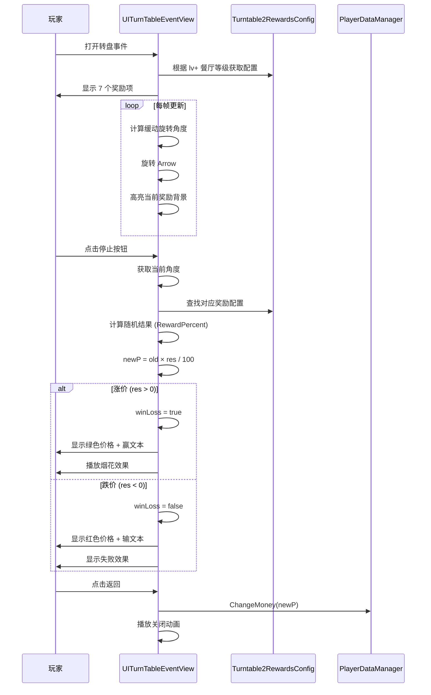

# UITurnTableEventView.cs - 转盘事件视图

## 📄 文件信息

| 属性 | 值 |
|------|------|
| **文件路径** | `Assets/Scripts/Code/Game/UIGame/UIMiniGame/UITurnTableEventView.cs` |
| **命名空间** | `TaoTie` |
| **基类** | `UIBaseView` |
| **实现接口** | `IOnCreate`, `IOnEnable<BigNumber, int>`, `IUpdate` |

---

## 🎯 类说明

`UITurnTableEventView` 是转盘事件小游戏的视图组件，玩家通过点击停止按钮来控制转盘指针，根据指针停留位置获得不同的价格奖励/惩罚。

### 核心职责

- **转盘玩法**: 自动旋转的转盘，玩家决定停止时机
- **奖励配置**: 根据餐厅等级和事件等级配置奖励
- **价格波动**: 根据指针位置计算价格涨跌
- **广告最优**: 支持看广告获得最大奖励

---

## 📋 字段说明

### UI 组件字段

| 字段名 | 类型 | 说明 |
|--------|------|------|
| `UICommonView` | `UIAnimator` | 通用视图动画控制器 |
| `Bgs` | `UIImage[]` | 奖励背景数组（7 个） |
| `Types` | `UIImage[]` | 奖励类型图标数组（7 个） |
| `Arrow` | `UIEmptyView` | 指针容器 |
| `Text` | `UITextmesh` | 价格文本 |
| `StopBtn` | `UIButton` | 停止按钮 |
| `AdBtn` | `UIButton` | 广告按钮 |
| `StopText` | `UITextmesh` | 停止按钮文本 |
| `Light` | `UIAnimator` | 灯光动画控制器 |
| `CashGroup` | `UICashGroup` | 金币显示组件 |
| `Fireworks` | `UIEmptyView` | 烟花效果容器 |
| `Fail` | `UIEmptyView` | 失败效果容器 |
| `Talk` | `UITextmesh` | 对话文本 |

### 数据字段

| 字段名 | 类型 | 说明 |
|--------|------|------|
| `winLoss` | `bool` | 是否已确定输赢 |
| `lastFireworksTime` | `long` | 上次烟花时间 |
| `ease` | `EasingFunction.Function` | 缓动函数（EaseInOutQuad） |
| `list` | `List<Turntable2RewardsConfig>` | 奖励配置列表 |
| `min` / `max` | `float` | 旋转角度范围 |
| `current` | `float` | 当前角度 |
| `MaxRewards` | `Turntable2RewardsConfig` | 最大奖励配置 |
| `old` | `BigNumber` | 原始价格 |
| `newP` | `BigNumber` | 新的价格变化 |

### 常量

| 常量名 | 类型 | 值 | 说明 |
|--------|------|-----|------|
| `REWARDS_COUNT` | `int` | `7` | 奖励数量 |
| `during` | `int` | `1000` | 旋转周期（毫秒） |

---

## 🔧 方法说明

### 生命周期方法

#### `OnCreate()`
创建时初始化所有 UI 组件。

```csharp
public void OnCreate()
{
    Talk = AddComponent<UITextmesh>("UICommonView/Bg/Content/Human/Talk/Text");
    Fail = AddComponent<UIEmptyView>("Fail");
    StopText = AddComponent<UITextmesh>("UICommonView/Bg/Content/Table/Buttons/StopBtn/Text");
    Fireworks = AddComponent<UIEmptyView>("Fireworks");
    CashGroup = AddComponent<UICashGroup>("CashGroup");
    Light = AddComponent<UIAnimator>("UICommonView/Bg/Content/Light");
    ease = EasingFunction.GetEasingFunction(EasingFunction.Ease.EaseInOutQuad);
    UICommonView = AddComponent<UIAnimator>("UICommonView");
    
    // 初始化 7 个奖励项
    Types = new UIImage[REWARDS_COUNT];
    Bgs = new UIImage[REWARDS_COUNT];
    for (int i = 0; i < Types.Length; i++)
    {
        Bgs[i] = AddComponent<UIImage>($"UICommonView/Bg/Content/Table/Type/Bg{i}");
        Types[i] = AddComponent<UIImage>($"UICommonView/Bg/Content/Table/Type/Bg{i}/Type");
    }
    
    Arrow = AddComponent<UIEmptyView>("UICommonView/Bg/Content/Table/Type/Arraw");
    Text = AddComponent<UITextmesh>("UICommonView/Bg/Content/Table/Price/Text");
    StopBtn = AddComponent<UIButton>("UICommonView/Bg/Content/Table/Buttons/StopBtn");
    AdBtn = AddComponent<UIButton>("UICommonView/Bg/Content/Table/Buttons/AdBtn");
}
```

#### `OnEnable(BigNumber price, int lv)`
启用时初始化转盘游戏。

**参数说明:**
- `price`: 基准价格
- `lv`: 事件等级

**核心逻辑:**
```
1. 重置状态（winLoss=false、newP=null、隐藏效果）
2. 根据 lv 和餐厅等级获取奖励配置列表
3. 如果配置不存在或数量不足 7 个，关闭窗口
4. 设置随机旋转周期（600~1100ms）
5. 绑定按钮事件
6. 遍历所有奖励配置，计算：
   - min/max：最小/最大角度
   - MaxRewards：最高奖励配置
7. 随机设置初始角度 current
8. 设置 7 个奖励项的图标
9. 设置初始价格文本
```

#### `Update()`
每帧更新转盘旋转。

**核心逻辑:**
```
1. 如果 list 为空，返回
2. 如果 newP != null（已确定结果）：
   - 如果 winLoss 为 true 且距离上次烟花 > 1 秒：
     * 随机位置播放烟花效果
   - 返回
3. 隐藏烟花
4. 计算当前时间在一个周期内的位置
5. 使用缓动函数计算 current 角度
6. 旋转 Arrow 到 current 角度
7. 高亮当前指针指向的奖励背景
```

---

### 核心业务方法

#### `CloseSelf()`
关闭窗口时播放动画并提交结果。

```csharp
public override async ETTask CloseSelf()
{
    using ListComponent<ETTask> task = ListComponent<ETTask>.Create();
    task.Add(ChangeMoney());       // 提交价格变化
    task.Add(UICommonView.Play("UIView_Close"));
    Fail.SetActive(false);
    await ETTaskHelper.WaitAll(task);
    await base.CloseSelf();
    winLoss = false;
}
```

#### `ChangeMoney()`
提交价格变化到玩家资产。

```csharp
private async ETTask ChangeMoney()
{
    if (newP != null)
    {
        if (newP > 0)
        {
            PlayerDataManager.Instance.RecordWinToday(newP);  // 记录今日赢利
            await CashGroup.DoMoneyMoveAnim(newP, Text 位置，5);  // 金币动画
        }
        PlayerDataManager.Instance.ChangeMoney(newP);  // 实际增减金钱
        newP = null;
    }
}
```

---

### 事件处理方法

| 方法名 | 触发条件 | 功能说明 |
|--------|----------|----------|
| `OnClickStopBtn()` | 点击停止按钮 | 停止转盘并计算结果 |
| `OnClickAdBtn()` | 点击广告按钮 | 播放广告获得最大奖励 |
| `OnClickClose()` | 点击关闭 | 关闭窗口 |

#### `OnClickStopBtnAsync()`
停止转盘并计算结果。

**核心逻辑:**
```
1. 切换停止按钮为"返回"文本
2. 禁用按钮防止重复点击
3. 播放灯光闪烁动画
4. 获取当前角度 current
5. 遍历奖励列表，找到指针对应的配置：
   - 检查 current 是否在配置的 Range 范围内
   - 记录索引和配置
6. 高亮对应奖励背景
7. 计算结果：
   - res = Random.Range(RewardPercent[0], RewardPercent[1]) - 100
   - res > 0: 涨价（winLoss=true）
   - res < 0: 跌价（winLoss=false）
8. 计算 newP = old × res / 100
9. 播放指针停止音效
10. 等待 500ms 后更新价格文本
11. 设置文本颜色（绿涨红跌）
12. 显示对话文本（赢/输提示）
```

**价格计算示例:**
```csharp
// 配置：RewardPercent = [80, 150]
res = Random.Range(80, 150);  // 假设 120
res -= 100;  // res = 20
newP = old * 20 / 100;  // 涨价 20%

// 配置：RewardPercent = [50, 90]
res = Random.Range(50, 90);  // 假设 70
res -= 100;  // res = -30
newP = old * -30 / 100;  // 跌价 30%
```

#### `OnClickAdBtnAsync()`
广告播放逻辑。

```csharp
private async ETTask OnClickAdBtnAsync()
{
    AdBtn.SetInteractable(false);
    StopBtn.SetInteractable(false);
    try
    {
        var res = await AdManager.Instance.PlayAd();
        if (res)
        {
            // 广告成功：强制最大奖励
            winLoss = true;
            Fail.SetActive(false);
            
            // 获取最大奖励的角度范围
            var max = Mathf.Max(MaxRewards.Range[0], MaxRewards.Range[1]);
            var min = Mathf.Min(MaxRewards.Range[0], MaxRewards.Range[1]);
            current = Random.Range(min, max);  // 随机停在最大奖励区域
            
            // 计算最大奖励
            var percent = Random.Range(MaxRewards.RewardPercent[0], MaxRewards.RewardPercent[1]);
            newP = old * percent / 100;
            
            // 更新 UI
            Arrow 旋转到 current;
            Text.DoNum(newP + old);
            Text.SetTextColor(绿色);
            播放指针停止音效;
        }
    }
    catch (Exception ex)
    {
        Log.Error(ex);
    }
    finally
    {
        AdBtn.SetInteractable(true);
        StopBtn.SetInteractable(true);
    }
}
```

---

## 📊 游戏流程图



---

## 💡 使用示例

```csharp
// 打开转盘事件
var view = await UIManager.Instance.OpenWindow<UITurnTableEventView, BigNumber, int>(
    UITurnTableEventView.PrefabPath,
    UILayerNames.PopupLayer,
    basePrice,
    eventLevel
);

// 转盘奖励配置示例（Turntable2RewardsConfig）
/*
{
    "Lv": 1,                    // 事件等级
    "RestaurantLv": 1,          // 餐厅等级要求
    "Range": [-30, 30],         // 角度范围（度）
    "RewardPercent": [80, 120]  // 奖励百分比（80%~120%）
}

// 7 个奖励项示例：
[
    {"Range": [-30, 30], "RewardPercent": [80, 120]},   // -30°~30°: 80%~120%
    {"Range": [30, 90], "RewardPercent": [50, 80]},     // 30°~90°: 50%~80%
    {"Range": [90, 150], "RewardPercent": [120, 150]},  // 90°~150°: 120%~150% (大奖)
    {"Range": [150, 210], "RewardPercent": [60, 90]},   // ...
    {"Range": [210, 270], "RewardPercent": [90, 110]},
    {"Range": [270, 330], "RewardPercent": [70, 100]},
    {"Range": [330, 390], "RewardPercent": [100, 130]}
]
*/
```

---

## ⚠️ 注意事项

| 问题 | 说明 | 解决方案 |
|------|------|----------|
| **配置缺失** | 找不到对应等级的配置 | 检查日志，关闭窗口 |
| **奖励数量** | 必须恰好 7 个奖励项 | 配置不足时记录错误 |
| **角度计算** | Range 可能跨越 0 度 | 使用 Mathf.Max/Min 处理 |
| **烟花性能** | 频繁播放影响性能 | 限制 1 秒最多 1 次 |

---

## 🔗 相关文档

- [UIBaseView.cs.md](../../UI/UIBaseView.cs.md) - UI 视图基类
- [Turntable2RewardsConfig.cs.md](../../../Module/Generate/Config/Turntable2RewardsConfig.cs.md) - 转盘奖励配置
- [UITurntableView.cs.md](./UITurntableView.cs.md) - 大厅转盘视图
- [UICashGroup.cs.md](../UILobby/UICashGroup.cs.md) - 金币显示组件

---

*文档由 OpenClaw AI 助手自动生成 | 基于静态代码分析*
