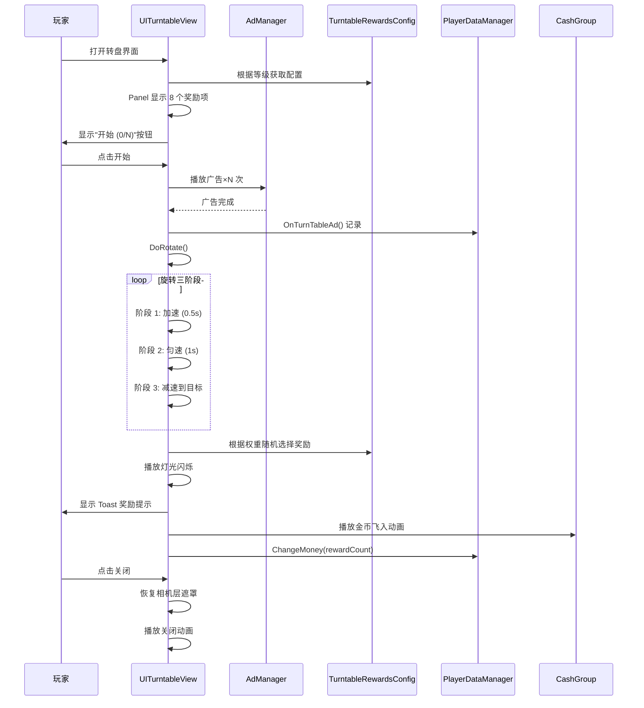

# UITurntableView.cs - 大厅转盘视图

## 📄 文件信息

| 属性 | 值 |
|------|------|
| **文件路径** | `Assets/Scripts/Code/Game/UIGame/UIMiniGame/UITurntableView.cs` |
| **命名空间** | `TaoTie` |
| **基类** | `UIBaseView` |
| **实现接口** | `IOnCreate`, `IOnEnable`, `IUpdate`, `IOnWidthPaddingChange` |

---

## 🎯 类说明

`UITurntableView` 是家园大厅中的转盘小游戏视图，玩家通过观看广告获得转盘机会，转动转盘随机获取金币奖励。

### 核心职责

- **转盘展示**: 3D 旋转的转盘面板
- **广告机制**: 观看广告获取转盘次数
- **随机奖励**: 根据权重随机分配奖励
- **金币动画**: 奖励金币飞入效果

---

## 📋 字段说明

### UI 组件字段

| 字段名 | 类型 | 说明 |
|--------|------|------|
| `Panel` | `UICopyGameObject` | 转盘面板（复制游戏对象） |
| `Light` | `UIAnimator` | 灯光动画控制器 |
| `btn_start` | `UIButton` | 开始按钮 |
| `Close` | `UIButton` | 关闭按钮 |
| `UICommonView` | `UIAnimator` | 通用视图动画控制器 |
| `Count` | `UITextmesh` | 按钮文本（显示广告进度） |
| `Ad` | `UIImage` | 广告图标 |
| `CashGroup` | `UICashGroup` | 金币显示组件 |

### 数据字段

| 字段名 | 类型 | 说明 |
|--------|------|------|
| `data` | `List<TurntableRewardsConfig>` | 奖励数据列表 |
| `isRotate` | `bool` | 是否正在旋转 |
| `adCount` | `int` | 需要观看的广告次数 |
| `overAD` | `int` | 已观看广告次数 |

---

## 🔧 方法说明

### 生命周期方法

#### `OnCreate()`
创建时初始化所有 UI 组件。

```csharp
public void OnCreate()
{
    CashGroup = AddComponent<UICashGroup>("CashGroup");
    Ad = AddComponent<UIImage>("UICommonView/Bg/Content/StartBtn/Ad");
    UICommonView = AddComponent<UIAnimator>("UICommonView");
    Panel = AddComponent<UICopyGameObject>("UICommonView/Bg/Content/Panel");
    Panel.InitListView(0, GetPanelItemByIndex);  // 初始化列表视图
    Light = AddComponent<UIAnimator>("UICommonView/Bg/Content/Light");
    btn_start = AddComponent<UIButton>("UICommonView/Bg/Content/StartBtn");
    Close = AddComponent<UIButton>("UICommonView/Bg/Close");
    Count = AddComponent<UITextmesh>("UICommonView/Bg/Content/StartBtn/Text");
}
```

#### `OnEnable()`
启用时初始化转盘状态。

**核心逻辑:**
```
1. 启动 OnEnableAsync() 协程
2. 重置 isRotate = false
3. 播放正常灯光动画
4. 绑定关闭和开始按钮事件
5. 根据拍卖等级和餐厅等级获取转盘配置
6. 如果配置不存在，记录错误并关闭窗口
7. 保存 data 列表
8. 初始化 Panel 显示所有奖励项
9. 计算需要观看的广告次数 adCount
10. 设置广告图标显示和按钮文本
```

#### `Update()`
每帧更新转盘旋转。

```csharp
public void Update()
{
    if (isRotate) return;  // 旋转中不更新
    var transform = Panel.GetTransform();
    transform.localEulerAngles += Time.deltaTime * Vector3.forward * 10;  // 每秒 10 度
}
```

---

### 核心业务方法

#### `OnEnableAsync()`
启用异步流程。

```csharp
private async ETTask OnEnableAsync()
{
    var mainCamera = CameraManager.Instance.MainCamera();
    if (mainCamera == null) return;
    await UICommonView.Play("UIView_Open");  // 播放打开动画
    CameraManager.Instance.MainCamera().cullingMask = Define.UILayer;  // 仅渲染 UI 层
}
```

#### `OnClickCloseAsync()`
关闭异步流程。

```csharp
public async ETTask OnClickCloseAsync()
{
    var mainCamera = CameraManager.Instance.MainCamera();
    if (mainCamera != null)
    {
        mainCamera.cullingMask = Define.AllLayer;  // 恢复所有层渲染
    }
    await UICommonView.Play("UIView_Close");
    CloseSelf().Coroutine();
    GameTimerManager.Instance.SetTimeScale(1);  // 恢复时间流速
}
```

#### `GetPanelItemByIndex(int index, GameObject obj)`
获取转盘面板项。

```csharp
public void GetPanelItemByIndex(int index, GameObject obj)
{
    TurntableItem item = Panel.GetUIItemView<TurntableItem>(obj);
    if (item == null)
    {
        item = Panel.AddItemViewComponent<TurntableItem>(obj);
    }
    item.SetData(data[index]);  // 设置奖励数据
    item.GetTransform().localEulerAngles = new Vector3(0, 0, -45 * index);  // 每项旋转 45 度
}
```

#### `OnClickBtnStartAsync()`
开始按钮点击逻辑。

**核心逻辑:**
```
1. 禁用关闭按钮，隐藏开始按钮
2. 循环播放广告直到达到 adCount 次数：
   - 调用 AdManager.Instance.PlayAd()
   - 如果成功：overAD++，更新按钮文本显示进度
   - 如果失败：over = false，跳出循环
3. 如果广告全部完成：
   - 调用 PlayerDataManager.Instance.OnTurnTableAd() 记录
   - 执行 DoRotate() 开始转盘
4. 如果广告中断：恢复开始按钮
5. 恢复关闭按钮
```

#### `DoRotate()`
执行转盘旋转和奖励计算。

**核心逻辑:**
```
1. 设置 isRotate = true
2. 播放旋转灯光动画
3. 计算总权重：total = Σ(data[i].Weight)
4. 随机权重：weight = Random(0, total)
5. 根据权重随机选择奖励索引：
   - 遍历 data，weight -= data[i].Weight
   - 当 weight <= 0 时，记录 index
6. 获取对应配置 config = data[index]
7. 分三阶段旋转：
   - 阶段 1（0.5 秒）：加速旋转 a=2000
   - 阶段 2（1 秒）：匀速旋转 v=1000
   - 阶段 3（t 秒）：减速旋转到目标位置
8. 计算目标角度：endPos = 360×5 + 45×index + Random(-20, 20)
9. 播放灯光闪烁动画
10. 显示 Toast 提示奖励金额
11. 播放金币飞入动画
12. 增加玩家金钱
```

**旋转物理公式:**
```csharp
// 阶段 1：加速
angle = startPos + a × during²  (a=2000, during=0~0.5)

// 阶段 2：匀速
angle = startPos + v × during  (v=1000, during=0~1)

// 阶段 3：减速
angle = startPos + v × during - a × during² / 2
t = 2 × (endPos - startPos) / v  // 计算减速时间
```

---

### 事件处理方法

| 方法名 | 触发条件 | 功能说明 |
|--------|----------|----------|
| `OnClickClose()` | 点击关闭按钮 | 调用 OnClickCloseAsync() |
| `OnClickbtn_start()` | 点击开始按钮 | 调用 OnClickBtnStartAsync() |

---

## 📊 游戏流程图



---

## 💡 使用示例

```csharp
// 打开大厅转盘
var view = await UIManager.Instance.OpenWindow<UITurntableView>(
    UITurntableView.PrefabPath,
    UILayerNames.PopupLayer
);

// 转盘奖励配置示例（TurntableRewardsConfig）
/*
{
    "Lv": 1,                    // 转盘等级
    "RestaurantLv": 1,          // 餐厅等级要求
    "Weight": 100,              // 权重（影响概率）
    "RewardCount": 500,         // 奖励金币数量
    "Icon": "path/to/icon"      // 图标路径
}

// 8 个奖励项示例（每项间隔 45 度）：
[
    {"Weight": 50, "RewardCount": 100},    // 小奖
    {"Weight": 30, "RewardCount": 500},    // 中奖
    {"Weight": 10, "RewardCount": 2000},   // 大奖
    {"Weight": 50, "RewardCount": 200},
    {"Weight": 30, "RewardCount": 800},
    {"Weight": 10, "RewardCount": 3000},   // 最大奖
    {"Weight": 50, "RewardCount": 150},
    {"Weight": 30, "RewardCount": 600}
]
*/
```

---

## ⚠️ 注意事项

| 问题 | 说明 | 解决方案 |
|------|------|----------|
| **相机遮罩** | 打开时隐藏 3D 场景 | cullingMask = Define.UILayer |
| **关闭恢复** | 关闭时恢复 3D 场景 | cullingMask = Define.AllLayer |
| **时间流速** | 游戏时可能暂停时间 | 关闭时 SetTimeScale(1) |
| **广告中断** | 玩家可能取消广告 | 恢复按钮状态，不执行旋转 |
| **旋转精度** | 目标角度需对齐奖励项 | endPos = 45 × index + 随机偏移 |

---

## 🔗 相关文档

- [UIBaseView.cs.md](../../UI/UIBaseView.cs.md) - UI 视图基类
- [TurntableRewardsConfig.cs.md](../../../Module/Generate/Config/TurntableRewardsConfig.cs.md) - 转盘奖励配置
- [TurntableItem.cs.md](./TurntableItem.cs.md) - 转盘奖励项组件
- [UITurnTableEventView.cs.md](./UITurnTableEventView.cs.md) - 转盘事件视图
- [UICashGroup.cs.md](../UILobby/UICashGroup.cs.md) - 金币显示组件

---

*文档由 OpenClaw AI 助手自动生成 | 基于静态代码分析*
