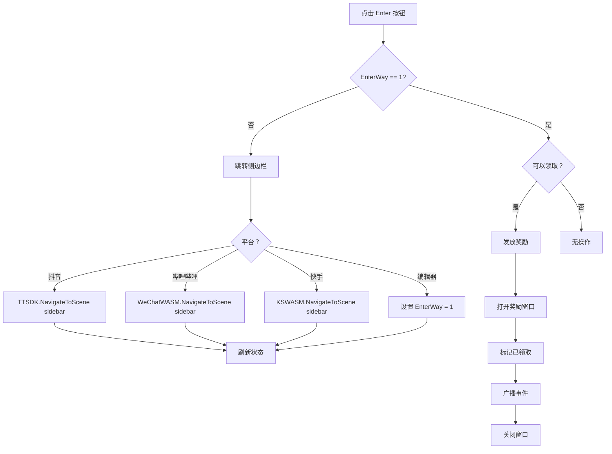

# UISidebarRewardsWin.cs 注解文档

## 文件基本信息

| 属性 | 值 |
|------|-----|
| **文件名** | UISidebarRewardsWin.cs |
| **路径** | Assets/Scripts/Code/Game/UIGame/UITT/UISidebarRewardsWin.cs |
| **所属模块** | 游戏层 → UIGame/UITT |
| **文件职责** | 侧边栏奖励窗口，展示侧边栏任务奖励并支持领取 |

---

## 类说明

### UISidebarRewardsWin

| 属性 | 说明 |
|------|------|
| **职责** | 显示侧边栏奖励信息，处理奖励领取和跳转侧边栏 |
| **继承关系** | 继承 `UIBaseView` |
| **实现的接口** | `IOnCreate`, `IOnEnable`, `IOnDisable` |

**使用场景**: 
- 玩家完成侧边栏任务后弹出奖励窗口
- 支持跳转抖音/快手/哔哩哔哩小游戏侧边栏

---

## 字段与属性

| 名称 | 类型 | 访问级别 | 说明 |
|------|------|----------|------|
| `PrefabPath` | `string` | `public static` | 预制体路径 |
| `Close` | `UIButton` | `public` | 关闭按钮 |
| `BtnEnter` | `UIButton` | `public` | 进入/领取按钮 |
| `TextBtn` | `UITextmesh` | `public` | 按钮文本 |
| `Icon` | `UIImage` | `public` | 奖励图标 |
| `Rewards` | `UITextmesh` | `public` | 奖励数量文本 |
| `ItemId` | `int` | `public` | 奖励物品 ID |
| `ItemCount` | `int` | `public` | 奖励物品数量 |
| `UICommonWin` | `UIAnimator` | `public` | 窗口动画组件 |

---

## 方法说明

### OnCreate()

**签名**:
```csharp
public void OnCreate()
```

**职责**: 创建窗口时初始化 UI 组件

**核心逻辑**:
```
1. 添加 UIAnimator 组件
2. 从 GlobalConfig 获取奖励配置:
   - 尝试获取 "SidebarRewards" 数组
   - ItemId = tempVal[0]
   - ItemCount = tempVal[1]
   - 失败则使用默认值 (1001, 5)
3. 获取 UI 组件引用:
   - Icon, Close, BtnEnter, TextBtn, Rewards
```

**调用者**: UIManager 创建窗口时

---

### OnEnable()

**签名**:
```csharp
public void OnEnable()
```

**职责**: 窗口启用时设置内容和事件

**核心逻辑**:
```
1. 播放打开音效 SoundManager.PlaySound("Win_Open.mp3")
2. 检查是否已领取:
   - isGot = !PlayerDataManager.CanGotSidebarRewards()
3. 设置按钮文本:
   - 已领取 → "已领取"
   - EnterWay==1 → "领取奖励"
   - 否则 → "进入侧边栏"
4. 绑定按钮事件:
   - Close → OnClickBg
   - BtnEnter → OnClickEnter
5. 注册 EnterWayChange 事件监听
6. 加载物品图标和名称:
   - 从 ItemConfigCategory 获取配置
   - 设置图标 Sprite
   - 设置文本 (物品名 x 数量)
7. 设置按钮灰度状态
```

**调用者**: UIManager 启用窗口时

---

### RefreshState()

**签名**:
```csharp
public void RefreshState()
```

**职责**: 刷新按钮文本状态

**核心逻辑**:
```
1. 根据 EnterWay 更新文本:
   - EnterWay==1 → "领取奖励"
   - 否则 → "进入侧边栏"
```

**调用者**: EnterWayChange 事件触发时

---

### OnDisable()

**签名**:
```csharp
public void OnDisable()
```

**职责**: 窗口禁用时清理

**核心逻辑**:
```
1. 移除 EnterWayChange 事件监听
```

**调用者**: UIManager 禁用窗口时

---

### CloseSelf()

**签名**:
```csharp
public override async ETTask CloseSelf()
```

**职责**: 关闭窗口（带动画）

**核心逻辑**:
```
1. 播放关闭音效
2. 播放关闭动画 UICommonWin.Play("UIWin_Close")
3. 调用基类 CloseSelf()
```

**调用者**: OnClickBg(), OnClickEnter()

---

### OnClickEnter()

**签名**:
```csharp
public void OnClickEnter()
```

**职责**: 处理进入/领取按钮点击

**核心逻辑**:
```
1. 如果 EnterWay != 1 (未进入侧边栏):
   - 编辑器模式 → 设置 EnterWay = 1
   - WebGL 抖音 → TTSDK 跳转侧边栏
   - WebGL 哔哩哔哩 → WeChatWASM 跳转侧边栏
   - WebGL 快手 → KSWASM 跳转侧边栏
   - 刷新状态 RefreshState()
   
2. 否则 (EnterWay == 1):
   - 检查是否可以领取奖励
   - 刷新红点 RedDotManager.RefreshRedDotViewCount()
   - 发放奖励 PlayerDataManager.ChangeItem()
   - 打开奖励展示窗口 UIRewardsView
   - 标记已领取 PlayerDataManager.GetSidebarRewards()
   - 广播 SidebarRewards 事件
   - 隐藏窗口 HideSelf()
```

**调用者**: BtnEnter 按钮点击

---

### OnClickBg()

**签名**:
```csharp
public void OnClickBg()
```

**职责**: 处理背景/关闭按钮点击

**核心逻辑**:
```
1. 隐藏窗口 HideSelf()
```

**调用者**: Close 按钮点击

---

## 平台跳转逻辑



---

## 使用示例

### 示例 1: 打开奖励窗口

```csharp
// 玩家完成侧边栏任务后
if (PlayerDataManager.Instance.CanGotSidebarRewards())
{
    // 打开奖励窗口
    UIManager.Instance.OpenWindow<UISidebarRewardsWin>(
        UISidebarRewardsWin.PrefabPath
    );
}
```

### 示例 2: 配置奖励

```csharp
// GlobalConfig 配置
{
    "SidebarRewards": [1001, 5]  // 物品 ID=1001, 数量=5
}

// 或在代码中设置
GlobalConfigCategory.Instance.SetArray("SidebarRewards", new[] { 1001, 5 });
```

### 示例 3: 监听领取事件

```csharp
// 注册事件
Messager.Instance.AddListener(0, MessageId.SidebarRewards, OnSidebarRewards);

void OnSidebarRewards()
{
    Log.Info("侧边栏奖励已领取");
    // 更新 UI 或触发其他逻辑
}
```

---

## 设计说明

### 平台适配

```csharp
// 多平台条件编译
#if UNITY_WEBGL_TT
    // 抖音小游戏
    TTSDK.TT.NavigateToScene(...)
#elif UNITY_WEBGL_BILIGAME
    // 哔哩哔哩小游戏
    WeChatWASM.WX.NavigateToScene(...)
#elif UNITY_WEBGL_KS
    // 快手小游戏
    KSWASM.KS.NavigateToScene(...)
#endif
```

### EnterWay 状态机

```
EnterWay = 0 → 未进入侧边栏 → 按钮显示"进入侧边栏"
    ↓ 点击按钮跳转
EnterWay = 1 → 已进入侧边栏 → 按钮显示"领取奖励"
    ↓ 点击按钮领取
奖励已发放 → 按钮显示"已领取" (灰色)
```

---

## 相关文档

- [UIBaseView.cs.md](../../../UI/UIBaseView.cs.md) - UI 视图基类
- [UIManager.cs.md](../../../UI/UIManager.cs.md) - UI 管理器
- [PlayerDataManager.cs.md](../../Data/PlayerDataManager.cs.md) - 玩家数据管理
- [RedDotManager.cs.md](../../../UI/RedDot/RedDotManager.cs.md) - 红点管理

---

*文档生成时间：2026-03-02 | OpenClaw AI 助手*
