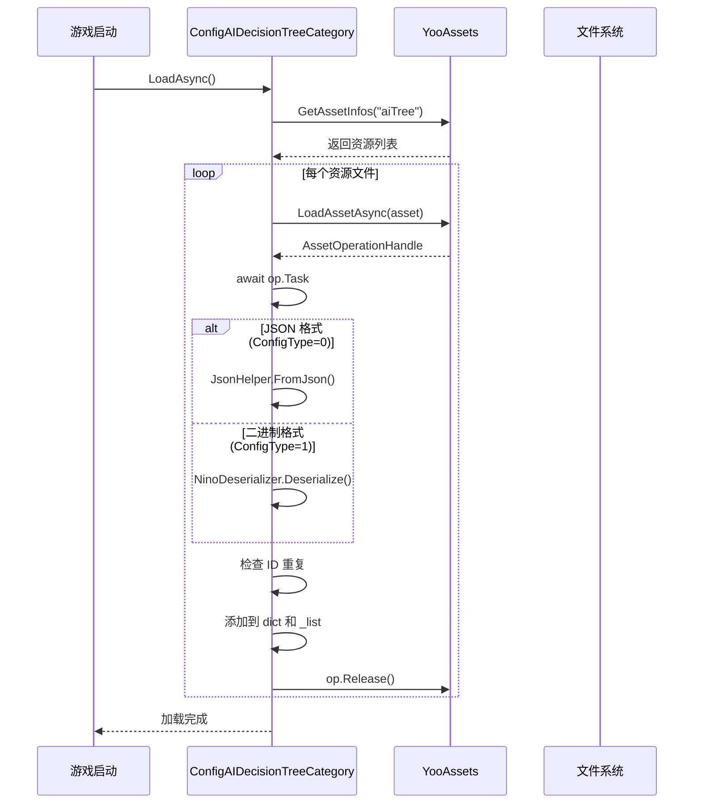

# ConfigAIDecisionTreeCategory.cs 注解文档

## 文件基本信息

| 属性 | 值 |
|------|-----|
| **文件名** | ConfigAIDecisionTreeCategory.cs |
| **路径** | Assets/Scripts/Code/Module/Config/ConfigAIDecisionTreeCategory.cs |
| **所属模块** | 框架层 → Code/Module/Config |
| **文件职责** | AI 决策树配置管理器，负责加载和管理 AI 决策树配置数据 |

---

## 类/结构体说明

### ConfigAIDecisionTreeCategory

| 属性 | 说明 |
|------|------|
| **职责** | 单例模式的管理器，加载并缓存所有 AI 决策树配置，提供查询接口 |
| **泛型参数** | 无 |
| **继承关系** | 无 |
| **实现的接口** | `IManager` |

**设计模式**: 单例模式 + 管理器模式

```csharp
// 单例访问
var aiTreeConfig = ConfigAIDecisionTreeCategory.Instance.Get("Attack");

// 获取所有配置
var allTrees = ConfigAIDecisionTreeCategory.Instance.GetAllList();
```

---

## 字段与属性

### Instance

| 属性 | 值 |
|------|------|
| **类型** | `ConfigAIDecisionTreeCategory` |
| **访问级别** | `public static` |
| **说明** | 单例实例，全局访问点 |

---

### dict

| 属性 | 值 |
|------|------|
| **类型** | `Dictionary<string, ConfigAIDecisionTree>` |
| **访问级别** | `private` |
| **说明** | 以 AI 类型为 key 的字典，用于快速查询 |

---

### _list

| 属性 | 值 |
|------|------|
| **类型** | `List<ConfigAIDecisionTree>` |
| **访问级别** | `private` |
| **说明** | 所有 AI 决策树的列表，用于遍历 |

---

## 方法说明

### Init

**签名**:
```csharp
public void Init()
```

**职责**: 初始化 AI 决策树配置管理器

**核心逻辑**:
```
1. 设置单例 Instance = this
2. 初始化字典 dict
3. 初始化列表 _list
```

**调用者**: ManagerProvider.RegisterManager<ConfigAIDecisionTreeCategory>()

---

### LoadAsync

**签名**:
```csharp
public async ETTask LoadAsync()
```

**职责**: 异步加载所有 AI 决策树配置文件

**核心逻辑**:
```
1. 获取 YooAsset 中 "aiTree" 资源组的所有资源
2. 遍历资源：
   - 根据 Define.ConfigType 过滤文件类型（.json 或 .bytes）
   - 加载资源文件
   - 反序列化（JSON 或 Nino）为 ConfigAIDecisionTree
   - 检查 ID 重复
   - 添加到字典和列表
3. 释放资源 handle
```

**调用者**: 游戏启动时的配置加载流程

**被调用者**: `YooAssets.GetAssetInfos()`, `YooAssets.LoadAssetAsync()`, `JsonHelper.FromJson()`, `NinoDeserializer.Deserialize()`

**配置文件格式支持**:
- **JSON 格式** (`Define.ConfigType == 0`): 人类可读，便于调试
- **二进制格式** (`Define.ConfigType == 1`): 紧凑高效，适合发布

---

### Destroy

**签名**:
```csharp
public void Destroy()
```

**职责**: 销毁管理器，释放资源

**核心逻辑**:
```
1. 设置 Instance = null
2. 清空字典和列表引用
```

**调用者**: ManagerProvider.RemoveManager<ConfigAIDecisionTreeCategory>()

---

### Get

**签名**:
```csharp
public ConfigAIDecisionTree Get(string type)
```

**职责**: 根据类型获取 AI 决策树配置

**核心逻辑**:
```
1. 从字典查找 type 对应的配置
2. 如果找不到，抛出异常
3. 返回配置对象
```

**调用者**: AI 系统、决策逻辑

**参数**:
| 参数名 | 类型 | 说明 |
|--------|------|------|
| `type` | `string` | AI 决策树类型名称 |

**返回值**: `ConfigAIDecisionTree` - AI 决策树配置

**异常**: 如果配置不存在，抛出 `Exception`

**使用示例**:
```csharp
var attackTree = ConfigAIDecisionTreeCategory.Instance.Get("Attack");
var patrolTree = ConfigAIDecisionTreeCategory.Instance.Get("Patrol");
```

---

### GetAll

**签名**:
```csharp
public Dictionary<string, ConfigAIDecisionTree> GetAll()
```

**职责**: 获取所有 AI 决策树配置的字典

**返回值**: `Dictionary<string, ConfigAIDecisionTree>` - 完整的配置字典

**用途**: 需要遍历或批量访问所有配置时

---

### GetAllList

**签名**:
```csharp
public List<ConfigAIDecisionTree> GetAllList()
```

**职责**: 获取所有 AI 决策树配置的列表

**返回值**: `List<ConfigAIDecisionTree>` - 配置列表

**用途**: 需要按顺序遍历或统计时

---

## AI 决策树配置加载流程



---

## 配置文件结构

### JSON 格式示例

```json
{
  "Type": "Attack",
  "Name": "攻击决策树",
  "RootNode": {
    "$type": "DecisionConditionNode",
    "Condition": {
      "$type": "DistanceCondition",
      "Distance": 5.0
    },
    "TrueNode": {
      "$type": "ActDecision",
      "Action": "MeleeAttack"
    },
    "FalseNode": {
      "$type": "ActDecision",
      "Action": "MoveToTarget"
    }
  }
}
```

### 二进制格式

使用 Nino 序列化，文件扩展名为 `.bytes`，体积更小，加载更快。

---

## 使用示例

### 示例 1: 获取 AI 决策树

```csharp
// 获取攻击决策树
var attackTree = ConfigAIDecisionTreeCategory.Instance.Get("Attack");

// 使用决策树进行 AI 决策
var aiController = GetComponent<AIController>();
aiController.SetDecisionTree(attackTree);
```

### 示例 2: 遍历所有决策树

```csharp
// 遍历所有 AI 决策树
var allTrees = ConfigAIDecisionTreeCategory.Instance.GetAllList();
foreach (var tree in allTrees)
{
    Debug.Log($"AI 类型：{tree.Type}, 名称：{tree.Name}");
}
```

### 示例 3: 检查配置是否存在

```csharp
// 安全获取（不抛异常）
var allDict = ConfigAIDecisionTreeCategory.Instance.GetAll();
if (allDict.TryGetValue("NewAIType", out var tree))
{
    // 使用配置
}
else
{
    Debug.LogWarning("AI 配置不存在：" + "NewAIType");
}
```

---

## 配置管理

### 资源组织

```
Assets/
└── Resources/
    └── aiTree/
        ├── Attack.bytes        # 攻击决策树
        ├── Patrol.bytes        # 巡逻决策树
        ├── Flee.bytes          # 逃跑决策树
        └── CustomAI.bytes      # 自定义 AI
```

### ConfigType 配置

```csharp
// Define.ConfigType
0 = JSON 格式（开发/调试）
1 = 二进制格式（发布/生产）
```

**开发阶段**: 使用 JSON 便于查看和修改
**发布阶段**: 使用二进制提高加载速度和减小体积

---

## 错误处理

### ID 重复检测

```csharp
if (!dict.ContainsKey(item.Type))
{
    _list.Add(item);
    dict[item.Type] = item;
}
else
{
    Log.Error("ConfigAIDecisionTree id 重复 " + item.Type);
}
```

**说明**: 如果检测到重复的 AI 类型，记录错误日志但不中断加载。

### 反序列化异常捕获

```csharp
try
{
    ConfigAIDecisionTree item = NinoDeserializer.Deserialize<ConfigAIDecisionTree>(textAsset.bytes);
    // ... 添加到字典
}
catch (Exception ex)
{
    Log.Error(ex);  // 记录异常，继续加载其他配置
}
```

---

## 相关文档

- [ConfigAIDecisionTree.cs.md](./DecisionTree/ConfigAIDecisionTree.cs.md) - AI 决策树配置类
- [DecisionNode.cs.md](./DecisionTree/DecisionNode.cs.md) - 决策节点基类
- [YooAsset 文档](https://www.yooasset.com/) - 资源管理系统
- [Nino 序列化文档](https://github.com/ninochan/Nino) - Nino 序列化库

---

*文档生成时间：2026-02-28 | OpenClaw AI 助手*
