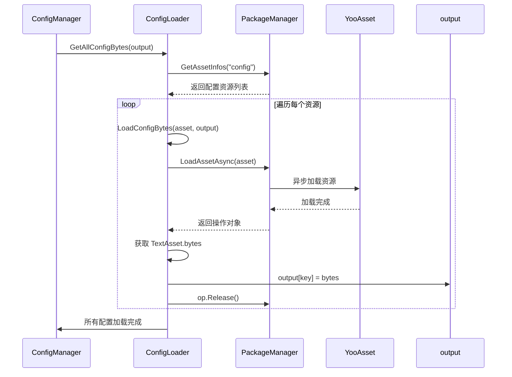
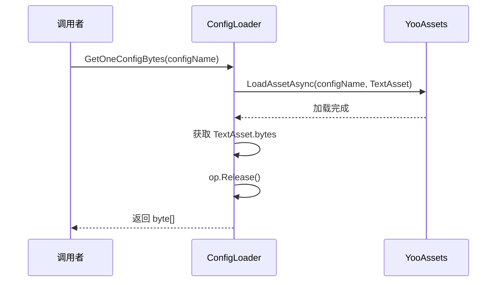

# ConfigLoader.cs 注解文档

## 文件基本信息

| 属性 | 值 |
|------|-----|
| **文件名** | ConfigLoader.cs |
| **路径** | Assets/Scripts/Code/Module/Config/ConfigLoader.cs |
| **所属模块** | 框架层 → Config (配置系统) |
| **文件职责** | 配置加载器实现，负责从 YooAsset 加载配置文件的字节数据 |

---

## 类/结构体说明

### ConfigLoader

| 属性 | 说明 |
|------|------|
| **职责** | 配置加载器，实现 IConfigLoader 接口，负责从资源包加载配置字节数据 |
| **泛型参数** | 无 |
| **继承关系** | 无 |
| **实现的接口** | `IConfigLoader` |

**设计模式**: 策略模式 - 配置加载策略的具体实现

```csharp
public class ConfigLoader : IConfigLoader
{
    public async ETTask GetAllConfigBytes(Dictionary<string, byte[]> output);
    public async ETTask<byte[]> GetOneConfigBytes(string configName);
}
```

---

## 字段与属性

该类无实例字段，所有操作通过 PackageManager 和 YooAssets 静态接口完成。

---

## 方法说明（按重要程度排序）

### GetAllConfigBytes(Dictionary<string, byte[]> output)

**签名**:
```csharp
public async ETTask GetAllConfigBytes(Dictionary<string, byte[]> output)
```

**职责**: 异步加载所有配置文件的字节数据

**核心逻辑**:
```
1. 获取所有配置资源 (PackageManager.GetAssetInfos("config"))
2. 为每个资源创建加载任务
3. 等待所有任务完成 (ETTaskHelper.WaitAll)
4. 将加载的字节数据存入 output 字典
```

**调用者**: ConfigManager.LoadAsync()

**被调用者**: LoadConfigBytes()

**使用示例**:
```csharp
// 加载所有配置字节
var configBytes = new Dictionary<string, byte[]>();
await configLoader.GetAllConfigBytes(configBytes);

// configBytes 包含所有配置文件的字节数据
// key: 资源地址 (如 "Config/ItemConfig.bytes")
// value: 配置文件的字节数组
```

---

### LoadConfigBytes(AssetInfo asset, Dictionary<string, byte[]> output)

**签名**:
```csharp
private async ETTask LoadConfigBytes(AssetInfo asset, Dictionary<string, byte[]> output)
```

**职责**: 异步加载单个配置文件的字节数据

**核心逻辑**:
```
1. 异步加载资源 (PackageManager.LoadAssetAsync)
2. 等待加载完成
3. 获取 TextAsset 对象
4. 提取字节数据存入 output 字典
5. 释放资源操作
```

**调用者**: GetAllConfigBytes()

**被调用者**: 无

---

### GetOneConfigBytes(string configName)

**签名**:
```csharp
public async ETTask<byte[]> GetOneConfigBytes(string configName)
```

**职责**: 异步加载单个配置文件的字节数据

**核心逻辑**:
```
1. 使用 YooAssets 加载资源
2. 等待加载完成
3. 获取 TextAsset 对象
4. 提取字节数据
5. 释放资源操作
6. 返回字节数组
```

**调用者**: ConfigManager (按需加载配置时)

**被调用者**: 无

**使用示例**:
```csharp
// 加载单个配置文件
var bytes = await configLoader.GetOneConfigBytes("Config/ItemConfig.bytes");

// bytes 包含 ItemConfig 的字节数据
```

---

## 配置加载流程

### 批量加载流程图



### 单个加载流程图



---

## 与其他模块的交互

```mermaid
graph TD
    subgraph ConfigLoader["ConfigLoader"]
        CL[ConfigLoader]
    end
    
    subgraph Yoo["YooAsset 资源系统"]
        PM[PackageManager]
        YA[YooAssets]
    end
    
    subgraph Config["配置系统"]
        CM[ConfigManager]
        CB[ConfigBytes]
    end
    
    CL --> PM
    CL --> YA
    CL --> CM
    CM --> CB
    
    note right of CL "ConfigLoader 负责从<br/>YooAsset 加载配置字节数据"
    
    style ConfigLoader fill:#e1f5ff
    style Yoo fill:#fff4e1
    style Config fill:#e8f5e9
```

**依赖关系**:
- **依赖**: `PackageManager`, `YooAssets` (资源加载)
- **被依赖**: `ConfigManager` (配置管理)

---

## 使用示例

### 示例 1: 批量加载所有配置

```csharp
// 创建配置加载器
var configLoader = new ConfigLoader();

// 加载所有配置字节
var configBytes = new Dictionary<string, byte[]>();
await configLoader.GetAllConfigBytes(configBytes);

// 遍历所有配置
foreach (var kvp in configBytes)
{
    Debug.Log($"配置：{kvp.Key}, 大小：{kvp.Value.Length} bytes");
}
```

### 示例 2: 按需加载单个配置

```csharp
// 加载单个配置文件
var configLoader = new ConfigLoader();
var bytes = await configLoader.GetOneConfigBytes("Config/ItemConfig.bytes");

// 使用字节数据反序列化
var itemConfig = NinoDeserializer.Deserialize<ItemConfigCategory>(bytes);
```

---

## 阅读指引

### 建议的阅读顺序

1. **理解加载器作用** - ConfigLoader 负责从资源包加载配置字节
2. **看方法签名** - 了解 GetAllConfigBytes 和 GetOneConfigBytes 的区别
3. **重点看批量加载** - 理解并发加载所有配置的流程
4. **了解资源释放** - 理解 op.Release() 的重要性

### 最值得学习的技术点

1. **并发加载**: 使用 ETTaskHelper.WaitAll 并发加载所有配置
2. **资源管理**: 使用 using 管理 ListComponent，自动释放
3. **异步模式**: 全程使用 async/await 避免阻塞
4. **资源释放**: 加载完成后及时调用 op.Release() 释放资源

---

## 相关文档

- [IConfigLoader.cs.md](./IConfigLoader.cs.md) - 配置加载器接口
- [ConfigManager.cs.md](./ConfigManager.cs.md) - 配置管理器
- [PackageManager.cs.md](../../Mono/Module/YooAssets/PackageManager.cs.md) - 资源包管理器
- [ProtobufHelper.cs.md](./ProtobufHelper.cs.md) - Protobuf 序列化工具

---

*文档生成时间：2026-03-02 | OpenClaw AI 助手*
