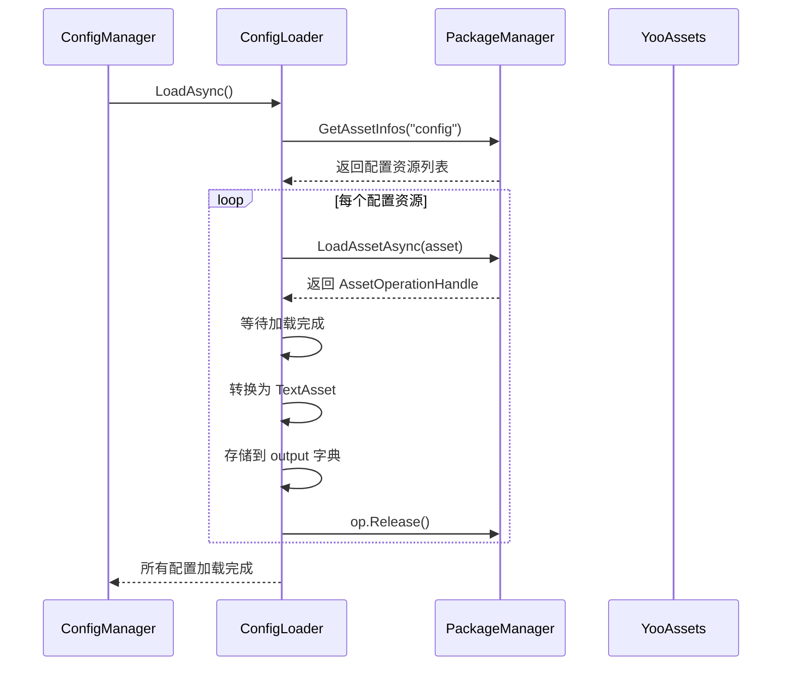
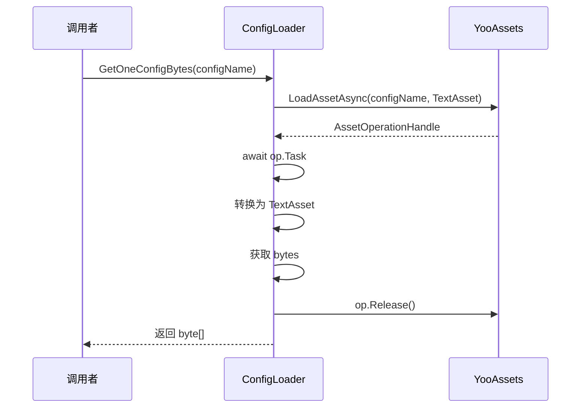

# ConfigLoader.cs 注解文档

## 文件基本信息

| 属性 | 值 |
|------|-----|
| **文件名** | ConfigLoader.cs |
| **路径** | Assets/Scripts/Code/Module/Config/ConfigLoader.cs |
| **所属模块** | 框架层 → Code/Module/Config |
| **文件职责** | 配置文件加载器，负责从 YooAsset 资源系统加载配置文件的二进制数据 |

---

## 类/结构体说明

### ConfigLoader

| 属性 | 说明 |
|------|------|
| **职责** | 实现 IConfigLoader 接口，提供配置文件的异步加载功能 |
| **泛型参数** | 无 |
| **继承关系** | 实现 `IConfigLoader` 接口 |
| **实现的接口** | `IConfigLoader` |

**设计模式**: 策略模式（作为 ConfigManager 的加载策略）

```csharp
// ConfigManager 使用 ConfigLoader 作为默认加载器
ConfigLoader = new ConfigLoader();
```

---

## 方法说明（按重要程度排序）

### GetAllConfigBytes

**签名**:
```csharp
public async ETTask GetAllConfigBytes(Dictionary<string, byte[]> output)
```

**职责**: 异步加载所有配置文件到输出字典

**核心逻辑**:
```
1. 获取所有配置资源 PackageManager.Instance.GetAssetInfos("config")
2. 创建任务列表 ListComponent<ETTask>
3. 为每个资源创建加载任务 LoadConfigBytes
4. 等待所有任务完成 ETTaskHelper.WaitAll
```

**调用者**: `ConfigManager.LoadAsync()`

**被调用者**: `LoadConfigBytes()`

**使用示例**:
```csharp
var configLoader = new ConfigLoader();
Dictionary<string, byte[]> configBytes = new Dictionary<string, byte[]>();
await configLoader.GetAllConfigBytes(configBytes);
// configBytes 现在包含所有配置文件的二进制数据
```

---

### LoadConfigBytes

**签名**:
```csharp
private async ETTask LoadConfigBytes(AssetInfo asset, Dictionary<string, byte[]> output)
```

**职责**: 加载单个配置文件到输出字典

**核心逻辑**:
```
1. 异步加载资源 PackageManager.Instance.LoadAssetAsync
2. 等待加载完成 await op.Task
3. 将资源转换为 TextAsset
4. 以资源地址为 key，二进制数据为 value 存入字典
5. 释放资源 op.Release()
```

**调用者**: `GetAllConfigBytes()`

**被调用者**: 无

---

### GetOneConfigBytes

**签名**:
```csharp
public async ETTask<byte[]> GetOneConfigBytes(string configName)
```

**职责**: 加载单个配置文件的二进制数据

**核心逻辑**:
```
1. 使用 YooAssets.LoadAssetAsync 加载指定配置
2. 等待加载完成
3. 转换为 TextAsset 并获取 bytes
4. 释放资源
5. 返回二进制数据
```

**调用者**: `ConfigManager.LoadOneConfig<T>()`

**被调用者**: 无

**使用示例**:
```csharp
var configLoader = new ConfigLoader();
byte[] configBytes = await configLoader.GetOneConfigBytes("LevelConfig");
// 使用 ProtobufHelper 解析配置
var levelConfig = ProtobufHelper.FromBytes<LevelConfigCategory>(configBytes);
```

---

## 配置加载流程

### 完整流程图



### 单个配置加载流程



---

## 资源管理

### YooAsset 资源加载

ConfigLoader 使用两种方式加载资源：

1. **批量加载** (`GetAllConfigBytes`):
   - 使用 `PackageManager.Instance.GetAssetInfos("config")` 获取所有配置资源
   - 并发加载所有资源
   - 适用于游戏启动时加载全部配置

2. **单个加载** (`GetOneConfigBytes`):
   - 使用 `YooAssets.LoadAssetAsync` 直接加载指定资源
   - 适用于运行时动态加载配置

### 资源释放

所有资源操作完成后都会调用 `op.Release()` 释放资源，避免内存泄漏。

---

## 使用示例

### 示例 1: 加载所有配置

```csharp
// ConfigManager 内部使用
var configLoader = new ConfigLoader();
Dictionary<string, byte[]> configBytes = new Dictionary<string, byte[]>();
await configLoader.GetAllConfigBytes(configBytes);

// 遍历所有配置
foreach (var kvp in configBytes)
{
    Debug.Log($"配置：{kvp.Key}, 大小：{kvp.Value.Length} bytes");
}
```

### 示例 2: 加载单个配置

```csharp
// 加载等级配置
byte[] levelConfigBytes = await ConfigManager.Instance.ConfigLoader.GetOneConfigBytes("LevelConfig");
LevelConfigCategory levelConfig = ProtobufHelper.FromBytes<LevelConfigCategory>(levelConfigBytes);

// 加载物品配置
byte[] itemConfigBytes = await ConfigManager.Instance.ConfigLoader.GetOneConfigBytes("ItemConfig");
ItemConfigCategory itemConfig = ProtobufHelper.FromBytes<ItemConfigCategory>(itemConfigBytes);
```

### 示例 3: 自定义配置加载器

```csharp
// 可以实现 IConfigLoader 接口来自定义加载逻辑
public class CustomConfigLoader : IConfigLoader
{
    public async ETTask GetAllConfigBytes(Dictionary<string, byte[]> output)
    {
        // 自定义加载逻辑，如从网络加载
    }
    
    public async ETTask<byte[]> GetOneConfigBytes(string configName)
    {
        // 自定义单个加载逻辑
    }
}

// 使用自定义加载器
ConfigManager.Instance.ConfigLoader = new CustomConfigLoader();
```

---

## 相关文档

- [ConfigManager.cs.md](./ConfigManager.cs.md) - 配置管理器
- [IConfigLoader.cs.md](./IConfigLoader.cs.md) - 配置加载器接口
- [ProtobufHelper.cs.md](./ProtobufHelper.cs.md) - Protobuf 序列化工具
- [PackageManager.cs.md](../Resource/PackageManager.cs.md) - 资源包管理器
- [ResourcesManager.cs.md](../Resource/ResourcesManager.cs.md) - 资源管理器

---

*文档生成时间：2026-02-28 | OpenClaw AI 助手*
