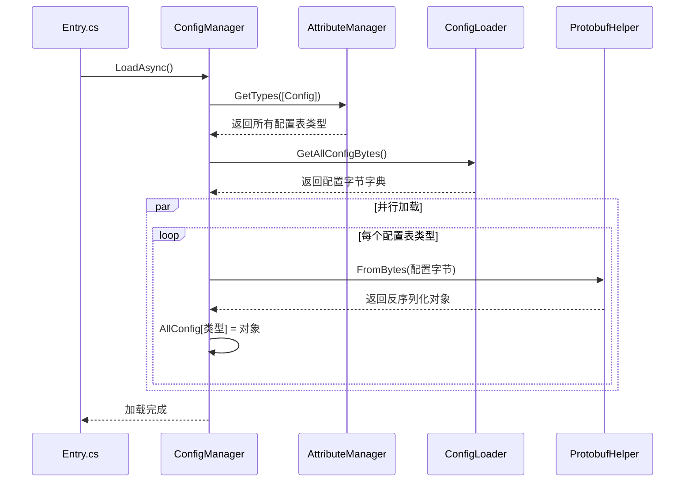
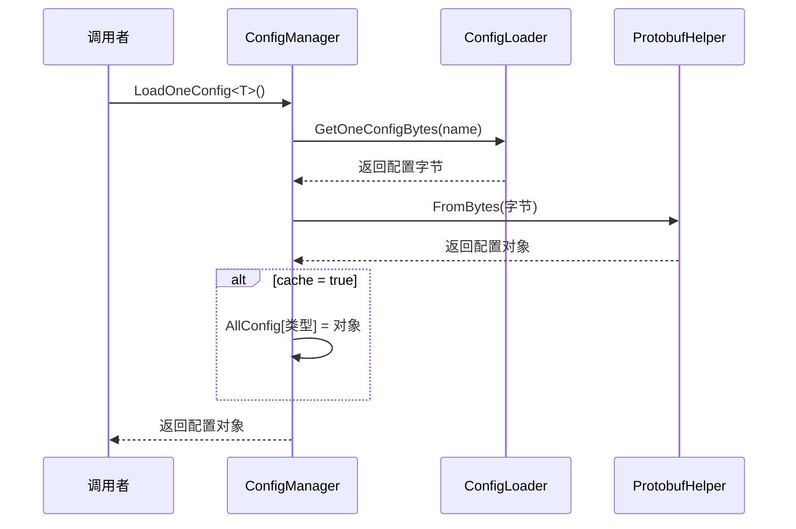

# ConfigManager.cs 注解文档

## 文件基本信息

| 属性 | 值 |
|------|-----|
| **文件名** | ConfigManager.cs |
| **路径** | Assets/Scripts/Code/Module/Config/ConfigManager.cs |
| **所属模块** | 框架层 → Code/Module/Config |
| **文件职责** | 配置表管理系统，负责加载、缓存和访问游戏配置数据 |

---

## 类/结构体说明

### ConfigManager

| 属性 | 说明 |
|------|------|
| **职责** | 管理所有游戏配置表的加载、缓存和访问 |
| **泛型参数** | 无 |
| **继承关系** | 无继承 |
| **实现的接口** | `IManager` |

**设计模式**: 单例模式 + 缓存模式

```csharp
// 单例实现
public static ConfigManager Instance { get; private set; }

// 通过 ManagerProvider 注册
ManagerProvider.RegisterManager<ConfigManager>();
```

---

## 字段与属性（按重要程度排序）

| 名称 | 类型 | 访问级别 | 说明 |
|------|------|----------|------|
| `Instance` | `ConfigManager` | `public static` | 单例实例，全局访问点 |
| `ConfigLoader` | `IConfigLoader` | `public` | 配置加载器接口，支持自定义实现 |
| `AllConfig` | `Dictionary<Type, object>` | `public` | 缓存所有已加载的配置表 {类型：实例} |

---

## 方法说明（按重要程度排序）

### Init()

**签名**:
```csharp
public void Init()
```

**职责**: 初始化配置管理器

**核心逻辑**:
```
1. 设置单例 Instance = this
2. 创建 ConfigLoader 实例
```

**调用者**: ManagerProvider.RegisterManager<ConfigManager>()

**被调用者**: 无

---

### Destroy()

**签名**:
```csharp
public void Destroy()
```

**职责**: 销毁配置管理器，清理缓存

**核心逻辑**:
```
1. 设置 Instance = null
2. 设置 ConfigLoader = null
3. 清空 AllConfig 字典
```

**调用者**: ManagerProvider.RemoveManager<ConfigManager>()

---

### LoadAsync()

**签名**:
```csharp
public async ETTask LoadAsync()
```

**职责**: 异步加载所有配置表（带 [Config] 特性的类）

**核心逻辑**:
```
1. 清空 AllConfig 缓存
2. 获取所有带 [Config] 特性的类型 AttributeManager.Instance.GetTypes()
3. 加载所有配置字节数据 ConfigLoader.GetAllConfigBytes()
4. 根据平台选择加载方式：
   - WebGL: 主线程加载 LoadOneInThread()
   - 其他平台：多线程并行加载 Task.Run()
5. 等待所有加载完成
```

**调用者**: Entry.cs (游戏启动时)

**被调用者**: `AttributeManager.Instance.GetTypes()`, `ConfigLoader.GetAllConfigBytes()`, `LoadOneInThread()`

**代码示例**:
```csharp
// Entry.cs 中调用
var cm = ManagerProvider.RegisterManager<ConfigManager>();
await cm.LoadAsync();  // 等待所有配置加载完成
```

**多线程加载逻辑**:
```csharp
// 非 WebGL 平台使用多线程
using (ListComponent<Task> listTasks = ListComponent<Task>.Create())
{
    foreach (Type type in types)
    {
        Task assignment = Task.Run(() => this.LoadOneInThread(type, configBytes));
        listTasks.Add(assignment);
    }
    await Task.WhenAll(listTasks.ToArray());
}
```

---

### LoadOneConfig<T>(string name, bool cache)

**签名**:
```csharp
public async ETTask<T> LoadOneConfig<T>(string name = "", bool cache = false) where T: ProtoObject
```

**职责**: 加载单个配置表

**核心逻辑**:
```
1. 获取类型信息 TypeInfo<T>.Type
2. 如果 name 为空，使用类型全名
3. 读取配置字节数据 ConfigLoader.GetOneConfigBytes()
4. 使用 Protobuf 反序列化 ProtobufHelper.FromBytes()
5. 如果 cache=true，缓存到 AllConfig
6. 返回配置实例
```

**调用者**: 需要动态加载配置的场景

**被调用者**: `ConfigLoader.GetOneConfigBytes()`, `ProtobufHelper.FromBytes()`

**使用示例**:
```csharp
// 加载单个配置表，不缓存
var config = await ConfigManager.Instance.LoadOneConfig<LevelConfigCategory>();

// 加载并缓存
var cachedConfig = await ConfigManager.Instance.LoadOneConfig<LevelConfigCategory>(cache: true);
```

---

### LoadOneInThread(Type configType, Dictionary<string, byte[]> configBytes)

**签名**:
```csharp
private void LoadOneInThread(Type configType, Dictionary<string, byte[]> configBytes)
```

**职责**: 在子线程中加载单个配置表

**核心逻辑**:
```
1. 从 configBytes 字典获取配置字节数据
2. 使用 Protobuf 反序列化
3. 加锁保存到 AllConfig 字典
```

**调用者**: `LoadAsync()`

**被调用者**: `ProtobufHelper.FromBytes()`

**线程安全**:
```csharp
// 使用 lock 确保多线程安全
lock (this)
{
    this.AllConfig[configType] = category;
}
```

---

### ReleaseConfig<T>()

**签名**:
```csharp
public void ReleaseConfig<T>() where T : ProtoObject, IMerge
```

**职责**: 释放指定配置表的缓存

**核心逻辑**:
```
1. 获取类型信息
2. 从 AllConfig 字典移除
```

**调用者**: 需要释放内存的场景

**使用示例**:
```csharp
// 释放大型配置表缓存
ConfigManager.Instance.ReleaseConfig<LargeConfigCategory>();
```

---

## 配置表系统架构

### 配置表结构

```
配置表系统
├── ConfigManager (管理器)
│   ├── Instance (单例)
│   ├── ConfigLoader (加载器)
│   └── AllConfig (缓存字典)
│
├── IConfigLoader (接口)
│   ├── GetAllConfigBytes()  // 获取所有配置
│   └── GetOneConfigBytes()  // 获取单个配置
│
├── ConfigLoader (实现)
│   └── 从 YooAsset 加载配置字节
│
└── 配置表类 (带 [Config] 特性)
    ├── LevelConfigCategory
    ├── ItemConfigCategory
    └── AIConfigCategory
```

### 配置表定义示例

```csharp
// 配置表Category（由代码生成工具生成）
[Config]  // ← 标记为配置表
public class LevelConfigCategory : ProtoObject
{
    // 配置数据
    public Dictionary<int, LevelConfig> LevelConfigs { get; set; }
    
    // 获取单个配置
    public LevelConfig Get(int levelId)
    {
        return LevelConfigs[levelId];
    }
}

// 配置项
[Config]
public class LevelConfig : ProtoObject
{
    public int Id;           // 关卡 ID
    public string Name;      // 关卡名称
    public int Difficulty;   // 难度
    public BigNumber Reward; // 奖励
}
```

---

## 配置加载流程

### 启动时批量加载



### 运行时单个加载



---

## 阅读指引

### 建议的阅读顺序

1. **理解配置系统作用** - 为什么需要配置表
2. **看字段定义** - 了解 AllConfig 缓存机制
3. **重点看 LoadAsync** - 理解批量加载流程
4. **了解多线程优化** - 理解性能优化方案

### 最值得学习的技术点

1. **反射 + 特性**: 通过 [Config] 特性自动发现配置表
2. **多线程加载**: Task.Run 并行加载提升性能
3. **线程安全**: lock 确保多线程写入安全
4. **泛型方法**: LoadOneConfig<T> 支持任意配置类型
5. **缓存机制**: AllConfig 字典缓存已加载配置
6. **Protobuf 序列化**: 高效的二进制序列化格式

---

## 使用示例

### 示例 1: 访问配置表

```csharp
// 获取配置表 Category
var levelConfig = ConfigManager.Instance.AllConfig[typeof(LevelConfigCategory)] as LevelConfigCategory;

// 或者使用泛型扩展方法（如果有）
var levelConfig = ConfigManager.Instance.GetConfig<LevelConfigCategory>();

// 访问具体配置
var level1 = levelConfig.Get(1);
Log.Info($"关卡 1 名称：{level1.Name}");
```

### 示例 2: 动态加载配置

```csharp
// 运行时加载未缓存的配置
var newConfig = await ConfigManager.Instance.LoadOneConfig<NewConfigCategory>(cache: true);

// 使用配置
UseConfig(newConfig);
```

### 示例 3: 释放内存

```csharp
// 大型配置表使用完后释放
ConfigManager.Instance.ReleaseConfig<LargeConfigCategory>();
```

---

## 配置表命名规范

| 类型 | 命名格式 | 示例 |
|------|---------|------|
| Category | `{Name}ConfigCategory` | `LevelConfigCategory` |
| Item | `{Name}Config` | `LevelConfig` |
| 文件路径 | `Config/{Name}Config.bytes` | `Config/LevelConfig.bytes` |

---

## 相关文档

- [ConfigLoader.cs.md](./ConfigLoader.cs.md) - 配置加载器
- [IConfigLoader.cs.md](./IConfigLoader.cs.md) - 加载器接口
- [ConfigAttribute.cs.md](./ConfigAttribute.cs.md) - 配置特性
- [ProtobufHelper.cs.md](./ProtobufHelper.cs.md) - Protobuf 序列化工具
- [Entry.cs.md](../Entry.cs.md) - 游戏入口（调用 LoadAsync）

---

*文档生成时间：2026-02-27 | OpenClaw AI 助手*
