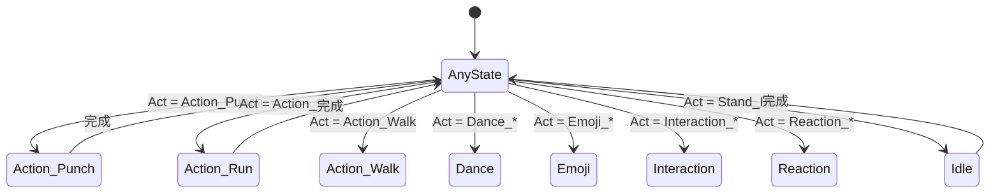

# ActDecision.cs 注解文档

## 文件基本信息

| 属性 | 值 |
|------|------|
| **文件名** | ActDecision.cs |
| **路径** | Assets/Scripts/Code/Module/Config/DecisionTree/ActDecision.cs |
| **所属模块** | 框架层 → Code/Module/Config/DecisionTree |
| **文件职责** | 定义 AI 动作枚举，指定 AI 执行的动画/行为类型 |

---

## 类/结构体说明

### ActDecision 枚举

| 属性 | 说明 |
|------|------|
| **职责** | 定义 AI 可执行的所有动作类型，用于 DecisionActionNode |
| **泛型参数** | 无 |
| **继承关系** | 继承 `System.Enum` |
| **实现的接口** | 无 |

**用途**:
- 在 `DecisionActionNode.Act` 字段中使用
- 策划通过下拉菜单选择 AI 动作
- 运行时驱动动画系统播放对应动画

---

## 枚举值详解

### 基础动作（0-4）

| 值 | 枚举名 | 中文标签 | 说明 |
|----|--------|----------|------|
| 0 | `NoActDecision` | 无，保持当前动作 | 不执行新动作，保持当前状态 |
| 1 | `Action_Jump` | - | 跳跃动作 |
| 2 | `Action_Punch` | - | 出拳攻击 |
| 3 | `Action_Run` | - | 跑步移动 |
| 4 | `Action_Walk` | - | 走路移动 |

---

### 舞蹈动作（5-8）

| 值 | 枚举名 | 中文标签 | 说明 |
|----|--------|----------|------|
| 5 | `Dance_1` | - | 舞蹈动作 1 |
| 6 | `Dance_2` | - | 舞蹈动作 2 |
| 7 | `Dance_3` | - | 舞蹈动作 3 |
| 8 | `Dance_4` | - | 舞蹈动作 4 |

**用途**: 庆祝、娱乐、互动场景

---

### 表情动作（9-27）

| 值 | 枚举名 | 中文标签 | 说明 |
|----|--------|----------|------|
| 9 | `Emoji_Aghast` | - | 震惊表情 |
| 10 | `Emoji_Angry` | - | 生气表情 |
| 11 | `Emoji_Applaud` | - | 鼓掌 |
| 12 | `Emoji_Be_Bashful` | - | 害羞 |
| 13 | `Emoji_Cheer` | - | 欢呼 |
| 14 | `Emoji_Cry` | - | 哭泣 |
| 15 | `Emoji_Gas` | - | 喘气/惊讶 |
| 16 | `Emoji_Hi` | - | 打招呼 |
| 17 | `Emoji_Nice` | - | 赞/好 |
| 18 | `Emoji_Pester` | - | 纠缠/烦人 |
| 19 | `Emoji_Putter_Around` | - | 闲逛/无所事事 |
| 20 | `Emoji_Showmanship` | - | 表演/炫耀 |
| 21 | `Emoji_SideToSide` | - | 左右摇摆 |
| 22 | `Emoji_Sigh` | - | 叹气 |
| 23 | `Emoji_Smile1` | - | 微笑 1 |
| 24 | `Emoji_Smile2` | - | 微笑 2 |

**用途**:
- 表达 AI 情绪状态
- 增强拟人化表现
- 配合 `DecisionActionNode.Emoji` 字段使用

---

### 交互动作（25-28）

| 值 | 枚举名 | 中文标签 | 说明 |
|----|--------|----------|------|
| 25 | `Interaction_Item_Put` | - | 放置物品 |
| 26 | `Interaction_Pickup` | - | 拾取物品 |
| 27 | `Interaction_Shovel` | - | 使用铲子 |
| 28 | `Interaction_Sickle` | - | 使用镰刀 |

**用途**:
- 与场景物品互动
- 采集/收集资源
- 家园系统操作

---

### 受击反应（29-31）

| 值 | 枚举名 | 中文标签 | 说明 |
|----|--------|----------|------|
| 29 | `Reaction_Agonize` | - | 痛苦挣扎 |
| 30 | `Reaction_Knockout` | - | 被击倒/昏迷 |
| 31 | `Reaction_Struck` | - | 被击中 |

**用途**:
- 受到攻击时的反应
- 战斗反馈
- 受伤状态表现

---

### 待机动作（32-37）

| 值 | 枚举名 | 中文标签 | 说明 |
|----|--------|----------|------|
| 32 | `Stand_Idle1` | - | 待机动作 1 |
| 33 | `Stand_Idle2` | - | 待机动作 2 |
| 34 | `Stand_idle3` | - | 待机动作 3 |
| 35 | `Stand_Idle4` | - | 待机动作 4 |
| 36 | `Stand_Idle5` | - | 待机动作 5 |
| 37 | `Stand_Idle6` | - | 待机动作 6 |

**用途**:
- 空闲状态循环播放
- 避免角色静止不动
- 增加生动感

---

## Odin Inspector 集成

### LabelText 特性

```csharp
public enum ActDecision
{
    [LabelText("无，保持当前动作")]
    NoActDecision = 0,
    
    Action_Jump,
    Action_Punch,
    // ...
}
```

**效果**: 
- `NoActDecision` 在 Inspector 中显示为 "无，保持当前动作"
- 其他值显示枚举名（如 "Action_Punch"）

### 使用建议

可以为所有枚举值添加 `LabelText` 特性，提升策划体验：

```csharp
public enum ActDecision
{
    [LabelText("无，保持当前动作")]
    NoActDecision = 0,
    
    [LabelText("跳跃")]
    Action_Jump,
    
    [LabelText("出拳")]
    Action_Punch,
    
    [LabelText("跑步")]
    Action_Run,
    
    [LabelText("走路")]
    Action_Walk,
    
    [LabelText("舞蹈 1")]
    Dance_1,
    
    // ... 以此类推
}
```

---

## 使用示例

### 示例 1: 基础动作

```csharp
// 攻击动作
var attackNode = new DecisionActionNode
{
    Act = ActDecision.Action_Punch,
    Tactic = AITactic.HighWeight
};

// 逃跑动作
var fleeNode = new DecisionActionNode
{
    Act = ActDecision.Action_Run,
    Tactic = AITactic.LeaveRun
};
```

### 示例 2: 表情动作

```csharp
// 微笑竞标
var bidNode = new DecisionActionNode
{
    Act = ActDecision.Emoji_Nice,
    Tactic = AITactic.LowWeight,
    Emoji = "1"
};

// 叹气放弃
var giveUpNode = new DecisionActionNode
{
    Act = ActDecision.Emoji_Sigh,
    Tactic = AITactic.Sidelines
};
```

### 示例 3: 交互动作

```csharp
// 拾取物品
var pickupNode = new DecisionActionNode
{
    Act = ActDecision.Interaction_Pickup,
    Tactic = AITactic.Sidelines
};

// 放置物品
var putNode = new DecisionActionNode
{
    Act = ActDecision.Interaction_Item_Put,
    Tactic = AITactic.Sidelines
};
```

### 示例 4: 待机动作

```csharp
// 随机待机动作
var idleActions = new[]
{
    ActDecision.Stand_Idle1,
    ActDecision.Stand_Idle2,
    ActDecision.Stand_Idle3,
    ActDecision.Stand_Idle4,
    ActDecision.Stand_Idle5,
    ActDecision.Stand_Idle6
};

var idleNode = new DecisionActionNode
{
    Act = idleActions[Random.Range(0, idleActions.Length)],
    Tactic = AITactic.Sidelines
};
```

---

## 动作分类统计

| 分类 | 数量 | 占比 |
|------|------|------|
| 基础动作 | 5 | 13% |
| 舞蹈动作 | 4 | 10% |
| 表情动作 | 16 | 42% |
| 交互动作 | 4 | 10% |
| 受击反应 | 3 | 8% |
| 待机动作 | 6 | 16% |
| **总计** | **38** | **100%** |

---

## 动画系统对接

### 动画控制器参数

```csharp
// 动画控制器中使用整数参数
Animator animator = GetComponent<Animator>();
animator.SetInteger("ActType", (int)actDecision);

// 或者使用触发器
string triggerName = actDecision.ToString();
animator.SetTrigger(triggerName);
```

### 动画状态机示例



---

## 设计要点

### 为什么使用枚举？

1. **类型安全**: 避免字符串拼写错误
2. **性能**: 整数比较比字符串快
3. **编辑器友好**: 下拉菜单选择
4. **可维护**: 集中管理所有动作类型
5. **序列化友好**: Nino 可以高效序列化枚举

### 命名规范

- `NoActDecision`: 特殊值，表示无动作
- `Action_*`: 基础移动/攻击动作
- `Dance_*`: 舞蹈动作
- `Emoji_*`: 表情动作
- `Interaction_*`: 交互动作
- `Reaction_*`: 受击反应动作
- `Stand_Idle*`: 待机动作

### 扩展建议

新增动作时：
1. 在枚举末尾添加新值
2. 在动画系统中添加对应动画
3. 更新相关文档
4. 考虑是否需要添加 `LabelText` 特性

---

## 相关文档

- [DecisionActionNode.cs.md](./DecisionActionNode.cs.md) - 使用 ActDecision 的节点
- [AITactic.cs.md](./AITactic.cs.md) - AI 策略枚举
- [DecisionNode.cs.md](./DecisionNode.cs.md) - 决策节点基类

---

*文档生成时间：2026-02-28 | OpenClaw AI 助手*
